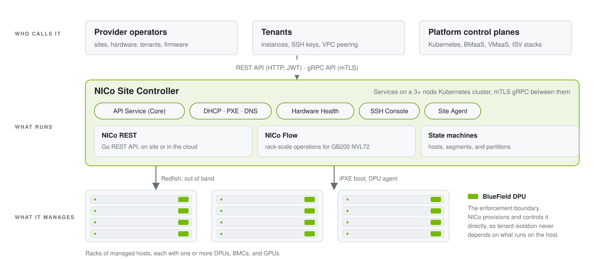
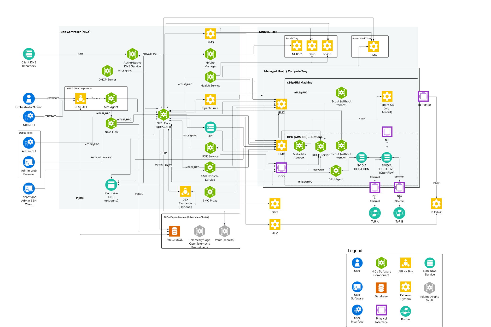
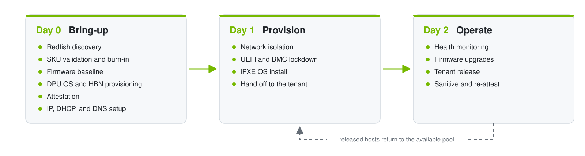
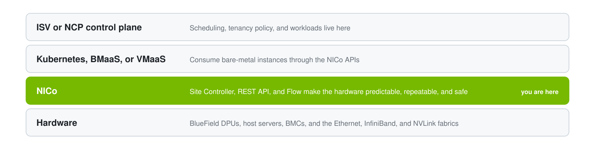

# NVIDIA Infra Controller (NICo)

<div align="center">

**Zero-trust lifecycle automation for bare-metal AI infrastructure**

[](LICENSE)
[](https://github.com/dsx-ai-factory/infra-controller/actions/workflows/ci.yaml)
[](https://github.com/dsx-ai-factory/infra-controller/actions/workflows/rest-ci.yml)
[](https://github.com/dsx-ai-factory/infra-controller/releases/latest)
[](https://docs.nvidia.com/infra-controller/documentation/home)

[Documentation](https://docs.nvidia.com/infra-controller/documentation/home) |
[Quick Start](#production-deployment) |
[Local Development](#local-development) |
[Architecture](docs/architecture/overview.md) |
[REST API Reference](https://docs.nvidia.com/infra-controller/rest-api-reference/api-reference) |
[Contributing](CONTRIBUTING.md)

</div>

> **Repository move notice:** On September 4, 2026, the NICo repository moved
> from the NVIDIA GitHub organization to
> [`dsx-ai-factory/infra-controller`](https://github.com/dsx-ai-factory/infra-controller).
> Existing repository URLs and standard Git operations continue to work through
> GitHub redirects. If you maintain automation or integrations that reference
> `NVIDIA/infra-controller`, such as GitHub Actions, webhooks, or pinned
> repository URLs, update them to `dsx-ai-factory/infra-controller`.

## What Is NICo

NICo delivers lifecycle automation for bare-metal systems that secures
datacenter infrastructure at its foundation. It is an open source suite of
microservices that run next to the hardware, managing and automating the full
bare-metal lifecycle: hardware discovery, firmware validation, BlueField DPU
provisioning, network isolation, tenant provisioning, and secure sanitization
between tenants. NVIDIA Cloud Partners (NCPs) and infrastructure operators can
use NICo to stand up and operate AI factory-scale infrastructure through APIs
instead of runbooks.

<picture>
  <source media="(prefers-color-scheme: dark)" srcset="docs/static/readme/hero-dark.svg">
  
</picture>

<details>
<summary><b>Full component diagram</b>: every Site Controller service, host agent, and off-the-shelf dependency</summary>
<br>

</details>

AI factories need rack-level management, host lifecycle automation, and
workload isolation that general-purpose tools do not provide as one integrated
system. Without it, operators are left with manual discovery and firmware
alignment on every rack bring-up, no single enforcement point for tenant
isolation across Ethernet, InfiniBand, and NVLink, custom scripts for
sanitization and attestation, and firmware drift across hardware generations.

NICo closes these gaps. In the default configuration, a managed host is a
server with one or more BlueField DPUs, and the DPU is the enforcement
boundary. NICo provisions and controls the DPU directly, independently of
whatever the tenant runs on the host, so the layers above it can treat bare
metal as a reliable building block. NICo also supports zero-DPU hosts, where
the DPU policy is `ignore` or `nic`. Their tenant instances attach to Flat
VPCs on the underlay, and the operator's fabric provides the isolation. Refer
to the [glossary](docs/glossary.md#zero-dpu-host) for both host types.

## What NICo Does

<table>
  <tr>
    <td width="33%" valign="top">
      
      <h3>Hardware Readiness</h3>
      Discovers BMCs over the out-of-band network with Redfish, pairs DPUs to
      hosts, validates each machine against its expected SKU, runs burn-in and
      fabric tests, and enforces a UEFI and BMC firmware baseline before a host
      is offered to tenants.
    </td>
    <td width="33%" valign="top">
      
      <h3>DPU Lifecycle</h3>
      Installs the DPU OS, provisions Host-Based Networking (HBN) with
      Containerized Cumulus, manages DPU BMC, NIC, UEFI, and ATF firmware, and
      runs the DPU agent that continuously applies the desired network state.
    </td>
    <td width="33%" valign="top">
      
      <h3>Network Isolation</h3>
      Enforces per-tenant boundaries on every plane without touching physical
      switches: VXLAN/EVPN and VRFs on Ethernet, UFM P_Key partitions on
      InfiniBand, NMX-C partitions on NVLink, and Spectrum-X partitioning.
    </td>
  </tr>
  <tr>
    <td valign="top">
      
      <h3>Trust and Attestation</h3>
      Treats every host as untrusted by default. Verifies measured boot PCRs
      and TPM signatures, locks down UEFI during tenant use, manages BMC and
      UEFI credentials, and never relies on in-band host reporting for
      security decisions.
    </td>
    <td valign="top">
      
      <h3>Firmware Upgrades</h3>
      Keeps the fleet on a site-wide firmware baseline. Operators declare the
      expected host and DPU versions, NICo detects drift, and it schedules
      out-of-band updates on healthy, unoccupied hosts without disrupting
      active tenants.
    </td>
    <td valign="top">
      
      <h3>Provisioning and Sanitization</h3>
      Boots any iPXE-installable OS, allocates IP addresses, and configures
      BGP, DHCP, and DNS. When a tenant leaves, securely erases NVMe, GPU, and
      system memory, resets the TPM, re-attests, and tears down the tenant
      network before reuse.
    </td>
  </tr>
</table>

For GB200 NVL72 systems, **NICo Flow** extends all of this to the rack. It
treats racks and NVL domains as first-class entities, sequences power and
firmware operations across trays, and gates allocation on NVLink fabric
health. Refer to [Key Capabilities](docs/overview/capabilities.md) for the
complete list and to the [Hardware Compatibility List](docs/hcl.md) for
supported servers and DPUs.

## Who Uses NICo

NICo REST authorizes every caller as a **provider** or a **tenant**, or as a
**service account** that acts as both. All of them work through the same REST
API, and every endpoint is documented in the
[REST API Reference](https://docs.nvidia.com/infra-controller/rest-api-reference/api-reference),
including the typical API call flows for each persona.

<table>
  <tr>
    <td width="50%" valign="top">
      <h3>Provider</h3>
      The NCP or infrastructure operator who owns the site. Providers register
      sites, ingest and validate hardware, define tenants and instance types,
      allocate hosts, manage racks, and run firmware and maintenance
      operations.
      <br><br>
      <b>Tools:</b> the REST API and its
      <a href="docs/manuals/nicocli-reference.md"><code>nicocli</code></a> client
      for day-to-day operations, and the
      <a href="docs/manuals/nico-admin-cli.md"><code>nico-admin-cli</code></a>
      for site-administrator tasks on the Core gRPC API.
      <br><br>
      <b>Start with:</b>
      <a href="docs/provisioning/ingesting-hosts-rest-api.md">Ingesting Hosts (REST API)</a>,
      <a href="docs/configuration/tenant_management.md">Tenant Management</a>,
      and <a href="docs/operations/firmware-updates.md">Firmware Updates</a>.
    </td>
    <td width="50%" valign="top">
      <h3>Tenant</h3>
      The organization that consumes bare-metal instances. Tenants manage
      their own instances, SSH keys, and VPC peering inside the isolation
      boundary the provider established, and they never see other tenants'
      hardware or networks.
      <br><br>
      <b>Tools:</b> the REST API with tenant-scoped JWTs, the serial console
      through the SSH Console service, and the metadata service on each
      instance.
      <br><br>
      <b>Start with:</b> the
      <a href="https://docs.nvidia.com/infra-controller/rest-api-reference/api-reference">REST API Reference</a>
      and the instance sections of
      <a href="docs/configuration/tenant_management.md">Tenant Management</a>.
    </td>
  </tr>
</table>

**Service Account mode** is the third option. NICo REST can be configured so
that one organization holds both the provider and tenant roles through a
service account, with no separate tenant organizations. This suits
deployments that manage tenancy in a system above NICo and call it as one
principal. Refer to [Tenant Management with Keycloak](docs/configuration/tenant-management-keycloak.md)
for the service-account client setup and to the
[authorization roles](docs/glossary.md#authorization-roles) in the glossary
for what each role family can do.

## The Lifecycle NICo Automates

NICo organizes bare-metal management into three phases. Day 0 takes hardware
from "racked and cabled" to "ready for tenants". Day 1 isolates and provisions
a host for a tenant. Day 2 keeps the fleet healthy and returns released hosts
to the pool.

<picture>
  <source media="(prefers-color-scheme: dark)" srcset="docs/static/readme/lifecycle-dark.svg">
  
</picture>

**Day 0: Discovery, Validation, and Ingestion**: The provider registers each
host as an Expected Machine with its BMC MAC address, chassis serial, and
factory BMC credentials. From there NICo takes over: it discovers the host
over Redfish, links each DPU to its host, validates the machine against its
SKU, runs burn-in and fabric tests, brings firmware to the site baseline,
installs the DPU OS and HBN, attests the host with measured boot and TPM
checks, and allocates its IP addresses. Component inventory is collected
automatically, so no manual component entry is required.

**Day 1: Isolation, Lockdown, and Provisioning**: Before a tenant receives a
host, NICo establishes isolation on every network plane, locks down UEFI and
the BMC, and coordinates the iPXE boot of the tenant's chosen OS image. The
provider allocates hosts to tenants as instances through the REST API.

**Day 2: Operations, Health, and Tenant Transitions**: NICo monitors health
continuously, schedules firmware upgrades on unoccupied hosts, upgrades itself
in place, and sanitizes and re-attests every released host before it returns
to the available pool.

Refer to [Day 0, Day 1, and Day 2 Lifecycle](docs/overview/lifecycle.md) for
the detail behind each step.

## Typical Flows

Each flow below is an end-to-end procedure you can run against a site. The
provider-side flows use `nicocli` or the REST API, and the REST API Reference
documents the matching API call sequences.

| Flow | Phase | Guide |
| --- | --- | --- |
| Register a site and ingest its first hosts | Day 0 | [Ingesting Hosts](docs/provisioning/ingesting-hosts.md) and [Ingesting Hosts (REST API)](docs/provisioning/ingesting-hosts-rest-api.md) |
| Validate machines against their SKU and run burn-in | Day 0 | [SKU Validation](docs/provisioning/sku-validation.md) and [Machine Validation](docs/provisioning/machine-validation.md) |
| Create a tenant, allocate hosts, and provision instances | Day 1 | [Tenant Management](docs/configuration/tenant_management.md) |
| Isolate tenant networks across Ethernet, InfiniBand, and NVLink | Day 1 | [Network Isolation](docs/manuals/network_isolation.md) |
| Upgrade host, DPU, and rack component firmware | Day 2 | [Firmware Updates](docs/operations/firmware-updates.md), with [host](docs/operations/firmware-updates/host-firmware.md), [DPU](docs/operations/firmware-updates/dpu-firmware.md), and [rack component](docs/operations/firmware-updates/rack-component-firmware.md) workflows |
| Release an instance and verify sanitization | Day 2 | [Tenant Lifecycle Cleanup](docs/operations/tenant-lifecycle-cleanup.md) |
| Monitor fleet health and respond to alerts | Day 2 | [Monitoring Health](docs/operations/monitoring-health.md) |
| Run rack-level power and maintenance operations with NICo Flow | Day 2 | [NICo Flow Operations](docs/operations/flow/overview.md) |
| Upgrade NICo itself | Day 2 | [Upgrading NICo](docs/manuals/upgrade.md) |

## Where NICo Fits

NICo sits below Kubernetes and platform layers. It exposes REST and gRPC APIs
that higher-level systems consume directly, and it does not dictate how
scheduling, tenancy policy, or workloads are managed above it.

<picture>
  <source media="(prefers-color-scheme: dark)" srcset="docs/static/readme/layers-dark.svg">
  
</picture>

## How It Is Built

The **Site Controller** is the on-site control plane: Rust services deployed
on a Kubernetes cluster of at least three nodes, all talking to each other over
mutual TLS (mTLS) and gRPC, plus the Go Site Agent that links the site to NICo
REST. **NICo REST** is a Go service layer
that exposes those capabilities as a REST API. It can run next to the Site
Controller or centrally in the cloud, where many sites connect to it through
their Site Agents.

| Service | Role |
| --- | --- |
| **API Service (NICo Core)** | Single source of truth and the only PostgreSQL writer. Runs the state machines for hosts, network segments, and InfiniBand and NVLink partitions. |
| **DHCP, PXE, and DNS** | Stateless front doors for the physical network. They forward every decision to NICo Core, which owns IP address management and boot artifacts. |
| **Hardware Health** | Scrapes host and DPU BMCs over Redfish and exports Prometheus metrics and per-sensor telemetry. |
| **SSH Console** | Holds persistent BMC console sessions, streams them to Loki, and gives tenants and operators live serial access. |
| **Site Agent and NICo REST** | Connect the on-site controller to the REST API over Temporal, so operators and ISVs integrate with HTTP and JWT. |
| **Scout and DPU Agent** | Run on the managed hosts. Scout collects in-band inventory and runs validation during discovery. The DPU agent applies network state, serves instance metadata, and self-updates. |

Refer to [Architecture: Overview and Components](docs/architecture/overview.md)
for the full component list and to the
[state handling design](docs/architecture/state_handling.md) for how the
state machines work.

## Installation

There are two ways to run NICo. Use the local development stack to work on
the code against mock hardware. Use the production installer to deploy a
complete site onto a bare-metal Kubernetes cluster.

### Local Development

The fastest way to run the whole stack locally is DevSpace on a kind cluster.
It compiles the Core and REST images from this clone, deploys the Helm charts,
and uses Machine-a-Tron to supply mock hosts, so you can exercise the REST API
and the Core gRPC API end to end without hardware.

```bash
# 1. Install the toolchain: rustup with the Rust version pinned in rust-toolchain.toml,
#    the Go version in rest-api/go.mod, Docker, kind, kubectl, helm, and devspace.
#    Then install cargo-make:
cargo install cargo-make

# 2. Create a local cluster. The bootstrap script works on your current
#    Kubernetes context, so this must exist first.
kind create cluster --name nico

# 3. Bootstrap the cluster-side prerequisites (cert-manager, PostgreSQL, Vault,
#    Temporal, and Keycloak) on that context. Safe to re-run.
dev/deployment/devspace/bootstrap-prereqs.sh

# 4. Build and deploy NICo Core, NICo REST, and the mock hosts.
devspace deploy
```

For a plain build and test loop without a cluster:

```bash
cargo build                              # all Rust workspace crates
cargo make correctly-execute-tests       # build prerequisites, then run the Rust tests
make rest-build                          # Go REST API binaries
make rest-test                           # Go unit tests with PostgreSQL and mock gRPC servers
cargo make pre-commit-verify-workspace   # what CI runs before merge
```

On a fresh Ubuntu VM, `dev/deployment/devspace/setup-devspace-on-host.sh`
performs all four steps, including the kind cluster.

Refer to [Local Development with DevSpace](dev/deployment/devspace/README.md)
for profiles, port-forwarding, and teardown, to the
[Development](docs/development.md) page for host package prerequisites, to the
[Build Guide](docs/development/build-guide.md) for ARM64 and release builds,
and to [AGENTS.md](AGENTS.md) for the full build, test, and lint command
reference.

### Production Deployment

`helm-prereqs/setup.sh` deploys the full NICo stack onto a bare-metal
Kubernetes cluster in three layers:

| Layer | What it installs | Helm release |
| --- | --- | --- |
| **Common services** | MetalLB, cert-manager, Vault, External Secrets Operator, and PostgreSQL | via `helmfile` in `helm-prereqs/` |
| **NICo Core** | The Site Controller services from this repo's `helm/` chart | `nico` in `nico-system` |
| **NICo REST** | The REST API, Temporal, Keycloak, and Site Agent | `nico-rest` and `nico-rest-site-agent` in `nico-rest` |

#### Prerequisites

- A running Kubernetes cluster of at least three nodes with `KUBECONFIG` set
- `helm`, `helmfile`, `kubectl`, and `jq` installed
- Images pushed to your container registry

#### Quick Start

```bash
# 1. Build and push amd64/arm64 container images from this clone.
#    Refer to docs/manuals/building_nico_containers.md for the build-host prerequisites.
export IMAGE_REGISTRY=my-registry.example.com/infra-controller
make images IMAGE_REGISTRY="${IMAGE_REGISTRY}"   # NICo Core and REST service images

# 2. Set environment variables. The values below are examples: replace
#    every one of them with your own before running setup.
export KUBECONFIG=/path/to/kubeconfig
export NICO_IMAGE_REGISTRY="${IMAGE_REGISTRY}"
export NICO_CORE_IMAGE_TAG=v2.2.0
export NICO_REST_IMAGE_TAG=v2.2.0
# For an authenticated registry, read the pull secret from a prompt so it
# never appears in shell history:
# read -r -s -p 'Registry pull secret: ' REGISTRY_PULL_SECRET && export REGISTRY_PULL_SECRET

# DPF (DOCA Platform Framework) DPU provisioning installs by default.
# Set these two variables, or pass --skip-dpf to opt out:
export NICO_DPF_DPU_INTERFACE=ens1f0          # controller NIC facing the DPUs
export NICO_DPF_DPU_CLUSTER_VIP=192.0.2.10    # free routable IP for the DPU cluster control plane

# RMS (Rack Management Service) installs by default and requires an image
# tag. Its default image is entitlement-gated on NGC, so also supply an NGC
# API key (it defaults to REGISTRY_PULL_SECRET), point NICO_RMS_IMAGE_REPO
# at your mirror, or pass --skip-rms to opt out:
export NICO_RMS_IMAGE_TAG=v0.8.0
read -r -s -p 'NGC API key for RMS: ' NICO_RMS_NGC_API_KEY && export NICO_RMS_NGC_API_KEY

# 3. Customize site-specific values
#    Edit helm-prereqs/values/nico-core.yaml:
#      nico-api.hostname      - your site's external API hostname
#      nico-api.siteConfig    - network pools, VLAN ranges, IB config, MetalLB VIPs
#    Edit helm-prereqs/values/metallb-config.yaml:
#      IPAddressPool, BGPPeer - your site's VIP ranges and TOR switch config
#    Edit helm-prereqs/values.yaml:
#      siteName               - short site identifier

# 4. Run setup. It installs common services, NICo Core, and NICo REST in order.
cd helm-prereqs
./setup.sh                # interactive: prompts before deploying Core and REST
./setup.sh -y             # non-interactive: deploys everything including DPF (CI/CD)
./setup.sh -y --skip-dpf  # non-interactive: skip DPF (no DPUs, or still on iPXE)
```

To tear everything down:

```bash
cd helm-prereqs
./clean.sh
```

Refer to the [Quick Start Guide](docs/getting-started/quick-start.md) for the
step-by-step walkthrough, including the `siteConfig` block and first host
discovery, and to [helm-prereqs/README.md](helm-prereqs/README.md) for the
full reference: PKI architecture, PostgreSQL setup, phase-by-phase description,
every environment variable, DPF options, secrets, health checks, and
troubleshooting.

## Examples

Runnable inputs and reference configurations that ship with the repository:

| Example | What it shows |
| --- | --- |
| [Go Simple SDK examples](rest-api/sdk/simple/examples/) | Small programs against the REST API for machines, expected machines, instances, VPCs, and IP blocks, built on the [Simple SDK](rest-api/sdk/simple/README.md) |
| [Site bootstrap manifest](rest-api/cli/examples/site-prerequisites.yaml) | Input for `nicocli site bootstrap`, which initializes the calling organization and creates the instance types, allocations, VPCs, and VPC prefixes for a Site that already exists |
| [NICo Flow inputs](rest-api/flow/examples/README.md) | A GB200 NVL72 rack definition and operation rules for the Flow CLI |
| [Helm values](helm/examples/) | Minimal and full values files for installing the NICo Core chart directly |

## Repository Tour

| Path | What lives there |
| --- | --- |
| [`crates/`](crates/) | The Rust workspace: NICo Core (`crates/api`), DHCP, PXE, DNS, hardware health, the DPU agent, Scout, the admin CLI, and shared libraries |
| [`rest-api/`](rest-api/) | The Go REST API, Site Agent, NICo Flow, `nicocli`, and the OpenAPI specification and generated SDK |
| [`helm/`](helm/) and [`helm-prereqs/`](helm-prereqs/) | The NICo Core Helm chart and the `setup.sh` reference installer for a complete site |
| [`docs/`](docs/) | Source for the published documentation, including architecture, provisioning, and operations guides |
| [`dev/`](dev/) | Local development tooling, including the DevSpace deployment with mock hardware |
| [`bluefield/`](bluefield/) and [`pxe/`](pxe/) | DPU image components and PXE boot artifact generation |
| [`deploy/`](deploy/) | Kubernetes manifests and Kustomize overlays |

## Community and Support

- **Questions and ideas:** [GitHub Discussions](https://github.com/dsx-ai-factory/infra-controller/discussions)
- **Bugs and feature requests:** [GitHub Issues](https://github.com/dsx-ai-factory/infra-controller/issues)
- **Releases:** [Release Notes](https://docs.nvidia.com/infra-controller/documentation/release-notes) for what changed, and the [Release Policy](RELEASE.md) for the monthly branch, version, and support cadence
- **Security:** report vulnerabilities as described in [SECURITY.md](SECURITY.md)

## Contributing

Contributions are welcome. Refer to the [contribution guide](CONTRIBUTING.md)
for the development environment, the DCO sign-off process, and the engineering
guidelines, and to the [code of conduct](CODE_OF_CONDUCT.md) for contributor
expectations.

## License and Release Notice

NICo is licensed under the [Apache License 2.0](LICENSE).

NICo is under active development. The software is provided "as is" without
warranties of any kind. Features, APIs, and configurations may change in
future releases. For production deployments, please test thoroughly in
non-critical environments first.
