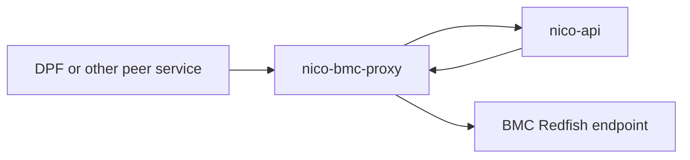
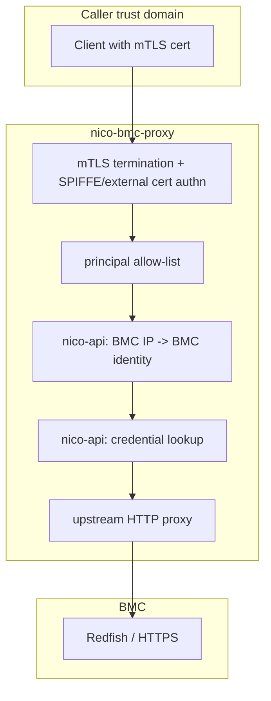
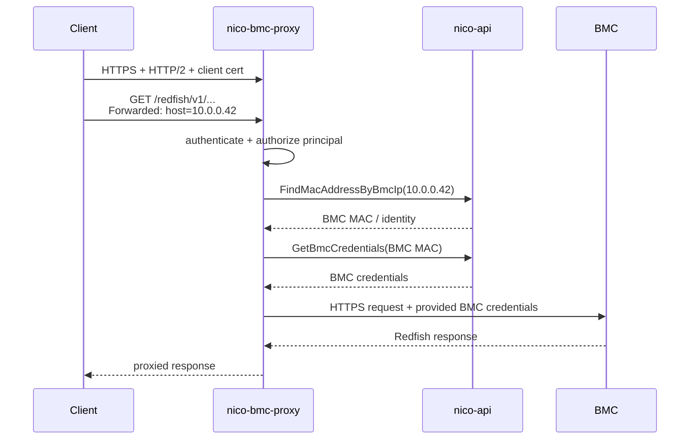

# nico-bmc-proxy

A small authenticated HTTP/2 proxy for BMC access:

- authenticates callers with mTLS
- authorizes callers by service principal
- maps `Forwarded: host=<bmc_ip>` to a known BMC through nico-api
- fetches the BMC's credentials from nico-api over gRPC
- proxies the HTTP request to the target BMC

The point is to keep BMC authentication and credential handling in one place, while allowing multiple higher-level systems to coexist as peers.

## Configuration

The binary is started with:

```bash
cargo run -p nico-bmc-proxy -- --config-path /path/to/bmc-proxy.toml
```

Important configuration fields:

- `listen`: proxy listen address, default `[::]:1079`
- `metrics_endpoint`: metrics listen address, default `[::]:1080`
- `allowed_principals`: authorized caller principals, for example `spiffe-service-id/<name>`
- `tls.*`: server certificate, key, and trust roots for mTLS
- `nico_api.*`: nico-api gRPC endpoint and mTLS material used for BMC IP resolution and `GetBmcCredentials`
- `auth.trust.*`: SPIFFE trust domain and allowed base paths
- `auth.acls`: per-principal ACL rules for HTTP method and path authorization
- `auth.cli_certs`: optional criteria for externally issued admin/client certs
- `bmc_proxy`: optional upstream override for dev/test chaining

Example shape:

```toml
listen = "[::]:1079"
metrics_endpoint = "[::]:1080"
allowed_principals = ["spiffe-service-id/dpf"]

[tls]
identity_pemfile_path = "/var/run/secrets/spiffe.io/tls.crt"
identity_keyfile_path = "/var/run/secrets/spiffe.io/tls.key"
root_cafile_path = "/var/run/secrets/spiffe.io/ca.crt"
admin_root_cafile_path = "/etc/nico/nico-bmc-proxy/site/admin_root_cert_pem"

[nico_api]
root_ca = "/var/run/secrets/spiffe.io/ca.crt"
client_cert = "/var/run/secrets/spiffe.io/tls.crt"
client_key = "/var/run/secrets/spiffe.io/tls.key"
api_url = "https://nico-api.nico-system.svc.cluster.local:1079"

[auth.trust]
spiffe_trust_domain = "nico.local"
spiffe_service_base_paths = ["/nico-system/sa/", "/default/sa/"]
spiffe_machine_base_path = "/nico-system/machine/"
additional_issuer_cns = []

[auth.acls]
"spiffe-service-id/dpf" = ["/redfish/v1/**"]
```

### `auth.acls`

`auth.acls` maps an authenticated principal to an ordered list of ACL entries:

```toml
[auth.acls]
"spiffe-service-id/nico-api" = ["/**"]
"spiffe-service-id/nv-dps" = [
  "GET /redfish/v1",
  "GET,POST /redfish/v1/Managers/BMC/NodeManager/Domains",
  "GET,PATCH,DELETE /redfish/v1/Managers/BMC/NodeManager/Domains/*",
]
```

Each ACL entry has the form:

```text
[!]VERB[,VERB...] /path/pattern
```

Rules:

- The leading `!` means deny. Without it, the entry allows.
- If the verb list is omitted, the entry matches any HTTP method.
- Entries are evaluated in order. The first matching entry wins.
- If no entry matches, the request is denied.
- ACLs are scoped per principal. A principal with no ACL list is denied.

Path matching syntax:

- Exact path components match literally.
- `*` matches exactly one path component.
- `prefix*` matches one path component with the given prefix.
- `*suffix` matches one path component with the given suffix.
- `**` matches zero or more path components.
- A single trailing slash does not create another path component. For example,
  `/redfish/v1/` matches `/redfish/v1`. Some clients include this slash when
  requesting the Redfish service root.
- A single `*` may appear by itself, at the beginning, or at the end of a path component.
  Valid: `/redfish/v1/Systems/*/SecureBoot/**`
  Valid: `/redfish/v1/Systems/system*/SecureBoot`
  Valid: `/redfish/v1/Systems/*Boot/SecureBoot`
  Invalid: `/redfish/v1/Systems/sys*tem/SecureBoot`
- At most one `**` is allowed in an ACL path.

Examples:

- `"/**"`
  Allow a principal to access any path with any method.
- `"GET /redfish/v1/**"`
  Allow only `GET` requests anywhere under `/redfish/v1`.
- `"!POST,PATCH /redfish/v1/Systems/*/SecureBoot/**"`
  Deny writes below any system's `SecureBoot` subtree.
- `"GET,POST /redfish/v1/Managers/BMC/NodeManager/Domains"`
  Allow both listing and creating node manager domains on the same path.

If you are translating endpoint docs into ACLs, replace templated path components such as
`{id}`, `{session_id}`, or `{policy_id}` with `*`.

## Request Classes

`[[class]]` tables group proxied requests that share an upstream budget and a
cache policy. Every request is classified after authorization: classes are
evaluated in order, and the first whose `match` patterns fit the request wins.
A request no class matches belongs to the implicit `default` class, which
keeps the proxy's historical 60 second upstream budget and caches nothing.

```toml
[[class]]
name = "inventory"
match = ["GET /redfish/v1/UpdateService/FirmwareInventory/**"]
upstream_timeout = "300s"

[class.cache]
ttl = "1h"
stale_while_revalidate = "6h"
stale_if_error = "24h"
invalidated_by = ["POST /redfish/v1/UpdateService/**"]

[[class]]
name = "default"
upstream_timeout = "90s"
```

| Field | Required | Default | Meaning |
| ----- | -------- | ------- | ------- |
| `name` | yes | — | Lowercase `snake_case`, at most 32 characters, unique. Appears as the `class` label on the proxy's cache metrics and as `bmc_proxy.class` on the request span. |
| `match` | yes, except for `default` | — | Patterns in the `[VERB[,VERB...]] /path/pattern` form ACL entries use, without the leading `!`. Any pattern matching admits the request to the class. |
| `principals` | no | any | Restricts the class to requests from these principal identifiers, for example `spiffe-service-id/nv-dps`. |
| `upstream_timeout` | no | `60s` | Total budget for one upstream exchange, as a duration such as `30s` or `5m`, at most `30m`. Streamed firmware uploads scale their own budget from the declared size and ignore it. |
| `cache` | no | none | Response cache policy for `GET` requests in the class; see below. |

The `default` class may be declared to change its budget, but it takes no
`match`, `principals`, or `cache`: it exists to catch what nothing else
matched, and what it catches includes resources whose live state must never
be served stale.

Classification is per request and internal to the proxy. Callers cannot see
or choose their class.

## Response Cache

A class with a `cache` table stores the body and headers of every eligible
`200` the BMC returns to a `GET` in that class: one whose query the cache keys
and whose body is unencoded and within the size limit, as the rules below
spell out. Entries are keyed by BMC, class, and request path (with its query,
and with a single trailing slash ignored). Later `GET`s for the same resource
are answered from the store according to three windows, all counted from the
moment the response was stored:

| Field | Required | Default | Meaning |
| ----- | -------- | ------- | ------- |
| `ttl` | yes | — | While younger than this, the stored response is served without asking the BMC. Must be greater than zero. |
| `stale_while_revalidate` | no | `0s` | After `ttl`, for this much longer the stored response is still served while one refresh runs in the background. |
| `stale_if_error` | no | `0s` | After `ttl`, for this much longer the stored response is served when the BMC fails to answer a fetch, or answers with a 5xx. |
| `invalidated_by` | no | any write | Write patterns that drop the class's stored responses for the written BMC. Omitted or empty means every write to the BMC does. |
| `hold_after_write` | no | `0s` | After an invalidating write, for this long `GET`s in the class for the written BMC are forwarded without the cache and nothing is stored. Use it for writes whose effect lands after the response, such as firmware updates that complete as a Task. |

Behavior that follows from the store:

- Concurrent misses for one resource share one upstream fetch, and that fetch
  runs on its own task: a caller that gives up waiting does not cancel it, so
  the next caller finds the response stored. This is what lets a resource that
  takes minutes to assemble, such as `FirmwareInventory` on a DGX H100, be
  served to callers whose own timeout is shorter.
- The fetch asks for one canonical representation, `Accept: application/json`
  with no content encoding, regardless of what the caller sent, so every
  caller can consume what one fetch stored. A response the BMC encodes anyway
  is forwarded but not stored.
- A refresh of a stored response sends its `ETag` as `If-None-Match`; a `304`
  keeps the stored body, adopts the headers the `304` carries, and restarts
  the age. A definitive client error on refresh, such as `404`, drops the
  stored response; `401`, `403`, `429`, and 5xx leave it in place.
- After a fetch yields nothing the store can hold, the resource is held off
  for 30 seconds and is not fetched through the cache again. After a failure
  or a 5xx, a stored response within its `stale_if_error` window is served
  instead; after an answer the store cannot hold (an oversized or encoded
  body, or a client error other than `404` or `410`), requests are forwarded
  directly so callers see what the BMC answers. Either way a BMC that fails
  fast or serves an unstorable resource is not asked through the cache once
  per client request.
- When a stored response within its `stale_if_error` window exists, a caller
  waits at most 10 seconds for the fetch before that response is served;
  the fetch continues on its own. A BMC slow to fail does not make callers
  wait out its budget.
- The cache runs at most 4 fetches against one BMC at a time; further
  fetches queue. A fetch outlives the caller that started it, so this bounds
  what a caller asking for many resources and leaving can pile onto a BMC.
- Only requests whose query is empty or made of Redfish's own parameters
  (`$expand`, `$select`, `$filter`, `$top`, `$skip`, `$skiptoken`, `only`,
  `excerpt`) are cached. A BMC ignores other parameters and answers the same
  resource, so caching them would let a caller mint unbounded entries; such
  requests are forwarded with `X-Nico-Cache: uncacheable`.
- A caller whose `If-None-Match` names the stored `ETag` receives `304 Not
  Modified` without the body being sent.
- `Cache-Control: no-cache`, `no-store`, or `max-age=0`, or `Pragma:
  no-cache`, on the request skips the stored response. The fetched response is
  still stored, unless the class is held after a write or the resource is
  held off after an unstorable fetch: the cache is shared and exists to
  protect the BMC, not to serve one caller's preference.
- A write (`POST`, `PUT`, `PATCH`, or `DELETE`) the BMC did not answer with a
  4xx drops the stored responses of every class whose `invalidated_by` it
  matches for that BMC, and starts that class's `hold_after_write` for the
  BMC. A write whose response was lost after it was sent counts as well; one
  the proxy could not send, because credentials could not be resolved or the
  request could not be built, does not.
- Only a `200` is stored, and only when its body is at most 8 MiB. A larger
  body is forwarded to its caller unstored, at the cost of a second upstream
  request for the caller that discovers it; for the hold-off that follows,
  requests for it are forwarded directly. A cache policy on resources with
  large payloads therefore adds BMC work instead of saving it.
- Stored headers never include `Set-Cookie`. The store is shared by every
  caller the ACL admits to the resource, and a cookie addresses one of them.
- Non-`GET` requests and classes without a `cache` table are forwarded and
  streamed back exactly as before.

Every `GET` in a class with a `cache` table carries `X-Nico-Cache` in its
response: `hit`, `stale`, `miss`, `coalesced`, `bypass`, `stale_if_error`,
`held`, or `uncacheable`, matching the `outcome` label of
`carbide_bmc_proxy_cache_lookups_total`. When a stored response is served the
response also carries `Age`, its age in seconds. The store is per proxy
replica and in memory, bounded to 256 MiB of response bodies.

Do not cache resources that carry live state a caller acts on. `Systems`,
`Chassis`, and `Managers` roots report `PowerState` and are read before power
actions; a stale value there is a safety problem, not a staleness one. The
`default` class cannot carry a cache policy for this reason. Firmware
inventory, processor, memory, and PCIe device collections are the intended
targets.

## Example Request

```bash
curl --http2 \
  --cert /path/to/tls.crt \
  --key /path/to/tls.key \
  -H 'Forwarded: host=192.168.192.8' \
  https://bmc-proxy.example/redfish/v1/Systems/Bluefield
```

The client chooses the BMC by IP. The proxy performs authentication, credential lookup, and backend authentication.

## Why?

We have at least two valid constraints at the same time:

1. NICo cannot assume it will be the only system that ever talks to BMC's.
2. We don't want to distribute BMC credentials to every system that needs BMC access

So an authenticating proxy makes it so any system needing to talk to BMC's can do so without needing to spread credentials around.

An alternative approach is to have nico-api be the only service that talks to BMC's, and have all operations on BMC's be implemented as high-level gRPC methods on nico-api. But this isn't really a scalable approach: there is other management software (such as [NVIDIA Domain Power Service (DPS)][DPS]) that cannot take a dependency on nico, and these systems need to coexist. So in order to support this without sharing BMC credentials, the idea is that each system should be configurable to use a general-purpose proxy for talking to BMC's, and nico-bmc-proxy is merely an implementation of this.

## What's Using It?

nico-api routes its own eligible BMC Redfish traffic through nico-bmc-proxy when its static `[bmc_proxy]` configuration section is enabled: machine-lifecycle traffic and the credentialed exploration of endpoints whose stored root credential is established. Credential-subject operations (credential setup, BMC session minting, password rotation, UEFI password management) and the other documented exceptions stay direct, so nico-api still holds BMC credentials. The routing contract, including every direct-path exception, is in [`crates/api-core/src/cfg/README.md`](../api-core/src/cfg/README.md#bmcproxyconfig--bmc_proxy).

We soon expect that [DPS] will support configuration of an authenticating proxy like this one, to manage power configuration on BMC's. DPS is a standalone service that should not have a direct dependency on nico-api. So nico-bmc-proxy serves an implementation of such a proxy, although any proxy that implements similar functionality can work.

Future work can move the remaining direct paths behind the proxy so that nico-api no longer holds BMC credentials at all.

## Architecture

Today, the proxy reuses existing NICo-adjacent building blocks:

- `nico-authn`: mTLS and SPIFFE principal extraction
- `nico-rpc`: nico-api gRPC client used for BMC IP resolution and credential lookup

### Dependency View



The important point in this picture is that both `nico-api` and external peers consume the same proxy. External peers never need BMC passwords. nico-api still holds them: it is the proxy's credential source, and its credential-subject operations dial BMCs directly.

### Trust Boundary View



The caller authenticates with a client certificate. If the caller is authorized, nico-bmc-proxy looks up the target BMC, retrieves the corresponding credentials, and performs the backend request itself.

### Request Sequence



## Future Direction

This crate is meant to implement a clean architectural boundary, but the implementation still couples to nico in slightly uncomfortable ways:

1. It's still a component of the infra-controller repo, so it's not fully independent
2. It expects nico-api to resolve proxied BMC IPs through `FindMacAddressByBmcIp`.
3. It expects nico-api to return credentials from `GetBmcCredentials` for every proxied BMC.

Point #1 doesn't really need to be solved, since there's no problem storing the crate in this repo and taking advantage of existing code. But future work can focus on making nico-bmc-proxy:

- Keep its own persisted configuration state, so that it can "own" IP-to-credentials lookups, rather than relying on nico-api's state
- Provide an admin/management API for setting/storing/rotating credentials (which nico-api can call when configuring hosts.)

At which point we can strip all BMC credential storage code out of nico-api and have it use this crate for BMC interaction.

[DPS]: https://docs.nvidia.com/datacenter/dps/versions/latest/
