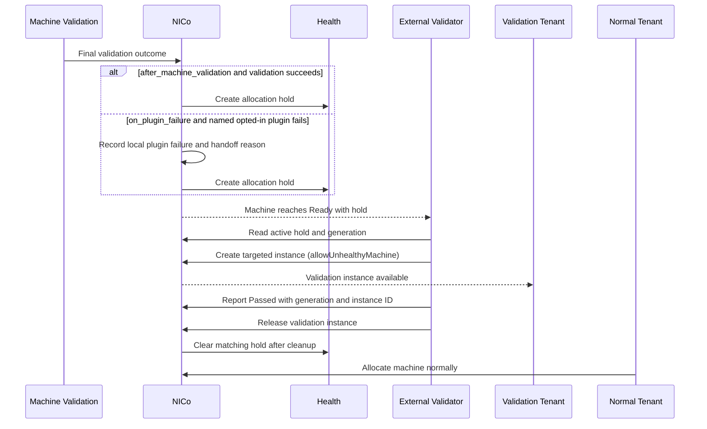

# External Validation Allocation Hold

## Software Design Document

## Revision History

| Version | Date | Modified By | Description |
| :---: | :---: | :---- | :---- |
| 0.1 | 2026-09-18 | Sunil Kumar | Initial draft |
|  |  |  |  |

# **1. Introduction**

Some sites need validation that does not fit inside normal Machine Validation.
For example, a service may need a different operating system image, a separate
network, or coordination with other machines. Once normal Machine Validation
finishes, however, the machine can become `Ready` and a normal tenant can claim
it before that external service has a chance to run.

This design lets NICo make a machine `Ready` while keeping it unavailable for
normal allocation until an authorized external validation workflow finishes.
The external workflow owns its test logic. NICo owns the allocation gate, the
machine lifecycle, and the audit trail.

## **1.1 Purpose**

The purpose of this document is to define a simple, generic way for a site to
run external validation before a machine is released for normal tenant use.

1. A site can require external validation for every eligible machine, or only
   when selected Machine Validation plugins fail.
2. Normal tenants cannot claim a machine while external validation is pending.
3. An authorized validation service can claim the held machine for its own
   validation instance.
4. Only a successful result followed by normal instance cleanup releases the
   machine for normal allocation.

## **1.2 Scope**

This SDD covers:

1. The site policy that selects when a machine needs external validation.
2. The health-based allocation hold created and owned by NICo.
3. The targeted validation-instance workflow for the external service.
4. Completion, retry, and recovery behavior.
5. Integration with pluggable Machine Validation tests.

This SDD does not cover:

1. The test logic, image, network, or workflow of an external validator.
2. Replacing the existing repair workflow.
3. Allowing ordinary tenants to bypass health or allocation checks.
4. Changing the Machine Validation plugin input/output contract.

# **2. Current State**

NICo already has the building blocks needed for this workflow:

| Capability | Current behavior | Use in this design |
| :--- | :--- | :--- |
| Health `Merge` override | Independent sources can add health alerts. | NICo creates one workflow-owned hold. |
| `PreventAllocations` | Blocks normal instance allocation. | Keeps the machine out of normal tenant allocation. |
| Targeted instance creation | A provider-authorized tenant can request one machine. | Lets the validation service claim the held machine. |
| `allowUnhealthyMachine` | A targeted request can proceed despite health allocation alerts when the machine is otherwise provisionable. | Allows the validation service to claim its held machine. |
| Instance release and cleanup | Releasing an instance returns the machine through normal cleanup and validation. | Ensures the validation instance is gone before normal allocation resumes. |
| Pluggable Machine Validation | Scout can run site-provided single-machine tests. | Provides local checks that can optionally trigger external validation. |

Today there is no workflow-specific state connecting these capabilities. An
external service can race with normal tenant allocation, and a passing external
result has no fenced, auditable way to release that allocation gate.

# **3. Design**

Each item below is marked **New** or **Changed**.

| Component | Change |
| :--- | :--- |
| Site policy | **New** — selects the machines and trigger for external validation. |
| NICo hold state | **New** — records the allocation hold, its generation, and validation-cycle state. |
| Health | **Changed** — NICo writes a dedicated `Merge` health override with `PreventAllocations`. |
| External validation API | **New** — lets the configured service read, complete, retry, or recover a hold. |
| Targeted instance workflow | **Reused** — the configured validation tenant creates an instance for the held machine. |
| Machine Validation | **Changed** — opted-in plugin failures can hand off to external validation without making the machine normally allocatable. |

## **3.1 Site Policy**

The policy is site-scoped. It selects eligible machines using the site's normal
Machine Validation context or machine-group selection. It also defines the
validation identity, timeout, audit destination, and the dedicated health source
and alert ID.

The policy has two trigger values:

| Trigger | NICo creates a hold | Use when |
| :--- | :--- | :--- |
| `after_machine_validation` | Normal Machine Validation succeeds. | Every eligible machine needs external validation. |
| `on_plugin_failure` | The named, opted-in plugin test fails. | Local plugin checks are the first screen and external validation is an escalation. |

The following is an illustrative site configuration for every eligible machine:

```toml
[machine_validation_config.external_validation_hold]
enabled = true
contexts = ["Discovery"]
trigger = "after_machine_validation"
health_report_source = "external-validation-hold"
alert_id = "ExternalValidationRequired"
claim_timeout = "24h"
```

For failure-only validation, the site selects the second trigger:

```toml
[machine_validation_config.external_validation_hold]
enabled = true
contexts = ["Discovery"]
trigger = "on_plugin_failure"
plugin_id = "gpu-health"
health_report_source = "external-validation-hold"
alert_id = "ExternalValidationRequired"
claim_timeout = "24h"
```

The final configuration API must make the selected scope explicit; it must not
enable the policy for every machine by default.

For `on_plugin_failure`, the plugin definition itself declares whether its
failure can hand off to external validation. For example:

```toml
[machine_validation_plugin]
id = "gpu-health"
external_validation_on_failure = true
```

This property belongs to the immutable, verified plugin revision, alongside its
execution settings. The policy names the exact catalog `plugin_id` that may
handoff. A site must enable both the named plugin revision and the
failure-triggered external-validation policy before the plugin can cause a
handoff. Plugin IDs are used because they are stable; display names are not
used for authorization or policy matching.

## **3.2 Allocation Hold**

When the policy trigger occurs, NICo creates a workflow-owned health override.
Its logical form is:

```json
{
  "source": "external-validation-hold",
  "mode": "Merge",
  "alerts": [
    {
      "id": "ExternalValidationRequired",
      "classifications": ["PreventAllocations"]
    }
  ]
}
```

`PreventAllocations` makes normal tenant allocation reject the machine. The
machine can still be `Ready`: `Ready` means lifecycle-ready, while the health
alert controls normal allocation eligibility. The dedicated source ensures this
workflow does not replace alerts from monitoring, maintenance, repair, or other
external integrations.

NICo records a generation and state for every hold. The generation fences a
completion request so an old result cannot release a later retry.

## **3.3 External Validation Flow**

The external-validation path starts only when one of the configured policy
triggers matches:



The external service does not create or remove the health override. Its normal
workflow is:

1. Observe a `Ready` machine and read its active external-validation hold.
2. Create a targeted validation instance for that exact machine using the
   configured validation tenant and `allowUnhealthyMachine: true`.
3. Run its own validation in that instance.
4. Report `Passed`, `Failed`, or `Cancelled` with the machine ID, hold
   generation, and validation instance ID.
5. On `Passed`, release the validation instance. NICo clears the matching hold
   only after normal cleanup returns the machine to `Ready`.

NICo provides these workflow APIs:

| API | Purpose |
| :--- | :--- |
| `GetExternalValidationHold(machine_id)` | Returns the active hold, generation, state, and validation instance ID. |
| `CompleteExternalValidationHold(machine_id, generation, validation_instance_id, outcome, details)` | Records the result for the active claimed hold. |
| `RetryExternalValidationHold(machine_id)` | Starts a new generation after failure, cancellation, or timeout. |
| `RemoveExternalValidationHold(machine_id, generation, reason)` | Audited break-glass recovery; not the normal completion path. |

`Failed`, `Cancelled`, a timeout, or a failed cleanup leaves the hold in place.
NICo never treats a missing result or a deleted validation instance as success.

## **3.4 Plugin Failure Handoff**

Normally, a failed Machine Validation test fails the run and the machine does
not become `Ready`. That remains the default.

With `on_plugin_failure`, NICo evaluates the final Machine Validation
outcome. It creates a hold and allows the machine to become `Ready` with that
hold only when every failed test is the plugin named by `plugin_id`, that
plugin revision has `external_validation_on_failure: true`, and no framework
error or timeout occurred. The local failure is recorded; it is not treated as
local success. A normal tenant remains blocked until the external workflow
passes and the validation instance is released.

This preserves the existing Machine Validation behavior for unrelated test
failures and prevents an approved plugin failure from concealing another
failure.

## **3.5 Validation Cycle and Retry**

NICo ties the hold to the machine's pre-allocation validation cycle. A cycle
starts for a new discovery or reprovisioning lifecycle.

After a passing external result and successful validation-instance cleanup,
NICo clears the matching hold and marks that cycle satisfied. The Machine
Validation run caused by releasing the validation instance sees the satisfied
cycle and does not create another hold. A later discovery or reprovisioning
cycle resets the state and may require external validation again.

Only one validation instance can claim a hold generation. Completion is
idempotent for the same generation, instance ID, and result. A retry creates a
new generation, so older results cannot affect it.

# **4. Security and Compatibility**

- Only NICo creates, reconciles, and normally clears this hold.
- The site configures a validation identity that can make targeted claims and
  submit results. Normal tenants cannot use this workflow.
- The initial design uses `allowUnhealthyMachine`. Because that capability
  bypasses health allocation alerts broadly, it must be granted only to a
  site-controlled validation tenant, never a normal tenant. A later narrower
  capability can limit the bypass to this hold source.
- A completion request must match the active hold generation and validation
  instance ID, and all creation, claim, completion, timeout, retry, and recovery
  actions are auditable.
- Existing Machine Validation tests and the repair workflow keep their current
  behavior unless a site explicitly enables this policy. The design does not
  change the Machine Validation plugin contract or normal tenant allocation.
