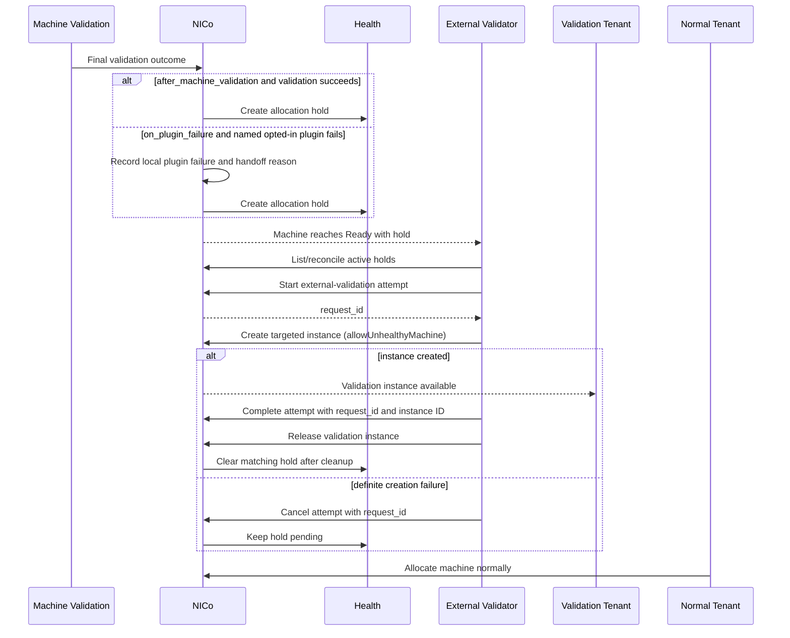

# External Validation Allocation Hold

## Software Design Document

## Revision History

| Version | Date | Modified By | Description |
| :---: | :---: | :---- | :---- |
| 0.1 | 2026-09-18 | Sunil Kumar | Initial draft |
| 0.2 | 2026-09-27 | Sunil Kumar | Add explicit-state alternative reference |
| 0.3 | 2026-09-28 | Sunil Kumar | Define phased API and event delivery |
| 0.4 | 2026-09-28 | Sunil Kumar | Define durable workflow, recovery, and security boundaries |
| 0.5 | 2026-09-28 | Sunil Kumar | Clarify targeted-instance caller and ownership |
| 0.6 | 2026-09-28 | Sunil Kumar | Define attempt idempotency and durable request recovery |
|  |  |  |  |

# **1. Introduction**

Some sites need validation that does not fit inside normal Machine Validation.
For example, a service may need a different operating system image, a separate
network, or coordination with other machines. Once normal Machine Validation
finishes, however, the machine can become `Ready` and a normal tenant can claim
it before that external service has a chance to run.

This design lets NICo make a machine `Ready` while keeping it unavailable for
normal allocation until an authorized external validation workflow finishes.
External validation is not a NICo-managed machine state: NICo manages the
allocation hold, normal lifecycle, and audit trail, while the authorized
external-validation tenant claims the `Ready` machine and performs its own
detailed validation or repair work.

## **1.1 Purpose**

The purpose of this document is to define a simple, generic way for a site to
run external validation before a machine is released for normal tenant use.

1. A site can require external validation for every eligible machine, or only
   when selected Machine Validation plugins fail.
2. Normal tenants cannot claim a machine while external validation is pending.
3. An authorized validation service can claim the held machine for its own
   validation instance.
4. Only a successful result followed by normal instance cleanup releases the
   machine for normal allocation.

## **1.2 Scope**

This SDD covers:

1. The site policy that selects when a machine needs external validation.
2. The health-based allocation hold created and owned by NICo.
3. The targeted validation-instance workflow for the external service.
4. Completion, retry, and recovery behavior.
5. Integration with pluggable Machine Validation tests.

This SDD does not cover:

1. The test logic, image, network, or workflow of an external validator.
2. Replacing the existing repair workflow.
3. Allowing ordinary tenants to bypass health or allocation checks.
4. Changing the Machine Validation plugin input/output contract.

## **1.3 Assumption: External Tenant Allocation**

The external-validation team continues to use the existing targeted-instance
allocation feature to allocate a held machine into its site-controlled tenant.
NICo keeps the machine in `Ready` so this allocation can use the current
workflow; the team then performs its external validation or repair work inside
that tenant's instance. The team must use `allowUnhealthyMachine: true` because
NICo's `PreventAllocations` hold remains active until the workflow completes.

# **2. Current State**

NICo already has the building blocks needed for this workflow:

| Capability | Current behavior | Use in this design |
| :--- | :--- | :--- |
| Health `Merge` override | Independent sources can add health alerts. | NICo creates one workflow-owned hold. |
| `PreventAllocations` | Blocks normal instance allocation. | Keeps the machine out of normal tenant allocation. |
| Targeted instance creation | A provider-authorized tenant can request one machine, but the machine must be in the controller's `Ready` state. | Lets the validation service claim the held machine without introducing a new lifecycle state. |
| `allowUnhealthyMachine` | A targeted request can proceed despite health allocation alerts when the machine is otherwise provisionable; it does not allow allocation from another managed state. | Allows the validation service to claim its held machine while the health hold remains in place. |
| Instance release and cleanup | Releasing an instance returns the machine through normal cleanup and validation. | Ensures the validation instance is gone before normal allocation resumes. |
| Pluggable Machine Validation | Scout can run site-provided single-machine tests. | Provides local checks that can optionally trigger external validation. |

Today there is no workflow-specific state connecting these capabilities. An
external service can race with normal tenant allocation, and a passing external
result has no fenced, auditable way to release that allocation gate.

In particular, `allowUnhealthyMachine` relaxes health eligibility only. It does
not relax the managed-state requirement: targeted instance creation still starts
from `Ready`, not from `Failed`, `Validation`, or a proposed
`ExternalValidation` state. Keeping the machine `Ready` is intentional: it lets
the authorized external-validation tenant claim the machine through the existing
targeted-instance flow and then perform its detailed validation or repair work.
The `PreventAllocations` health hold blocks normal tenants during that work.

# **3. Design**

Each item below is marked **New** or **Changed**.

| Component | Change |
| :--- | :--- |
| Site policy | **New** — selects the machines and trigger for external validation. |
| NICo hold state | **New** — records the allocation hold, validation-cycle state, and active attempt. |
| Health | **Changed** — NICo writes a dedicated `Merge` health override with `PreventAllocations`. |
| External validation API | **New** — lets the configured service list, start, complete, and recover validation attempts. |
| Targeted instance workflow | **Reused** — the configured validation tenant creates an instance for the held machine. |
| Machine Validation | **Changed** — opted-in plugin failures can hand off to external validation without making the machine normally allocatable. |

## **3.1 Site Policy**

The policy is site-scoped. It selects eligible machines using the site's normal
Machine Validation context or machine-group selection. It also defines the
validation identity, timeout, audit destination, and the dedicated health source
and alert ID.

The policy has two trigger values:

| Trigger | NICo creates a hold | Use when |
| :--- | :--- | :--- |
| `after_machine_validation` | Normal Machine Validation succeeds. | Every eligible machine needs external validation. |
| `on_plugin_failure` | The named, opted-in plugin test fails. | Local plugin checks are the first screen and external validation is an escalation. |

The following is an illustrative site configuration for every eligible machine:

```toml
[machine_validation_config.external_validation_hold]
enabled = true
contexts = ["Discovery"]
trigger = "after_machine_validation"
validation_tenant_id = "external-validation"
validation_service_identity = "external-validation-service"
health_report_source = "external-validation-hold"
alert_id = "ExternalValidationRequired"
claim_timeout = "24h"
attempt_timeout = "8h"
cleanup_timeout = "1h"
```

For failure-only validation, the site selects the second trigger:

```toml
[machine_validation_config.external_validation_hold]
enabled = true
contexts = ["Discovery"]
trigger = "on_plugin_failure"
plugin_id = "gpu-health"
validation_tenant_id = "external-validation"
validation_service_identity = "external-validation-service"
health_report_source = "external-validation-hold"
alert_id = "ExternalValidationRequired"
claim_timeout = "24h"
attempt_timeout = "8h"
cleanup_timeout = "1h"
```

The final configuration API must make the selected scope explicit; it must not
enable the policy for every machine by default.

Only one external-validation policy may match a machine for one validation
cycle. NICo rejects ambiguous configuration at validation time rather than
creating competing holds. `validation_tenant_id` and
`validation_service_identity` identify the dedicated tenant and service that
are permitted to run this workflow. The tenant must not be used for ordinary
customer workloads.

For `on_plugin_failure`, the plugin definition itself declares whether its
failure can hand off to external validation. For example:

```toml
[machine_validation_plugin]
id = "gpu-health"
external_validation_on_failure = true
```

This property belongs to the immutable, verified plugin revision, alongside its
execution settings. The policy names the exact catalog `plugin_id` that may
handoff. A site must enable both the named plugin revision and the
failure-triggered external-validation policy before the plugin can cause a
handoff. Plugin IDs are used because they are stable; display names are not
used for authorization or policy matching.

## **3.2 Allocation Hold**

When the policy trigger occurs, NICo creates a workflow-owned health override.
Its logical form is:

```json
{
  "source": "external-validation-hold",
  "mode": "Merge",
  "alerts": [
    {
      "id": "ExternalValidationRequired",
      "classifications": ["PreventAllocations"]
    }
  ]
}
```

`PreventAllocations` makes normal tenant allocation reject the machine. The
machine can still be `Ready`: `Ready` means lifecycle-ready, while the health
alert controls normal allocation eligibility. The dedicated source ensures this
workflow does not replace alerts from monitoring, maintenance, repair, or other
external integrations.

NICo records durable state for every hold and its active attempt. The attempt's
opaque `request_id` fences completion, so an old result cannot release a later
retry.

### **3.2.1 Atomic Gate and Durable State**

Creating a hold is part of making a machine available for the external
workflow. NICo must persist the hold record and its `PreventAllocations` health
override before, or atomically with, the transition that makes the host
`Ready`. A transition must never commit a normally allocatable `Ready` host and
write the hold later. The same transaction also records the validation cycle
and policy that caused the handoff.

The durable model is conceptually:

```text
ExternalValidationHold
  hold_id
  machine_id
  validation_cycle_id
  policy_id
  trigger_reason
  state                  // Pending, AttemptOpen, AwaitingCleanup, Satisfied, Recovery
  created_at
  active_attempt_id      // optional

ExternalValidationAttempt
  request_id
  hold_id
  validation_service_identity
  caller_idempotency_key
  state                  // Open, Passed, Failed, Cancelled, TimedOut
  opened_at
  timeout_at
  validation_instance_id // optional until NICo observes the target instance
  result_details         // optional, bounded
```

There is at most one active hold for a machine and validation cycle, and at
most one open attempt for a hold. `hold_id` remains stable for the cycle;
`request_id` changes for every attempt. NICo stores this state independently
of the health override so it can reconcile a missing override and retain the
audit record after clearing it.

NICo enforces these invariants in the database: a partial unique constraint
permits only one `Open` attempt per `hold_id`, and the pair
`(validation_service_identity, caller_idempotency_key)` is unique. Attempt
creation locks the hold and inserts the attempt in the same transaction. These
constraints, rather than client timing, decide which concurrent `Start` call
wins.

The timeout fields have distinct meanings:

- `claim_timeout` is the maximum time a new `Pending` hold can wait for the
  service to start an attempt. Expiry raises an audit/operational signal but
  does not clear the allocation hold.
- `attempt_timeout` bounds an `AttemptOpen` attempt, including failure to
  create a target instance. Expiry closes that attempt as `TimedOut` and
  returns the hold to `Pending` only when no live validation instance exists.
- `cleanup_timeout` bounds `AwaitingCleanup` after a terminal result. On
  expiry NICo keeps the hold in place and raises recovery; it must not start a
  second attempt while the prior validation instance or its cleanup remains
  unresolved.

## **3.3 External Validation Flow**

The external-validation path starts only when one of the configured policy
triggers matches:


```mermaid
sequenceDiagram
    participant MV as Machine Validation
    participant NICo
    participant Health
    participant Validator as External Validator
    participant Tenant as Validation Tenant
    participant Normal as Normal Tenant

    MV->>NICo: Final validation outcome
    alt after_machine_validation and validation succeeds
        NICo->>Health: Create allocation hold
    else on_plugin_failure and named opted-in plugin fails
        NICo->>NICo: Record local plugin failure and handoff reason
        NICo->>Health: Create allocation hold
    end
    NICo-->>Validator: Machine reaches Ready with hold
    Validator->>NICo: List/reconcile active holds
    Validator->>NICo: Start external-validation attempt
    NICo-->>Validator: request_id
    Validator->>NICo: Create targeted instance (allowUnhealthyMachine)
    alt instance created
        NICo-->>Tenant: Validation instance available
        Validator->>NICo: Complete attempt with request_id and instance ID
        Validator->>NICo: Release validation instance
        NICo->>Health: Clear matching hold after cleanup
    else definite creation failure
        Validator->>NICo: Cancel attempt with request_id
        NICo->>Health: Keep hold pending
    end
    Normal->>NICo: Allocate machine normally
```

The external service does not create or remove the health override. Its Phase 1
workflow is:

1. List and reconcile active external-validation holds. This is the
   authoritative discovery path, including after service restart or missed
   notifications.
2. Call `StartExternalValidation(machine_id, caller_idempotency_key)` for a
   pending hold. NICo opens one attempt and returns an opaque `request_id`; an
   already-open attempt is not opened again.
3. Create a targeted validation instance for that exact machine using the
   configured validation tenant and `allowUnhealthyMachine: true`.
4. If targeted instance creation definitively fails before an instance exists,
   call `CancelExternalValidation` with the `request_id`. For an ambiguous
   create result, reconcile the active hold first; do not cancel an instance
   that may have been created.
5. Run its own validation or repair work in that instance.
6. Call `CompleteExternalValidation` with the `request_id`, validation instance
   ID, and `Passed`, `Failed`, or `Cancelled` outcome.
7. On `Passed`, release the validation instance. NICo clears the matching hold
   only after normal cleanup returns the machine to `Ready`.

NICo provides these workflow APIs:

| API | Purpose |
| :--- | :--- |
| `ListExternalValidationHolds()` | Returns all active holds and their current attempt status. This is the authoritative discovery and recovery API. |
| `StartExternalValidation(machine_id, caller_idempotency_key)` | Opens an attempt for a pending hold and returns an opaque `request_id`. It reports no active hold or an already-open attempt without creating another one. |
| `CancelExternalValidation(request_id, details)` | Closes an active attempt before a validation instance has been created. It is idempotent and leaves the hold in place. |
| `CompleteExternalValidation(request_id, outcome, details, validation_instance_id)` | Records a result only for the matching active attempt. Replaying the same completion is idempotent; an old or closed `request_id` is rejected. |
| `RemoveExternalValidationHold(machine_id, reason)` | Audited break-glass recovery; not the normal completion path. |

### **3.3.1 Phase 1 API Contract**

The configured external-validation service is the only non-NICo caller of
`ListExternalValidationHolds`, `StartExternalValidation`,
`CancelExternalValidation`, and `CompleteExternalValidation`. Its identity is authorized for its configured
site and validation tenant only. It cannot create, modify, or clear the NICo
health override. `RemoveExternalValidationHold` is an administrator-only,
audited break-glass operation.

All hold and attempt mutations are persisted and auditable. The API responses
below are the external service's durable contract; DSX Exchange events are not
required for Phase 1 correctness.

Phase 1 deliberately reuses the existing targeted-instance API, which does not
carry an external-validation `request_id`. `StartExternalValidation` is an
audited attempt reservation and completion fence; it is not an allocator-side
authorization token. The dedicated validation tenant and service identity are
therefore the Phase 1 trust boundary and must not be shared with ordinary
workloads. A later hardening phase may add a validation-specific targeted
allocation capability that binds target creation to the active `request_id`.

#### **ListExternalValidationHolds**

The service calls this on startup and periodically thereafter. It returns every
active hold in its authorized scope, with pagination for large sites. Each item
includes:

```text
machine_id
hold_id                     // stable for this external-validation cycle
hold_state                  // Pending, AttemptOpen, AwaitingCleanup, Satisfied, or Recovery
request_id                  // present for an open or cleanup-pending attempt
validation_instance_id      // present when NICo observes the targeted instance
created_at
attempt_timeout_at          // present only when an attempt is open
```

The `validation_instance_id` is present when NICo observes a targeted instance
on the held machine; this lets the service recover an attempt whose instance
was created before the service restarted. The service uses this response to
discover work after restart and decide whether to start a new attempt or
resume/inspect an existing one. It must not infer that every `Ready` machine
requires external validation.

#### **StartExternalValidation**

Request:

```text
machine_id
caller_idempotency_key    // caller-generated UUID, retained across retries
```

NICo verifies that the caller is the configured validation identity, the
machine is in the caller's site, the machine is `Ready`, and an active hold
exists. It then atomically opens one attempt, generates and persists an opaque
`request_id`, and returns:

```text
status: Opened
request_id
machine_id
hold_id
attempt_timeout_at
```

If the caller retries after a timeout or service restart and the attempt is
already open with the same `caller_idempotency_key`, NICo returns the originally
persisted `request_id`; it does not create a second attempt. A different key
while an attempt is open returns `status: AlreadyOpen` with that active request
and its status. If the hold has been cleared or is not eligible, NICo returns
`status: NoActiveHold`. Once a failed, cancelled, or timed-out attempt is
closed, a subsequent start with a new idempotency key opens a new attempt with
a new `request_id`.

The external service must persist the `caller_idempotency_key` before calling
`StartExternalValidation` and persist the returned `request_id` before creating
the targeted instance. If it crashes between either step, it calls `Start` again
with the same key or uses `ListExternalValidationHolds()` to recover the durable
active `request_id`. NICo never relies on an in-memory request ID.

#### **Targeted Instance Caller and Ownership**

The caller of targeted instance creation is the configured
`validation_service_identity`, operated by the external-validation team. NICo
does not create the instance and does not invoke the external team's API on its
behalf. The service calls the existing targeted-instance creation API with the
held `machine_id`, requests placement in `validation_tenant_id`, and sets
`allowUnhealthyMachine: true`. `StartExternalValidation` does not allocate the
machine and does not remove the hold. If targeted instance creation cannot
proceed before an instance exists, the service calls
`CancelExternalValidation`; the hold remains in place. If creation has an
ambiguous result, the service reconciles the hold rather than cancelling. It
may rely on `attempt_timeout` only when it cannot determine whether an
instance was created.

The resulting instance belongs to `validation_tenant_id`; that tenant is the
execution environment for the external team's validation or repair work. The
external-validation service owns the operational lifecycle of that instance:
it waits for it to become usable, runs the work, reports the outcome through
`CompleteExternalValidation`, and releases the instance. NICo owns the host
lifecycle and hold only. On completion, NICo verifies that the supplied
instance is assigned to the held machine and belongs to the configured
validation tenant.

#### **CompleteExternalValidation**

Request:

```text
request_id
validation_instance_id
outcome                     // Passed, Failed, or Cancelled
details                     // bounded diagnostic text and/or result reference
```

NICo verifies that the request is active, belongs to the caller's site and
validation tenant, and that `validation_instance_id` is the targeted instance
for the held machine. A completion with an old request ID, a different tenant,
or a different machine is rejected. Replaying an identical completion is
idempotent; a conflicting second completion is rejected.

`Passed` records the result but does not immediately clear the hold. The
external service must release the validation instance, and NICo clears the hold
only after normal instance cleanup returns the machine to `Ready`. `Failed` or
`Cancelled` likewise requires the service to release any validation instance.
After that cleanup, the hold returns to `Pending` for operator action or a
later retry. If the instance disappears unexpectedly, or cleanup fails, NICo
keeps the hold and enters recovery rather than treating the attempt as success.

`Failed`, `Cancelled`, a timeout, or a failed cleanup leaves the hold in place.
NICo never treats a missing result or a deleted validation instance as success.

#### **CancelExternalValidation**

Request:

```text
request_id
details                     // bounded reason for pre-allocation cancellation
```

This API represents a definite targeted-instance creation failure before a
`validation_instance_id` exists. NICo verifies that the request is active,
belongs to the caller's site and validation tenant, and has no associated
validation instance. It atomically records `Cancelled`, closes the attempt,
and keeps the hold in `Pending`. Replaying the same cancellation is idempotent;
an old request, a different caller, or an attempt with an instance is rejected.

The service must not use this API after an ambiguous create result. It first
reconciles the hold and either resumes the discovered instance or waits for the
attempt timeout, so it cannot cancel an attempt that may already own a machine.

## **3.4 Plugin Failure Handoff**

Normally, a failed Machine Validation test fails the run and the machine does
not become `Ready`. That remains the default.

With `on_plugin_failure`, NICo evaluates the final Machine Validation
outcome. It creates a hold and allows the machine to become `Ready` with that
hold only when every failed test is the plugin named by `plugin_id`, that
plugin revision has `external_validation_on_failure: true`, and no framework
error or timeout occurred. The local failure is recorded; it is not treated as
local success. A normal tenant remains blocked until the external workflow
passes and the validation instance is released.

This preserves the existing Machine Validation behavior for unrelated test
failures and prevents an approved plugin failure from concealing another
failure.

After external validation reports `Passed` and its instance is released, the
same validation cycle must not simply re-run into the original approved plugin
failure and park the host in `Failed`. NICo records an external-validation
waiver for that exact cycle, plugin ID, and immutable plugin revision. During
the post-release Machine Validation pass, that triggering plugin is treated as
externally satisfied for the cycle; all other tests continue to run normally.
Any framework error, timeout, or failure from a different plugin still fails
the machine. A new discovery or reprovisioning cycle clears the waiver and
requires normal validation again.

## **3.5 Validation Cycle and Retry**

NICo ties the hold to the machine's pre-allocation validation cycle. A cycle
starts for a new discovery or reprovisioning lifecycle.

After a passing external result and successful validation-instance cleanup,
NICo clears the matching hold and marks that cycle satisfied. The Machine
Validation run caused by releasing the validation instance sees the satisfied
cycle and does not create another hold. A later discovery or reprovisioning
cycle resets the state and may require external validation again.

The hold and attempt lifecycle is:

```text
Pending
  → AttemptOpen
  → AwaitingCleanup
      → Satisfied    (Passed result and successful instance cleanup)
      → Pending      (Failed or Cancelled result and successful cleanup)

AttemptOpen → Pending       (TimedOut with no live validation instance)
AttemptOpen → Pending       (Cancelled before validation-instance creation)
AwaitingCleanup → Recovery  (instance loss, cleanup failure, or cleanup timeout)
```

Only one validation instance can claim an active attempt. Completion is
idempotent for the same `request_id`, instance ID, and result. A retry starts a
new attempt with a new `request_id`, so older results cannot affect it. NICo
does not open a retry while the previous attempt is in `AwaitingCleanup` or
`Recovery`.

## **3.6 Phased Delivery**

### **Phase 1: API-driven workflow**

Phase 1 delivers the complete, correct external-validation workflow without a
new DSX Exchange event contract. NICo creates and owns the
`PreventAllocations` hold while keeping the machine in `Ready`. The
site-controlled external-validation service uses
`ListExternalValidationHolds()` to discover and reconcile pending work, then
uses `StartExternalValidation(machine_id, caller_idempotency_key)` to obtain a
`request_id` before creating a targeted instance with
`allowUnhealthyMachine: true`.

The service performs its validation or repair work inside that tenant instance
and calls `CompleteExternalValidation()` with the same `request_id`. NICo
retains the hold until a passing result and normal instance cleanup have both
completed. API-based discovery is mandatory in this phase: it lets the service
recover after restart and remains correct even if it has not observed a machine
state notification.

### **Phase 2: DSX Exchange event enrichment**

Phase 2 improves the common event-driven path but does not replace Phase 1
reconciliation. NICo already publishes managed-host state changes to the DSX
Exchange MQTT topic. The current payload contains the machine ID, timestamp,
and managed state only. This phase adds optional external-validation-hold
metadata to the `Ready` event, for example whether a hold is active and a
stable hold/cycle identifier.

The external-validation service can then ignore ordinary `Ready` events without
an API lookup and start work promptly when the event carries an active hold.
Implementing this phase requires an AsyncAPI contract update and matching NICo
state-change publisher and periodic-republisher changes. `ListExternalValidationHolds()`
remains the source of truth for service startup, missed events, and
out-of-order delivery.

# **4. Security and Compatibility**

- Only NICo creates, reconciles, and normally clears this hold.
- The site configures a validation identity that can make targeted claims and
  submit results. Normal tenants cannot use this workflow.
- The initial design uses `allowUnhealthyMachine`. Because that capability
  bypasses health allocation alerts broadly, it must be granted only to a
  dedicated, site-controlled validation tenant and service identity, never a
  normal tenant. Phase 1 does not make the active hold an allocator-side
  requirement; this is an explicit trust-boundary tradeoff. A later narrower
  capability can bind target creation to the active hold and `request_id`.
- A completion request must match the active `request_id` and validation
  instance ID, and all creation, claim, completion, timeout, retry, and recovery
  actions are auditable.
- Hold creation and the transition to a held `Ready` machine are atomic, so a
  normal tenant cannot allocate the machine in a gap before the health gate is
  present.
- Existing Machine Validation tests and the repair workflow keep their current
  behavior unless a site explicitly enables this policy. The design does not
  change the Machine Validation plugin contract or normal tenant allocation.

# **5. Design Reference: Explicit `ExternalValidation` State**

A dedicated `ExternalValidation` state was considered as an alternative to
returning a host to `Ready` with a `PreventAllocations` allocation hold. It is
a valid future lifecycle model:

```text
Validation / ExternalValidation / WaitingForClaim
  → Assigned / ExternalValidationInstanceRunning
  → Validation / ExternalValidation / AwaitingResult
  → Ready
```

This model has a clear ownership boundary: NICo keeps the host in validation
until the external workflow has completed, so normal tenant allocation is never
admitted merely because the host is lifecycle-ready.

It cannot, however, remain in `ExternalValidation` for the whole workflow. The
external validator runs through targeted instance creation using a
site-controlled tenant. That is still a normal NICo-managed instance
allocation; while that instance exists, the host must use the existing
`Assigned` lifecycle for network configuration, boot, instance cleanup, and
release.

Using this alternative would therefore require a separate, cross-cutting
allocation and lifecycle implementation:

1. **Allocation from validation.** Current targeted allocation, including
   `allowUnhealthyMachine`, admits a host only when its managed state is
   `Ready`. The alternative needs a narrowly authorized allocation route from
   `Validation / ExternalValidation / WaitingForClaim`; ordinary tenants must
   remain rejected.

2. **Atomic claim and assignment.** That route must atomically verify the
   validation tenant, site, machine, and active external-validation request,
   create exactly one instance, record its claim, and move the host into
   `Assigned / ExternalValidationInstanceRunning`.

3. **Context across `Assigned`.** The request identity and external-validation
   context must survive the existing `Assigned` lifecycle so that instance
   deletion can resume the correct validation operation.

4. **Non-standard release.** Normal instance release converges toward
   `Ready`. The alternative must instead return the host to
   `Validation / ExternalValidation / AwaitingResult`, where NICo accepts a
   matching result and chooses `Ready`, retry, or `Failed`.

5. **Recovery and policy changes.** Controller restart recovery,
   instance-delete recovery, timeouts, RBAC, audit, and observability must all
   understand this validation-to-assignment path.

The explicit-state model is therefore architecturally sound, but it is broader
than required for the initial use case. The selected allocation-hold design
reuses the existing targeted-instance and `Assigned` lifecycle. NICo creates
the hold before normal allocation can proceed, keeps ordinary tenants blocked,
and permits only the configured validation tenant to claim the machine with the
existing targeted allocation capability. A future implementation can adopt the
explicit-state model if external validation becomes a first-class lifecycle
capability.
