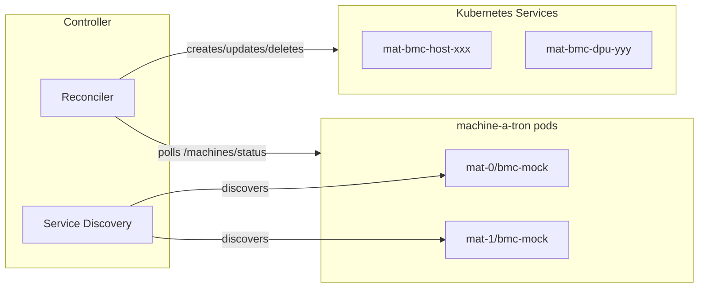

# Machine-a-tron Kubernetes Controller

Kubernetes controller that auto-discovers machine-a-tron pods and creates
Services for mock BMC endpoints.

## Features

- Auto-discovers machine-a-tron pods via `nvidia-infra-controller/mat-service=true`
  label
- Creates ClusterIP Services with BMC IP for each mock BMC that has reported
  one; devices still waiting for DHCP are skipped until their BMC IP is known,
  so the API server never picks an arbitrary ClusterIP for them
- Supports Redfish (TCP 443), IPMI (UDP 623), and per-machine SSH ports
- IPMI and SSH ports are dynamically added when machine-a-tron reports their endpoints in status
- Multi-pod deployments with pod-specific routing
- Automatic cleanup of stale Services

## Build

```bash
docker build -t mat-k8s-controller:latest .
kind load docker-image mat-k8s-controller:latest --name <cluster>
```

## Configuration

| Flag | Env Var | Default | Description |
|------|---------|---------|-------------|
| `--namespace` | `NAMESPACE` | `nico-system` | Kubernetes namespace |
| `--discovery-selector` | `DISCOVERY_SELECTOR` | `nvidia-infra-controller/mat-service=true` | Label selector for discovery |
| `--sync-interval` | `SYNC_INTERVAL` | `30s` | Reconciliation interval |
| `--target-selector` | `TARGET_SELECTOR` | `app.kubernetes.io/name=nico-machine-a-tron` | Pod selector for Services |
| `--insecure-skip-verify` | `INSECURE_SKIP_VERIFY` | `false` | Skip TLS verification (dev only) |
| `--log-level` | `LOG_LEVEL` | `info` | Log level |
| `--kubeconfig` | `KUBECONFIG` | (empty) | Path to kubeconfig (dev only, uses in-cluster config if empty) |

### Owner References

The controller automatically sets an ownerReference on each created Service,
pointing to the machine-a-tron Deployment that the Service routes traffic to.
This enables Kubernetes garbage collection - when a machine-a-tron Deployment
is deleted (e.g., when a pod is removed from Helm values or the release is
uninstalled), the Services routing to it are automatically cleaned up.

The owner Deployment is derived from the discovered Service name by stripping
the `-bmc-mock` suffix (e.g., `nico-machine-a-tron-mat-0-bmc-mock` →
`nico-machine-a-tron-mat-0`).

### Port Discovery

The controller automatically derives the bmc-mock API port from the discovered
Kubernetes Service. It looks for a port named `redfish` or `bmc-mock` in the
Service spec, falling back to the first available port. This eliminates the
need for manual port configuration and ensures the controller always uses the
correct port defined in the Service.

## Helm Deployment

Enable in parent chart:

```yaml
mat-k8s-controller:
  enabled: true
  image:
    pullPolicy: Never  # For local images
  config:
    insecureSkipVerify: true  # Only for dev with self-signed certs
```

## Service Structure

Created Services have:

**Labels:**

- `app.kubernetes.io/managed-by: mat-k8s-controller`
- `nvidia-infra-controller/mat-id: <uuid>`
- `nvidia-infra-controller/mat-machine-type: host|dpu`
- `nvidia-infra-controller/pod-name: <pod>` (multi-pod)

**Annotations:**

- `nvidia-infra-controller/mat-bmc-ip`
- `nvidia-infra-controller/mat-api-state`
- `nvidia-infra-controller/mat-power-state`
- `nvidia-infra-controller/mat-hardware-type`
- `nvidia-infra-controller/mat-ipmi-listen-port` (when `bmc.ipmi` reported in status)
- `nvidia-infra-controller/mat-ssh-listen-port` (when `bmc.ssh` reported in status)

**Ports:**

- `redfish` (TCP) - Always present for Redfish API access
- `ipmi` (UDP) - Present only when machine-a-tron reports `bmc.ipmi` in status
- `ssh` (TCP) - Present only when machine-a-tron reports `bmc.ssh` in status

## Development

```bash
make build
make test
make run KUBECONFIG="$HOME/.kube/config"
```

## Troubleshooting

### ClusterIP already allocated

The API server rejected a Service create because another Service holds the
requested BMC IP. The controller resolves this on its own where it safely can:

1. The create is retried a few times with backoff within the cycle, which
   covers an address released by a delete or recreate running in the same
   cycle.
2. If a controller-managed Service holds the address without owning it (its
   `mat-bmc-ip` annotation does not match its ClusterIP, for example a Service
   created before its device had a BMC IP), that Service is deleted and the
   create is retried.
3. If the address is the recorded BMC IP of another managed Service, two
   devices report the same BMC IP. The conflict is logged with the holder's
   name and left in place for the duplicate lease to be fixed.

If the error persists across cycles, the BMC IP is outside the ServiceCIDR or
held by a Service the controller does not manage.

**Solutions:**

1. Reserve a ServiceCIDR for machine-a-tron (K8s 1.29+)
2. Use a CIDR within the cluster's ServiceCIDR
3. Delete conflicting Services

### Service name already exists

A Service with the desired name exists but does not carry the
`app.kubernetes.io/managed-by: mat-k8s-controller` label, so it is invisible to
the controller's listing. The controller adopts it: the spec and the
controller-owned labels and annotations are written over it while foreign
labels and annotations are kept. If its ClusterIP differs from the BMC IP the
Service is deleted and recreated, since ClusterIP is immutable. Adoptions are
reported in the `adopted` counter of the reconciliation log line.

### ClusterIP change detected

BMC IP changed but ClusterIP is immutable. Controller will delete and recreate
the Service. This runs even when another machine-a-tron instance could not be
polled in the same cycle; only deletions of Services that are no longer
reported are held back until every instance answers.

## Architecture


