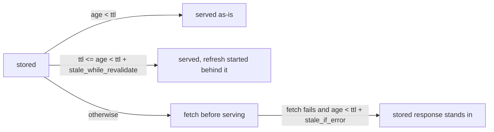

# BMC Proxy Request Classes and Cache

`nico-bmc-proxy` is the one place where every consumer of a BMC's Redfish
service can converge: `nico-api` (machine lifecycle and site exploration),
`nico-hardware-health`, NVIDIA Domain Power Service (DPS), and operators. This
page describes the first two mechanisms the proxy uses to protect BMCs from
that combined load: request classification and a response cache. It also
records the contract later mechanisms build on.

## Problem

A BMC is a slow, single-purpose device with a handful of session slots and
little tolerance for concurrency. Several NICo components poll it on their own
cadence with their own timeouts, and none of them knows about the others. Three
symptoms follow.

- A resource that takes minutes to assemble, such as `FirmwareInventory` on a
  DGX H100 with ConnectX-7 NICs, times out on every exploration cycle and
  raises an alert each time, even though its content changes only when firmware
  is updated.
- A power-control write from DPS waits behind metrics polls that happen to be
  in flight against the same BMC.
- There is no single point at which BMC access can be measured against a
  latency objective and throttled when it is missed.

Request classes and the response cache address the first symptom directly and
lay the groundwork for the other two.

## Request classes

Every proxied request is classified after authentication and authorization.
The proxy configuration declares an ordered `[[class]]` table; each class has
a name, `match` patterns in the ACL grammar, an optional principal filter, an
upstream timeout, and an optional cache policy. The first class whose patterns
match the request's method and path (and, if given, one of its principals)
claims the request. A request no class matches falls into the implicit
`default` class, whose upstream budget is the proxy's historical 60 seconds.

The class decides the total budget for one upstream exchange. It is recorded
on the request span as `bmc_proxy.class` and appears as the `class` label on
the proxy's cache metrics. Callers cannot see or choose their class.

## Response cache

A class with a `cache` policy stores the body and headers of every eligible
`200` a `GET` in that class receives, keyed by BMC, class, and request path
with its query. A single trailing slash on the path is ignored; a different
query is a different entry, and only requests whose query is empty or uses
Redfish's own parameters are cached at all. Two classes that match one path
keep separate entries. The policy gives a stored response three windows, all
counted from when it was stored.

Every fetch the cache issues goes through one single-flight path per resource:
concurrent misses wait on one upstream request, and that request runs on its
own task. A caller that stops waiting does not cancel it. This is what turns a
three-minute `FirmwareInventory` fetch from a failure on every cycle into one
fetch per `ttl`: the first caller may still time out, but the fetch completes
and the next caller is served from the store.

A refresh is conditional on the stored `ETag`; a `304` keeps the stored body
and restarts its age, while a definitive client error such as `404` drops it.
After a fetch that yields nothing storable, such as a failure, a server
error, or an oversized body, the resource is held off for thirty seconds:
a stored response that can stand in is served without asking the BMC, and a
request without one is forwarded directly. A caller whose own
`If-None-Match` names the stored `ETag` receives `304` from the proxy without
the body being sent.

A write to a BMC (a `POST`, `PUT`, `PATCH`, or `DELETE` the BMC did not
answer with a 4xx, or whose response was lost after it was sent) invalidates the stored
responses of every class whose `invalidated_by` patterns the write matches. A
class without patterns is invalidated by any write. Invalidation is a per-BMC,
per-class generation counter, so it costs nothing per stored entry.

Some writes take effect after their response. A Redfish firmware update is
accepted with `202` and applied by a Task that runs for minutes, so a poll
right after the acceptance would store the old inventory again. A policy's
`hold_after_write` window covers this: for that long after an invalidating
write, the class is forwarded uncached for the written BMC and nothing is
stored. The shipped inventory policy holds for thirty minutes.

The full field reference, the request and response headers involved, and the
size limit are in the
[crate README](https://github.com/dsx-ai-factory/infra-controller/blob/main/crates/bmc-proxy/README.md#request-classes).

### What to cache

Cache resources whose content changes only through events the proxy can see
or that a short staleness window cannot make dangerous: firmware inventory,
processor, memory, PCIe device, and network adapter collections. Do not cache
the `Systems`, `Chassis`, or `Managers` roots. They report `PowerState`, and
the machine lifecycle reads it before every power action.

## Wire contract

The proxy communicates cache and class behavior to callers as follows. Later
mechanisms extend this contract rather than replacing it.

| Surface | Value | Meaning |
| ------- | ----- | ------- |
| Response header `X-Nico-Cache` | `hit`, `stale`, `miss`, `coalesced`, `bypass`, `stale_if_error`, `held`, `uncacheable` | How the cache answered a `GET` in a cached class. Present on every such response, absent outside cached classes. |
| Response header `Age` | seconds | Age of the stored response served. Present when a stored response was served. |
| Request header `Cache-Control: no-cache` or `max-age=0`, or `Pragma: no-cache` | | Skip the stored response in every case, including as a fallback when the BMC fails; the fetched response is still stored. |
| Request header `Cache-Control: no-store` | | Forwarded directly; nothing is served from or written to the store. |
| Request header `If-None-Match` | the stored `ETag` | Receive `304 Not Modified` from the store. |
| Span field `bmc_proxy.class` | class name | The class a request was assigned to. |

Metrics, all counters labeled by `class`:

| Metric | Additional label | Counts |
| ------ | ---------------- | ------ |
| `carbide_bmc_proxy_cache_lookups_total` | `outcome` | `GET`s in cached classes answered, by how the cache answered. |
| `carbide_bmc_proxy_cache_refreshes_total` | `result` | Upstream fetches the cache issued, by `stored`, `revalidated`, `uncacheable`, `failed`, or `refused`. |
| `carbide_bmc_proxy_cache_invalidations_total` | | Writes the BMC did not reject that invalidated a class for a BMC, whether or not entries were stored. |

## Limits

The store is in memory and per proxy replica, and so is invalidation: a write
through one replica drops that replica's entries, while another replica keeps
serving its own until their `ttl` ends. Run one replica while cache classes
are configured, or have callers that need read-after-write consistency send
`Cache-Control: no-cache`. Within one replica the boundary is the write's
response: a `GET` that arrives after it observes the BMC's state after the
write, because the write forgets any fetch that began before it as well as the
stored entries. The cache runs at most four fetches against one BMC at a
time, accepts at most thirty-two running or waiting before refusing, and
caches only requests whose query is empty or made of Redfish's own
parameters. A response the BMC marks `no-store`, `private`, or `no-cache` is
never stored. Only bodies of at most 8 MiB are stored, the store
holds at most 256 MiB of bodies per replica, and a larger body in a cached
class is forwarded to its caller unstored. A stored response is served to any
principal whose ACL allows the request; every principal reaches the BMC
through the same account, so nobody receives a body they could not fetch
themselves, and a stored response never carries a `Set-Cookie`.

## Related work

Request classes are also the unit of scheduling for the per-BMC admission
control, priority between classes, and latency-objective throttling tracked in
[issue #2356](https://github.com/dsx-ai-factory/infra-controller/issues/2356)
and [issue #4793](https://github.com/dsx-ai-factory/infra-controller/issues/4793).
The cache addresses the firmware inventory timeouts in
[issue #6419](https://github.com/dsx-ai-factory/infra-controller/issues/6419).
