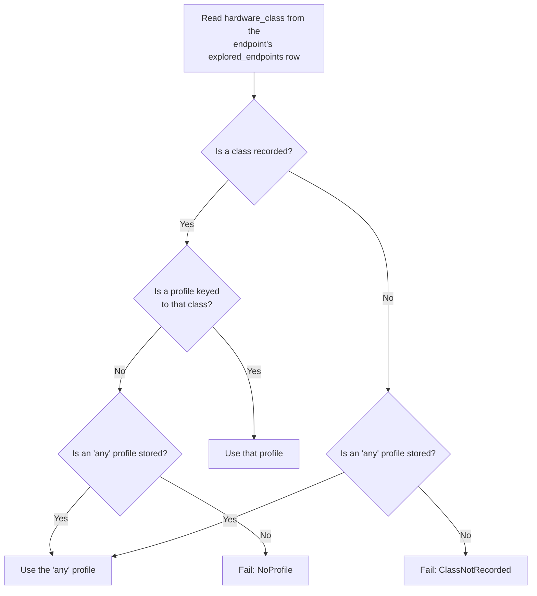
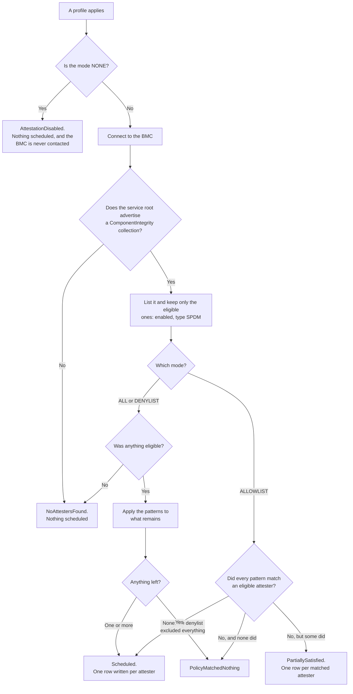
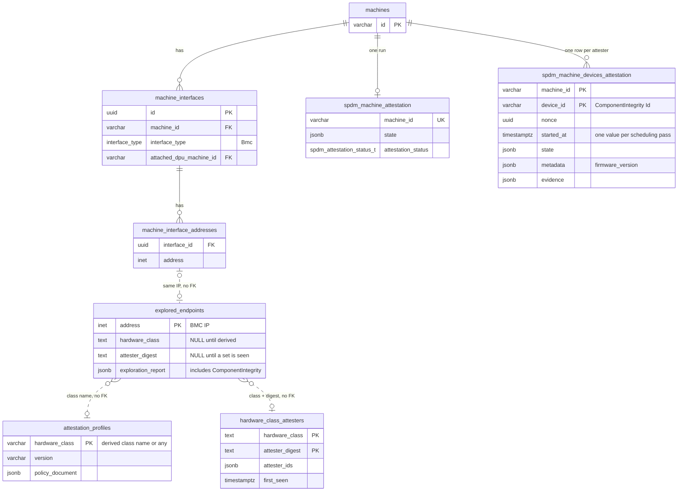

# Machine Attestation Profiles

**Implements:** [NVIDIA/infra-controller#4772](https://github.com/NVIDIA/infra-controller/issues/4772)
— *SPEC-AS-12: Attestation Profiles*. Milestone v2.3.

**Status:** Implemented

## Revision History

| Version | Date | Modified By | Description |
| :---: | :---: | :---- | :---- |
| 0.1 | 09/04/2026 | Binu Ramakrishnan | Initial version |
| 0.2 | 09/15/2026 | Binu Ramakrishnan | Hardware class derived from BMC-reported manufacturer and model instead of `HwType`; `ComponentIntegrity` captured at exploration; attester inventory added |

## 1 What this changes

NICo verifies that a machine's hardware is genuine by collecting cryptographic
evidence from chips inside it. Each such chip is an **attester**. NICo asks the
machine's BMC, which lists what it can reach as Redfish `ComponentIntegrity`
resources, picks the ones it wants, writes one row of work per attester, and a
background worker collects and verifies the evidence.

`spdm_enabled` defaults to `false` and no deployment has set it to `true`, so the
attestation tables are empty everywhere. Nothing below has to preserve current
behaviour. A site that had enabled it would attest nothing until a profile
exists, reporting `ClassNotRecorded` for an endpoint no exploration has
classified and `NoProfile` for one it has; seeding `any` ends both.

### 1.1 Feature requirements

| #   | Feature                                                                              | Addressed in |
| --- | ------------------------------------------------------------------------------------ | ------------ |
| 1   | A new data structure, the Machine Attestation Profile                                | §4           |
| 2   | CRUD operations attached to it                                                       | §6           |
| 3   | enabling and disabling individual attesters                                          | §4.2         |
| 4   | The unique machine type / hardware class: GB300, a DPU model, an NVLink switch model | §4.1         |
| 5   | The scheduler consults the profile and attests only the right attesters              | §5           |
| 6   | Room to refine with attester details such as path or other parameters                | §4.4         |

## 2 The flow end to end

| #   | Step                                                                                                 | Where                                                             |
| --- | ---------------------------------------------------------------------------------------------------- | ----------------------------------------------------------------- |
| 1   | Exploration derives each BMC's hardware class from what it reports                                   | §4.1, in `nv_generate_exploration_report()` and its libredfish twin |
| 2   | The class, the BMC's `ComponentIntegrity` list, and the attester set it implies are recorded          | §5.1, §7.1, §7.5                                                  |
| 3   | An operator writes a profile keyed to a hardware class                                               | §4, §6                                                            |
| 4   | Attestation resolves machine → BMC → class → profile, then writes one work row per selected attester | §5                                                                |
| 5   | The controller collects evidence per work row                                                        | Exists, unchanged                                                 |
| 6   | The evidence is verified and recorded                                                                | Exists, unchanged                                                 |

Steps 1 through 4 are this document's scope.

**Resolution goes through the BMC.** A machine row carries no class; its BMC
endpoint does. The scheduler goes from `machine_id` to that machine's BMC
address, reads the class off that endpoint's row, and looks up the profile.

**A DPU is its own machine.** A BlueField in DPU mode has its own machine row,
linked to its host through `machine_interfaces.attached_dpu_machine_id`, with its
own BMC endpoint, hardware class, and profile. A GB200 host with two BlueField-3 DPUs
is three machines, each resolving independently. Attesting the host does not
attest its DPUs; each is triggered separately, and composing them into one run is
separate work (§12).

## 3 Terminology

| Term               | Meaning                                                                                                                            |
| ------------------ | ---------------------------------------------------------------------------------------------------------------------------------- |
| **Attester**       | One chip inside a machine that can produce evidence. A GPU root of trust, for example.                                             |
| **Hardware class** | A group of hardware sharing one profile, for example `nvidia_dgx-gb200`. Derived from what the BMC reports; see §4.1.                  |
| `any`              | The one reserved class an operator can write. A profile keyed `any` covers hardware with no profile of its own; see §4.2 and §5.3. |
| **Profile**        | The stored policy for one hardware class.                                                                                          |
| **Selection**      | The part of a profile naming which attesters are in or out.                                                                        |
| **Pattern**        | One matcher inside a selection: `exact` (a full ID) or `prefix` (every ID starting with a string).                                 |
| **Attester digest** | A hash of a machine's sorted SPDM-capable attester IDs. Describes what the hardware carries; it is not an identity; see §7.5.       |

## 4 The profile

### 4.1 The hardware class is the key

A profile is keyed by a hardware class: two fields the BMC reports, joined by an
underscore.

```text
<manufacturer>_<model>
```

Each field comes from a fallback chain, so one empty Redfish property does not
sink the key.

| Field        | Source order                                                        |
| ------------ | ------------------------------------------------------------------- |
| manufacturer | `ComputerSystem.Manufacturer` → `ServiceRoot.Vendor` → `unknown`    |
| model        | `ComputerSystem.Model` → `ServiceRoot.Product` → `nomodel`          |

The `ComputerSystem` is the one exploration treats as the host: the first member
after the first that reports a BIOS, or the first member when none does. A BMC
serving several — an NVIDIA compute tray exposes a host system beside its GPU
baseboard — can therefore move a class by reordering its `Systems` collection,
which is the same re-keying the `any` fallback (§4.2) and the coverage view
(§6.4) already cover.

Each field is normalised on its own: lowercased, every run of characters outside
`a-z0-9` becomes a single `-`, and leading and trailing `-` are dropped. The
fields are then joined with `_`, which cannot appear inside a normalised field,
so a class name parses back into exactly two parts.

```text
nvidia_dgx-gb200
dell-inc_poweredge-r750
```

`any` is the one reserved name (§4.2). Because the chain always yields two
fields, every explored endpoint gets a keyable class — worst case
`unknown_nomodel`, which an operator can write a profile for. There is no
`unrecognized` marker.

**Why not the SKU.** A third field from `ComputerSystem.SKU` would give
sub-model granularity, and an earlier revision of this design used one. Redfish
defines that property as "the manufacturer SKU for this system" and leaves the
meaning to the vendor, and the vendors disagree: Dell reports the service tag,
which iDRAC also returns as `SerialNumber`; HPE reports the product part number;
Lenovo reports the machine type model; and NVIDIA's DGX BMCs leave it empty.
Keying on it would mint one class per machine on Dell, where a profile could
then only ever describe a single node, and would add nothing on the NVIDIA
hardware this feature targets. Hardware of one model carrying different
components is told apart by its attester set instead (§7.5), which is measured
from the `ComponentIntegrity` collection rather than asserted by a vendor
string.

**Why not `HwType`.** `HwType` is a closed enum of sixteen variants resolved from
`ServiceRoot` and chassis signatures by `bmc-explorer`. Two properties
disqualify it as a key. Its granularity is uneven in the wrong direction —
`Gb200` and `LenovoGb300` name platforms, but `Dell` names every Dell server ever
built, which no single attester policy fits. And it is a closed set, so hardware
with no variant yet would key on `unrecognized`, and adding the variant later
would rename the class and orphan any profile written against it. A class built
only from reported fields moves when the hardware or its firmware moves, never
when NICo ships. `HwType` keeps its existing duties — BIOS attributes and
platform quirks.

### 4.2 Modes, and the `any` fallback

A selection has one mode and a list of patterns.

| Mode        | Meaning                                                                 |
| ----------- | ----------------------------------------------------------------------- |
| `NONE`      | Attest nothing. Attestation is disabled for this hardware.              |
| `ALL`       | Attest every attester the BMC reports.                                  |
| `ALLOWLIST` | Attest only the attesters matching a pattern.                           |
| `DENYLIST`  | Attest every attester the BMC reports, except those matching a pattern. |

One `mode` field holds one value.

**One reserved fallback:** `any`**.** A profile keyed `any` applies to a machine
whose own class has no profile. An exact class match always wins, so `any` is
consulted only after that lookup misses.

Seeding `any` with `mode: ALL`: whatever the BMC offers
on hardware nobody has profiled, attest it. Without a fallback, an unprofiled
class contributes nothing — the machine fails, and a failed machine is not an
attested one. Because an exact match wins, a `mode: NONE` profile on a real class
is how an operator says "this platform has nothing to attest," and it keeps the
`ALL` net off hardware that can never satisfy it. Power shelves and generic Dell hosts are
the cases to seed that way.

### 4.3 Patterns: exact and prefix

| Kind     | Matches                                  |
| -------- | ---------------------------------------- |
| `exact`  | One ID, matched in full.                 |
| `prefix` | Every ID starting with the given string. |

Each pattern is independently exact or prefix, and one selection may mix them.

Prefix exists because a GB200 tray reports several GPU roots of trust — the
fixture in `crates/redfish/src/libredfish/test_support.rs` shows
`HGX_IRoT_GPU_0`, `HGX_IRoT_GPU_1`, and `HGX_IRoT_GPU_2` alongside `HGX_BMC_0` —
and one prefix covers them however many a tray has.

### 4.4 The policy is a JSON document

The profile row stores its policy as one JSON document. Here is
`nvidia_dgx-gb200`, attesting every GPU root of trust plus one
named CPU root of trust, and a denylist excluding a single component:

```json
{
  "schema_version": 1,
  "selection": {
    "mode": "ALLOWLIST",
    "component_ids": [
      { "prefix": "HGX_IRoT_GPU_" },
      { "exact": "VERA_CPU_0" }
    ]
  }
}
```

```json
{
  "schema_version": 1,
  "selection": {
    "mode": "DENYLIST",
    "component_ids": [
      { "exact": "HGX_BMC_0" }
    ]
  }
}
```

Each entry carries exactly one key, `exact` or `prefix`.

Using json makes it easy to update fields without a migration, and `schema_version`
tells a reader which shape it has.

### 4.5 A selection says what must be attested

- **An allowlist is a requirement, per pattern.** Every pattern must match at
least one eligible attester. A profile requiring `HGX_IRoT_GPU_` and
`VERA_CPU_0` fails on a tray reporting GPUs but no `VERA_CPU_0`. It is not
"attest the empty set."
- **A denylist matching nothing is fine.** Denying `HGX_BMC_0` on a tray that has
none excludes nothing. The asymmetry follows the direction of the mistake: an
unsatisfied allowlist pattern attests *less* than intended, a denylist matching
nothing attests *more*.
- **A denylist that excludes everything fails.** An operator who wants nothing
attested writes `NONE`.
- `ALL` **matching nothing schedules nothing, and is not a failure.** `ALL` states
no requirement, so there is nothing to leave unsatisfied. A BMC reporting no
eligible components already means no attestation work today, whatever the
profile.
- **An attester matched by two patterns is attested once.**
- **Matching is case-sensitive,** because Redfish treats `Id` as opaque.
- **Prefer exact patterns in denylists.** A prefix excludes whatever appears
under it in future: deny `HGX_IRoT_GPU_` and a later `HGX_IRoT_GPU_MEZZ_0` is
excluded too.

A selection is a requirement rather than a filter over a discovered list, which
also keeps it expressible for RMS, whose eventual switch support has no call to
list attesters before collecting.

## 5 Resolving the class and scheduling

1. Check `spdm_enabled`. If false, stop.
2. Resolve the machine to its BMC address from `machine_interfaces`, as the
  existing worker does.
3. Read `hardware_class` off that endpoint's `explored_endpoints` row.
4. Find the policy: the class first, then `any`. An endpoint with no class
  recorded reaches `any` too, so an unexplored endpoint is covered by the site's
  default rather than left unattested. If neither yields one, stop with the
  matching failure from §5.3.
5. If the policy is `mode: NONE`, stop and report `AttestationDisabled`. The BMC
  is not contacted.
6. Connect to the BMC. If its service root advertises no `ComponentIntegrity`
  collection, stop and report `NoAttestersFound`. Otherwise list its
  `ComponentIntegrity` resources.
7. Keep the eligible ones: `ComponentIntegrityEnabled` true and type `SPDM`.
   Eligibility comes before patterns because an ID says nothing about whether
   the component can be attested. `ComponentIntegrityTypeVersion` is not
   filtered on, which drops the `1.1.0` check in the deleted
   `get_supported_components()` (§9). The version is not persisted.
8. Apply the selection's patterns to what remains and take the outcome from
  §5.3.
9. On success, write one `spdm_machine_devices_attestation` row per selected
  attester — keyed `(machine_id, device_id)`, where `device_id` is that
  attester's `ComponentIntegrity` `Id` — which the existing controller picks up.

Step 6 stays a live call even though exploration records the same collection
(§7.1): selection has to reflect what the BMC reports at the moment of
attestation, not what it reported when last explored. The recorded copy is for
authoring and diagnosis.

### 5.1 Where the hardware class comes from

Both exploration backends derive it from the report they already build:
`nv_generate_exploration_report()` in `bmc-explorer`, and the libredfish path in
`site-explorer`. The `ComputerSystem` fields the chain reads are already on the
report's `systems` entries, as `Option<String>` that the chain's fallbacks cover.

The class is also copied into a nullable `hardware_class` column on
`explored_endpoints`, so coverage can group by it and the scheduler can read it
without parsing the report. Both statements that persist a report — `insert` and
`try_update` — set the column from the report they are writing, so the two cannot
disagree (§7.1). Two states:

| Value        | Meaning                                 | Lookup                |
| ------------ | --------------------------------------- | --------------------- |
| A class name | Exploration derived it                  | Key the profile on it |
| `NULL`       | No exploration has recorded a class     | Fall back to `any`    |

`any` is the only reserved name and is never recorded on an endpoint (§6.4).

### 5.2 A derived class moves when reporting changes

A BMC firmware update that changes how a field reads changes the class — a
manufacturer reported as `Dell Inc.` and later as `Dell` moves the same hardware
from `dell-inc_poweredge-r750` to `dell_poweredge-r750`, and a model that was
empty and fell through to `ServiceRoot.Product` moves when the system starts
reporting one of its own. This is inherent to deriving a key from reported data;
no available field avoids it, since the instability is in how the BMC reports,
not in what the field means.

Two things make it survivable rather than breaking.

- The new class has no profile, so `any` applies and the machine still attests.
- Coverage (§6.4) lists the new class and its endpoint count, so it is visible.

Re-authoring the profile for the new class is the operator's step. NICo does not
carry a policy across on its own, and will not: a matching attester digest is
evidence that the hardware is unchanged, not proof — machines from two vendors
built around a shared baseboard can report the same attester set (§7.5) — and a
policy NICo moved by itself would be indistinguishable from one an operator
authored deliberately, with no honest value to store in `updated_by`. Reducing
that step to one command is §12's to take up.

### 5.3 Which policy applies, and how it can end

Two questions in order: which profile applies, then what did it select.

#### Which profile applies

One rule: **an exact class match always wins over** `any`**.**



Section 6.4 shows these same situations against a real inventory.

#### Policy selector and outcome

The profile from the previous step carries forward, including whether `any`
supplied it.



`mode: NONE` never contacts the BMC, and eligibility is applied before the
patterns, both for the reasons in §5 steps 5 and 7.
A BMC that cannot be reached produces no outcome at all. It stays the retried
error it is today.

`PolicyMatchedNothing` means an operator-authored requirement went unsatisfied
and left nothing to attest: no allowlist pattern matched, or a denylist excluded
everything. It names the unsatisfied patterns, or that the denylist excluded
everything — diagnostic detail, not a separate outcome.

`NoAttestersFound` is not a verdict. It records that the BMC had nothing
attestable to offer, which is what such hardware already does today. `ALL` and a
denylist both report it, since neither asserts that a component must be there
and neither caused the emptiness; an allowlist does assert that, so it reports
`PolicyMatchedNothing` instead. A BMC whose service root advertises no
collection reports `NoAttestersFound` under every mode that reaches it, because
the selection is never evaluated (§5 step 6). `NONE` never reaches it: it
settles from the profile alone and reports `AttestationDisabled` without
connecting.

There are three switches and no others: `spdm_enabled` for the site, `mode: NONE`
on a real class for one platform, and `any` for everything unprofiled.

## 6 Managing profiles

### 6.1 The RPCs

```protobuf
rpc CreateAttestationProfile(CreateAttestationProfileRequest) returns (AttestationProfile);
rpc UpdateAttestationProfile(UpdateAttestationProfileRequest) returns (AttestationProfile);
rpc DeleteAttestationProfile(DeleteAttestationProfileRequest) returns (DeleteAttestationProfileResponse);
rpc GetAttestationProfile(GetAttestationProfileRequest) returns (AttestationProfile);
rpc ListAttestationProfiles(google.protobuf.Empty) returns (ListAttestationProfilesResponse);
rpc GetAttestationCoverage(google.protobuf.Empty) returns (GetAttestationCoverageResponse);
```

```protobuf
message AttesterSelection {
  AttesterSelectionMode mode = 1;
  // Required for ALLOWLIST and DENYLIST, and must be empty for ALL and NONE.
  repeated ComponentIdMatch component_ids = 2;
}

message ComponentIdMatch {
  oneof pattern {
    string exact = 1;
    string prefix = 2;
  }
}

enum AttesterSelectionMode {
  // Zero is not a real mode: an omitted one would otherwise read as NONE and
  // silently disable attestation for the class.
  ATTESTER_SELECTION_MODE_UNSPECIFIED = 0;
  ATTESTER_SELECTION_MODE_NONE = 1;
  ATTESTER_SELECTION_MODE_ALL = 2;
  ATTESTER_SELECTION_MODE_ALLOWLIST = 3;
  ATTESTER_SELECTION_MODE_DENYLIST = 4;
}

message AttestationProfile {
  string hardware_class = 1;
  string version = 2;              // ConfigVersion
  AttesterSelection selection = 3;
  google.protobuf.Timestamp updated_at = 4;
  string updated_by = 5;
}

message CreateAttestationProfileRequest {
  string hardware_class = 1;
  AttesterSelection selection = 2;
}

message UpdateAttestationProfileRequest {
  string hardware_class = 1;
  AttesterSelection selection = 2;
  optional string if_version_match = 3;
}

message DeleteAttestationProfileRequest {
  string hardware_class = 1;
  optional string if_version_match = 2;
}

message DeleteAttestationProfileResponse {}

message GetAttestationProfileRequest {
  string hardware_class = 1;
}

message ListAttestationProfilesResponse {
  // Ordered by hardware class.
  repeated AttestationProfile profiles = 1;
}
```

The coverage read (§6.4) reports the §5.3 rule applied to each class the site
has, so a caller does not restate it:

```protobuf
enum AttestationCoverage {
  ATTESTATION_COVERAGE_UNSPECIFIED = 0;
  ATTESTATION_COVERAGE_OWN_PROFILE = 1;
  ATTESTATION_COVERAGE_ANY_FALLBACK = 2;
  ATTESTATION_COVERAGE_NO_PROFILE = 3;
  ATTESTATION_COVERAGE_CLASS_NOT_RECORDED = 4;
}

message AttestationCoverageEntry {
  // Empty for the endpoints exploration has recorded no class for.
  string hardware_class = 1;
  int32 endpoints = 2;
  AttestationCoverage coverage = 3;
  // The mode that would apply, absent when nothing would.
  optional AttesterSelectionMode mode = 4;
  // The attester sets recorded for the class (§7.5), one entry per distinct
  // digest. Empty before the class is first attested; above one entry, the
  // class spans hardware carrying different components.
  repeated AttesterSet attester_sets = 5;
}

message AttesterSet {
  string digest = 1;
  // Explored endpoints of this class last reporting this set. Sums to at most
  // the entry's `endpoints`, since an endpoint may have no digest yet.
  int32 endpoints = 2;
  // How many attesters the set holds. Zero where the BMC reported an SPDM
  // collection with no SPDM members.
  int32 attesters = 3;
}

message GetAttestationCoverageResponse {
  repeated AttestationCoverageEntry entries = 1;
  // Absent when no `any` profile is stored.
  optional AttesterSelectionMode any_profile_mode = 2;
}
```

`updated_by` is a response field only; the server derives it (§7.2).

### 6.2 Validation rules

- `hardware_class` must be `any`, or two non-empty `_`-separated fields each
matching `[a-z0-9-]+` — the shape §4.1 derives. `any` carries no extra
restriction on its `mode`.
- **Create** additionally requires a class some endpoint has recorded; the error
points at `attestation spdm coverage`. `any` is exempt, because it is never
recorded on an endpoint (§6.4) and seeding it is the first thing an operator does
(§4.2). Update and delete do not apply this rule, so a profile whose hardware has
left the site stays editable and removable.
- `mode` must be set. There is no safe default.
- `component_ids` must be non-empty for `ALLOWLIST` and `DENYLIST`, and empty for
`ALL` and `NONE`. An allowlist of nothing can never be satisfied; a denylist of
nothing means `ALL`.
- Every entry must set `pattern`, with a non-empty `exact` or `prefix` value. An
empty prefix matches every ID, which already has proper spellings in `ALL` and
`NONE`.
- `schema_version` is `1`. It is not a request field: the server sets it when it
builds the document, and a document carrying any other value is refused on the
way to storage.
- Creating a profile for a `hardware_class` that already has one is an error. Use
update. This also makes `any` unique.
- Update and delete against a `hardware_class` with no profile are not found.
- `if_version_match` is optional on update and delete. When supplied it must
match the stored version, and the write changes nothing otherwise
(`ConcurrentModificationError`). When omitted the write proceeds.

The format rule guarantees structurally that derivation can never produce `any`:
a derived class always has two `_`-separated fields, and `any` has one.

### 6.3 The admin CLI

The commands sit under the existing `attestation spdm` group, alongside the
`trigger`, `get`, `list`, and `cancel` commands that act on the machines these
profiles decide:

```text
nico-admin-cli attestation spdm profile list
nico-admin-cli attestation spdm profile get <hardware-class>
nico-admin-cli attestation spdm profile create <hardware-class> --mode allowlist --prefix HGX_IRoT_GPU_
nico-admin-cli attestation spdm profile update <hardware-class> --mode denylist --exact HGX_BMC_0 [--if-version-match <version>] [--force]
nico-admin-cli attestation spdm profile delete <hardware-class> [--if-version-match <version>] [--force]
nico-admin-cli attestation spdm coverage
```

Patterns are two repeatable flags, `--exact <id>` and `--prefix <string>`, so a
selection can mix them:

```text
nico-admin-cli attestation spdm profile create nvidia_dgx-gb200 \
  --mode allowlist --prefix HGX_IRoT_GPU_ --exact VERA_CPU_0
```

`--mode allowlist` and `--mode denylist` require at least one pattern flag;
`--mode all` and `--mode none` reject both.
`--if-version-match` is optional; `get` and `list` print the version it takes.

`create` checks the §4.1 format locally before sending anything, so a misspelling
costs no round trip. Whether a class is one an endpoint has recorded is the
server's to judge (§6.2), since only it knows the inventory.

**Edits that stop attesting hardware not named on the command line require**
`--force`. Those are exactly two: switching `any` to `--mode none`, and deleting
`any`. Both leave every class without a profile of its own attesting nothing.
Everything else writes unprompted, including `any` with `--mode all`, and
`--mode none` on a single class, which stops attesting only the class named.

```text
$ nico-admin-cli attestation spdm profile delete any
error: generic error: removing the 'any' fallback leaves every hardware class
       without a profile of its own attesting nothing; re-run with --force to
       confirm
```

`attestation spdm trigger` prints what §5.3 decided for the machine: the
outcome, the hardware class resolved for it, and the profile version that
applied. A trigger that schedules nothing still succeeds, so without the outcome
its response cannot be told from one that scheduled work.

### 6.4 Seeing coverage before enabling

Which classes a site has is not written down anywhere, and §5.3 makes enablement
depend on it. One read-only view groups `explored_endpoints` by `hardware_class`
and resolves each group against the profile table:

```text
$ nico-admin-cli attestation spdm coverage
+------------------------------+--------------------+-----------+----------+-------------+-----------------------------+
| HARDWARE CLASS               | EXPLORED ENDPOINTS | ATTESTERS | VARIANTS | OWN PROFILE | WOULD USE                   |
+==============================+====================+===========+==========+=============+=============================+
| dell-inc_poweredge-r750      | 6                  | 2         | 1        | no          | any (all)                   |
+------------------------------+--------------------+-----------+----------+-------------+-----------------------------+
| lenovo_thinksystem-sr680a-v3 | 4                  | 4         | 1        | yes         | its own profile (none)      |
+------------------------------+--------------------+-----------+----------+-------------+-----------------------------+
| nvidia_dgx-gb200             | 72                 | 7, 8      | 2        | yes         | its own profile (allowlist) |
+------------------------------+--------------------+-----------+----------+-------------+-----------------------------+
| (no class recorded)          | 1                  |           | 0        | n/a         | any (all)                   |
+------------------------------+--------------------+-----------+----------+-------------+-----------------------------+
| any                          | —                  | —         | —        | yes         | its own profile (all)       |
+------------------------------+--------------------+-----------+----------+-------------+-----------------------------+
```

That table holds four findings. Nobody has written a profile for the six R750s,
so `any` attests them with whatever their BMCs report. The four SR680a V3s have
a profile of their own that attests nothing, which is a deliberate exclusion
rather than an oversight — the two rows read differently and only this view
tells them apart. The 72 GB200 trays share a profile, and the two variants under
one class mean at least one tray reports seven attesters where the rest report
eight (§7.5). And one endpoint has no class recorded yet, either because it is
new or because its explorations are failing, so there is nothing to key on and
`any` covers it too.

`EXPLORED ENDPOINTS` counts rows of `explored_endpoints` rather than machines,
because `hardware_class` is recorded per endpoint and a machine can present more
than one. Hardware nobody has explored has no row at all.
`VARIANTS` renders how many attester sets the class has (§7.5); more than one
means it spans hardware carrying different SPDM-capable components. It does not
move when an operator switches a component's integrity reporting off, which is a
configuration difference rather than a hardware one. Zero means nothing has been
recorded yet, which is every class before its first exploration.
`ATTESTERS` renders how many attesters those sets hold, listing every distinct
count because a class spanning variants of different sizes has no single one —
`7, 8` is the drift `VARIANTS` counts, said in the units an operator reasons
about. It is empty for a class with no set recorded, and `0` where a BMC reported
an SPDM collection holding no SPDM members, which is a variant in its own right.
Which digests those counts belong to, and how many endpoints report each, are in
`--format json`, where an outlier of one endpoint against seventy-one is the
useful detail.
`OWN PROFILE` is `n/a` for the endpoints carrying no class, since no profile can
be keyed to them.
The `any` row carries no counts, because `any` is never recorded on an endpoint.

`WOULD USE` is the §5.3 rule applied per group, not a second implementation of
it: the server reports which profile would supply the policy, and the CLI only
spells it. The view contacts no BMC. It reports what was last recorded, so a
change made since the last exploration or attestation is not yet reflected.

`--format json` and `--format yaml` report the same rows, with the class `null`
rather than labelled for the endpoints carrying none, and the counts `null` on
the `any` row; every key is present. `--format` is a root-level flag
and must precede the command path:
`nico-admin-cli --format json attestation spdm coverage`.

### 6.5 What editing a profile does not do

A profile is consulted once, when attestation is scheduled. Changing one affects
attestations scheduled afterwards and does not alter those already scheduled or
in flight. Deleting one does not cancel scheduled work.

## 7 Storage

### 7.1 Migration

```sql
-- The hardware class derived at exploration. NULL means no exploration has
-- recorded one for this endpoint yet.
ALTER TABLE explored_endpoints ADD COLUMN hardware_class TEXT;

-- Digest of the SPDM-capable attester set last seen on this endpoint, for
-- counting endpoints per variant of a class. Same value and name as
-- hardware_class_attesters.attester_digest (§7.5).
ALTER TABLE explored_endpoints ADD COLUMN attester_digest TEXT;
```

Both additive and nullable, so neither needs a backfill: Site Explorer fills them
in as it re-probes. Until it has, the endpoint's class is absent rather than
wrong, and §5.3 covers it through `any`.

The `ComponentIntegrity` list itself needs no migration. It is a new field on
`EndpointExplorationReport`, which is stored whole in the existing
`exploration_report` jsonb:

```rust
pub struct ComponentIntegrityEntry {
    pub id: String,
    pub component_integrity_type: String,
    pub component_integrity_enabled: bool,
}
```

Recorded unfiltered, so a device present but switched off is distinguishable from
one that is absent. `None` means the BMC reported no collection — some platforms
answer `NotSupported` — while `Some([])` means it reported an empty one. A failed
fetch also records `None`, with a warning: the list drives coverage while
scheduling reads the collection live, so it must not fail an exploration that
otherwise succeeded. The next exploration restores it.

### 7.2 The profile table

```sql
-- Attestation profiles: one row per hardware class, naming which attesters
-- machines of that class require. The key is a derived manufacturer_model
-- class name, or the reserved 'any'.
CREATE TABLE attestation_profiles (
    hardware_class  text         PRIMARY KEY,
    version         varchar(64)  NOT NULL,
    policy_document jsonb        NOT NULL,
    updated_at      timestamptz  NOT NULL DEFAULT now(),
    updated_by      varchar(256) NOT NULL
);
```

`version` is a `ConfigVersion`. A write matches on the caller's
`if_version_match` and stores `increment()`. Delete removes the row, so a later
create for the same class starts at `initial()`; the token carries a timestamp,
so that new `V1` does not match the old one.

`updated_by` records one identity: `Principal::audit_identity()` for the
request's principal, from the `AuthContext` `principals: Vec<Principal>`.

`hardware_class` carries no foreign key. The class is a string on each endpoint's
row (§7.3), and `hardware_class_attesters` (§7.5) is an observation log rather
than a class registry, so neither is a parent table. Format and reserved-name
checks stay in the API (§6.2).

### 7.3 The existing tables

Relevant columns only; all as they are on `main`.

```sql
-- Where the hardware class is read from. Keyed by BMC IP.
explored_endpoints (
    address              inet NOT NULL PRIMARY KEY,
    exploration_report   jsonb NOT NULL,  -- now also holds the ComponentIntegrity list
    hardware_class       text,            -- NULL until exploration derives one
    attester_digest      text             -- NULL until an attester set is seen
)

-- One attestation run per machine.
spdm_machine_attestation (
    machine_id         varchar NOT NULL UNIQUE REFERENCES machines(id),
    requested_at       timestamptz NOT NULL,
    state              jsonb NOT NULL,
    attestation_status spdm_attestation_status_t NOT NULL DEFAULT 'not_started'
)

-- One work row per selected attester. Written by §5 step 9.
spdm_machine_devices_attestation (
    machine_id  varchar NOT NULL,
    device_id   varchar NOT NULL,       -- the ComponentIntegrity Id
    nonce       uuid NOT NULL,          -- fresh, per attester
    started_at  timestamptz NOT NULL,   -- stamped per scheduling pass; see §8
    state       jsonb,                  -- SpdmAttestationState
    metadata    jsonb,                  -- firmware_version, fetched at FetchMetadata
    evidence    jsonb,
    ca_certificate jsonb,
    PRIMARY KEY (machine_id, device_id)
)

-- How a machine resolves to the BMC that answers for it.
machine_interfaces (
    id             uuid NOT NULL PRIMARY KEY,
    machine_id     varchar(64),
    interface_type interface_type NOT NULL,  -- 'Bmc' for the BMC NIC
    attached_dpu_machine_id varchar(64)      -- host row -> its DPU machine row
)
machine_interface_addresses (
    interface_id uuid,
    address      inet
)
```

`spdm_attestation_status_t` is `not_started`, `started`, `not_supported`,
`device_list_mismatch`, `completed`. `spdm_device_attestation_history` also
exists and is untouched.

### 7.4 How they connect



Three of those edges are dotted because they are joins on a value, not foreign
keys.

To read a machine's class, follow `machine_interfaces` where
`interface_type = 'Bmc'`, take that interface's address from
`machine_interface_addresses`, and look up `explored_endpoints` by it — the join
the existing worker already performs to find the BMC. The class then keys
`attestation_profiles` directly.

Because neither edge is a foreign key, a profile can name a class no hardware
reports and hardware can report a class with no profile. Nothing in the schema
detects either; §6.4's coverage report is what reconciles them.

A DPU in DPU mode is its own row in `machines` with its own BMC interface, so it
resolves its own class and profile. `attached_dpu_machine_id` is only what links
it to its host (§12).

### 7.5 The attester inventory

Pattern matching alone cannot see every kind of drift: a prefix such as
`HGX_IRoT_GPU_` still matches when a tray reports seven GPU roots of trust
instead of eight. Recording the sets makes that visible.

```sql
-- Each distinct set of SPDM-capable attesters seen for a hardware class.
-- More than one row for a class means the class spans hardware with differing
-- attestable components.
CREATE TABLE hardware_class_attesters (
    hardware_class  text        NOT NULL,
    attester_digest text        NOT NULL,
    attester_ids    jsonb       NOT NULL,
    first_seen      timestamptz NOT NULL DEFAULT now(),
    PRIMARY KEY (hardware_class, attester_digest)
);
```

`attester_digest` is a SHA-256 over the IDs of every member whose
`ComponentIntegrityType` is `SPDM`, sorted and newline-joined. No measurements,
which move with every firmware update.

A collection holding no SPDM member is a set like any other and gets its own
digest, so a tray reporting none where its peers report eight shows up as a
second set rather than as nothing observed. Only §7.1's `None` — no collection
reported, or a fetch that failed — records neither a digest nor a row.

**Scoped by type, not by enablement.** A `TPM` member is never attested, and
`ComponentIntegrityEnabled` is read-write, so filtering on it would put
configuration inside the identity: switching SPDM off on one GPU would read as
hardware drift. Disabled members therefore count — Redfish keeps the type
readable, suppressing only the nested `SPDM` object — and §7.1's projection holds
the flag itself.

`explored_endpoints.attester_digest` (§7.3) records which of the class's sets that
one endpoint last reported, which is what makes an odd set traceable to hardware:
grouping endpoints by `(hardware_class, attester_digest)` gives the per-set
endpoint counts in `attester_sets` (§6.1), so 71 trays on one set and one on
another is visible rather than just "two sets exist".

**A digest is a property, not an identity.** Two classes can share one, since
machines from different vendors can be built around the same baseboard. So a
match across classes is never grounds to apply one class's policy to another, and
nothing reads digests across classes — the two §12 items that would are the ones
that have to reckon with it. Within a class, distinct digests are the drift signal
§6.4 counts.

## 8 The trigger API

`TriggerMachineAttestation` keeps its signature. Five response fields are added,
which does not break clients.

```protobuf
message SpdmMachineAttestationTriggerResponse {
  common.MachineId machine_id = 1;
  int32 devices_under_attestation = 2;
  string resolved_hardware_class = 3;
  SpdmSchedulingOutcome outcome = 4;
  bool used_any_fallback = 5;
  optional string profile_version = 6;
  optional google.protobuf.Timestamp started_at = 7;
}
```

`outcome` is an enum of the §5.3 values rather than a string, so the schema
carries them and a client switching on it is exhaustive:

```protobuf
enum SpdmSchedulingOutcome {
  // Unset sentinel. The server always reports a real outcome, so this only
  // appears to a client newer than the server it is talking to.
  SPDM_SCHEDULING_OUTCOME_UNSPECIFIED = 0;
  SPDM_SCHEDULING_OUTCOME_SCHEDULED = 1;
  SPDM_SCHEDULING_OUTCOME_ATTESTATION_DISABLED = 2;
  SPDM_SCHEDULING_OUTCOME_NO_ATTESTERS_FOUND = 3;
  SPDM_SCHEDULING_OUTCOME_POLICY_MATCHED_NOTHING = 4;
  SPDM_SCHEDULING_OUTCOME_CLASS_NOT_RECORDED = 5;
  SPDM_SCHEDULING_OUTCOME_NO_PROFILE = 6;
  SPDM_SCHEDULING_OUTCOME_PARTIALLY_SATISFIED = 7;
}
```

`used_any_fallback` is needed separately because `resolved_hardware_class`
reports the machine's class either way, so without it the response cannot
distinguish a policy written for this hardware from a default written for
everything else. Without all three, an operator testing a profile has to infer
from a count whether it was applied.

`profile_version` names the revision that decided. Reading the profile
separately does not answer this: profiles are editable, so the one an operator
reads before or after a trigger may not be the one that ran. It is `optional`
because `class_not_recorded` and `no_profile` are reached before any profile
applies, so they have no version to report, and an empty string would read as
unknown rather than none.

It answers "which policy produced this response", not "which policy the machine
is attesting under".

`started_at` tells a caller whether the devices it scheduled are still the ones
the machine has. Scheduling stamps every device row it writes with one value, so
a caller that still finds its own there knows nothing has replaced it.

It takes the name the column and the read API already use: the same value is
`SpdmAttestationDetails.started_at` in `SpdmGetAttestationMachineResponse`.
Comparing the two is the whole point of reporting it, so a second name for one
instant would hide the comparison it exists for. It is `optional` here and not
there because a call that scheduled nothing has nothing to stamp.

What a caller does with a failing outcome is not decided here; that belongs to
whatever drives host ingestion, firmware update, and tenant switching (§12).

## 9 Removing the old list

`is_supported_product()`, `get_supported_components()`, and the `PRODUCT_GB200`
and `PRODUCT_GB300` constants are deleted along with the version check they
carried, which no profile can express and none needs.

## 10 Logging and metrics

Scheduling outcomes are worth counting and alerting on, so scheduling emits a
declared event rather than a plain log line.

```rust
#[derive(carbide_instrument::Event)]
#[event(event_name = "attestation_scheduled",
    metric_name = "carbide_attestation_scheduling_total",
    component = "machine-controller", log = info, metric = counter,
    message = "SPDM attestation scheduling finished",
    describe = "Number of SPDM attestation scheduling attempts, by outcome")]
struct AttestationScheduled {
    #[label] outcome: SchedulingOutcome,
    #[context] machine_id: MachineId,
    #[context] hardware_class: String,
    #[context] used_any_fallback: bool,
    #[context] profile_version: Option<String>,
    #[context] devices_scheduled: u64,
}
```

`outcome` is a fixed enum of the §5.3 values, so it is safe as a label, and it is
the only one: a site accumulating unprofiled hardware is a count of machines in a
state, which the coverage view answers directly, where this metric counts
occurrences.

Machine IDs are unbounded and stay in `#[context]`. Class names stay there too:
the explorer writes the column, so nothing at the emit site bounds what a stored
row can contain.

A profile is security policy, so every accepted change to one is recorded with
the version it moved from and to.

```rust
#[derive(carbide_instrument::Event)]
#[event(event_name = "attestation_profile_changed",
    metric_name = "carbide_attestation_profile_changes_total",
    component = "nico-api", log = info, metric = counter,
    message = "Attestation profile changed",
    describe = "Number of accepted attestation profile create, update, and delete operations, by operation.")]
struct AttestationProfileChanged {
    #[label] operation: AttestationProfileOperation,  // Created, Updated, Deleted
    #[context] hardware_class: String,
    #[context] from_version: Option<String>,          // None on create
    #[context] to_version: Option<String>,            // None on delete
    #[context] updated_by: String,
    #[context] policy_document: Option<String>,       // the new document; None on delete
}
```

`operation` is the only label: it is a closed three-variant enum.

Emitted from the three mutating RPCs in §6.1 after the write commits, so the
trail records what took effect. A rejected `if_version_match` or a §6.2
validation failure changes nothing and surfaces as an ordinary API error.

Together with `version`, this gives an ordered per-class history in the logs:
`from_version` and `to_version` chain, so a gap means a record was lost rather
than a change going unrecorded. It is a log trail, not a queryable one — it ages
out with log retention.

A class growing a second attester set means hardware under one policy stopped
matching its peers, which is worth alerting on.

```rust
#[derive(carbide_instrument::Event)]
#[event(event_name = "attestation_attester_set_new",
    metric_name = "carbide_attestation_attester_sets_total",
    component = "site-explorer", log = warn, metric = counter,
    message = "new attester set recorded for a hardware class",
    describe = "Number of previously unseen SPDM-capable attester sets recorded for a hardware class")]
struct AttestationAttesterSetNew {
    #[context] hardware_class: String,
    #[context] attester_digest: String,
    #[context] attester_ids: String,
}
```

Emitted only when the upsert in §7.5 inserts a row, so a set already seen is
silent. It carries no label: class names and digests are both unbounded, and the
count is of the event, not of any dimension of it. The first set for a brand-new
class also emits, which is how a site sees hardware arrive.

## 11 Testing

| Req                                       | Tests                                                                                                                                                                                                                                                                                                                                                                                                                                      | Layer                                            |
| ----------------------------------------- | ------------------------------------------------------------------------------------------------------------------------------------------------------------------------------------------------------------------------------------------------------------------------------------------------------------------------------------------------------------------------------------------------------------------------------------------ | ------------------------------------------------ |
| 1 The profile (§4)                        | A policy document is stored and read back unchanged, and every §6.2 validation rule is refused                                                                                                                                                                                                                                                                                                                                             | Unit, then the API boundary                      |
| 2 CRUD (§6)                               | Create, update, delete, get and list reflect each step; `version` increments; a stale `if_version_match` is refused on update and on delete while an omitted one proceeds; a second create for one class fails; an unknown `schema_version` is refused                                                                                                                                                                                                                                                                                 | API and database                                 |
| 3 Enabling and disabling attesters (§4.2) | Against `HGX_IRoT_GPU_0/1/2` and `HGX_BMC_0`: an allowlist of `prefix: HGX_IRoT_GPU_` selects the three GPUs and not the BMC, a denylist of `exact: HGX_BMC_0` selects the same three, `ALL` selects four, `NONE` selects none. Mixed patterns take the union, overlapping ones select once, and `hgx_irot_gpu_` selects nothing. Per §4.5, an allowlist pattern matching nothing fails while a denylist pattern matching nothing does not | Pure function over a policy and a component list |
| 4 The hardware class (§4.1)               | Derivation normalises each field, falls back through §4.1's chain, yields `unknown_nomodel` where both are absent, and keeps a reported SKU out of the key; the §6.2 format rule accepts `any` and a two-field name and refuses the rest; a mock BMC records the class its reported fields imply, together with the `ComponentIntegrity` projection and the attester set that class then carries (§7.5); an unexplored endpoint stays `NULL`                                                                                          | Unit, then the explorer against mock BMCs        |
| 5 The scheduler consults the profile (§5) | With `spdm_enabled` on, a mock GB200 tray resolves its class, finds its profile, and gets one work row per selected attester; every §5.3 outcome is reached, `PartiallySatisfied` writes a row per matched attester, and an outcome that selects nothing writes nothing                                                                                                                                                                                                                                              | Attestation integration                          |
| 6 Room to refine (§4.4)                   | A document written today reads back with its `schema_version`, so a later shape can be told apart from this one                                                                                                                                                                                                                                                                                                                            | Unit                                             |

Seven cases where an assertion can pass while the behaviour is wrong:

- `AttestationDisabled` must produce no work **and** no failure. A test
asserting only "no rows" also passes for `PolicyMatchedNothing`.
- A class whose own profile is `mode: NONE` must stay unattested with `any`
seeded to `ALL`. A precedence bug there silently attests hardware an operator
switched off.
- `ALL` selecting nothing gives `NoAttestersFound` and is not a failure, while an
allowlist matching nothing on the same hardware gives `PolicyMatchedNothing`. The
two reasons for selecting nothing have to stay distinguishable.
- An allowlist with one pattern that matches and one that does not must still
write a row per matched attester and report `PartiallySatisfied`. Asserting only
the outcome would pass if the selection were discarded.
- An endpoint with no class recorded must reach the `any` profile with `any`
seeded, and `ClassNotRecorded` only without it. Asserting one of the two would
pass if the fallback were wired backwards.
- A second attester set under one class must insert a row and leave the first
row's `first_seen` untouched, and re-seeing a set must insert nothing and emit
nothing. Asserting only the row count would pass if the upsert overwrote.
- Flipping `ComponentIntegrityEnabled` off on one member must leave the digest
unchanged while removing that member from the eligible list, and a member whose
type is `TPM` must be absent from both. Asserting the digest against one fixture
would pass if it were computed over the eligible set instead (§7.5).

## 12 Out of scope

Adjacent problems this surfaced. None is required by #4772, and each needs its
own ticket.

- **Per-subject outcomes under one run:** attesting a host covering its attached
DPU machines and reporting one result.
- **Attestation run identity,** so a late worker from an old attempt cannot write
onto a new one.
- **Adopting a moved class in one command,** as a `profile create --copy-from
<class>` flag plus the coverage hint that names a candidate. Deferred, not
rejected: §5.2's re-authoring step is the whole cost of a class moving, and this
is what removes it. Any candidate it names has to be scoped to a matching
manufacturer field, since a digest alone can match across vendors (§7.5).
- **Resolving a class through a matching attester digest,** so a moved class
inherits a policy with no operator step at all. Rejected rather than deferred:
the automatic version would apply one vendor's policy to another's hardware and
report nothing unusual while doing it.
- **Splitting** `HwType::Bluefield` **into BF3 and BF4,** and narrowing the
`Gb200` catch-all. Both are `bmc-explorer`'s to fix and no longer affect
profiles, since the class no longer derives from `HwType` (§4.1).
- **What a failed verdict costs a gate:** what a bad result means for host
ingestion, firmware update, and tenant switching.
- **Attesting switches and NIC-mode BlueField cards,** neither of which has a
machine row.
- **Evidence collection through RMS,** needed for switches.
- **Per-attester error detail in the read API.**
- **Richer pattern matching:** glob, regex, substring.
