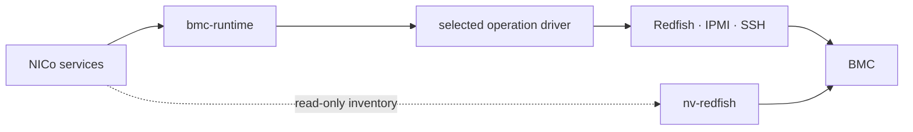
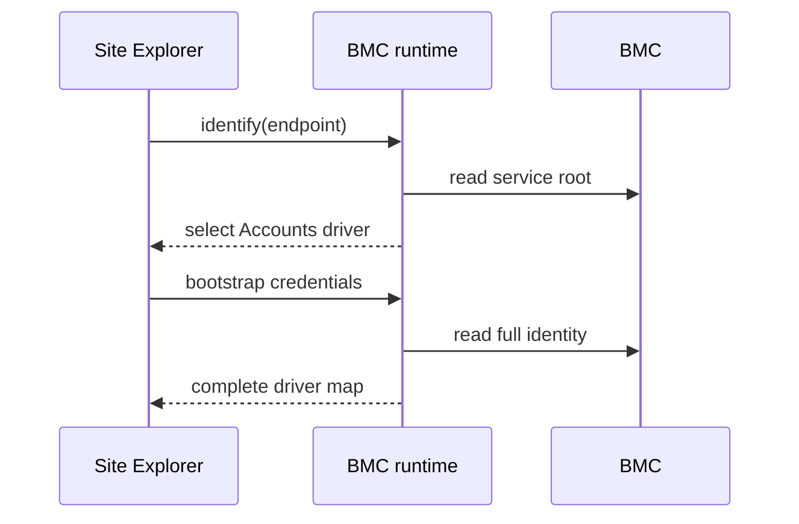

# BMC Driver Platform

Author: Krish Dandiwala

## Summary

NICo's hardware-specific behavior is spread across external libraries (libredfish, nv-redfish), several identity enums, controller branches, BIOS tables, and console code. This makes new hardware expensive to support and makes changes risky.

This design moves that behavior into operation-specific drivers and deprecates libredfish:

- NICo defines small capabilities such as `HostPower`, `Bios`, `BootOrder`, and `Accounts`.
- Each capability has a standard Redfish implementation plus narrowly scoped vendor or model implementations for known deviations.
- Declarative rules resolve every capability from hardware identity and firmware data gathered during exploration.
- Controllers call the capabilities and never branch on vendor or model.
- A common receipt type records asynchronous tasks and jobs.
- BIOS values become declarative baseline data, separate from the driver that knows how to apply them.
- Selection and driver behavior are tested independently.

Drivers are compiled into NICo. This is an in-process library design, not a new service or a runtime plugin system.

## Architecture




### Contracts

`crates/bmc-platform` defines:

- capability traits and operation request/response types
  ```rust
  #[async_trait]
  pub trait BmcControl: Send + Sync {
      async fn reset(
          &self,
          cx: &OpCx<'_>,
      ) -> Result<DriverOutcome<()>, PlatformError>;

      async fn reset_to_factory_defaults(
          &self,
          cx: &OpCx<'_>,
      ) -> Result<DriverOutcome<()>, PlatformError>;
  }
  ```
- `PlatformIdentity`
  ```rust
  pub struct PlatformIdentity {
      pub vendor: Option<String>,
      pub product: Option<String>,
      pub oem_keys: Vec<String>,
      pub manager_model: Option<String>,
      pub manager_firmware: Option<String>,
      pub system_manufacturer: Option<String>,
      pub system_model: Option<String>,
      pub system_sku: Option<String>,
      pub part_number: Option<String>,
      pub bios_version: Option<String>,
      pub chassis_manufacturer: Option<String>,
  }
  ```
- operation receipts and errors
  ```rust
  /// Persisted evidence for asynchronous work accepted by the BMC.
  pub struct OperationReceipt {
      pub driver: DriverId,
      pub operation: Op,
      pub reference: OperationReference,
  }

  pub enum OperationReference {
      /// Standard Redfish task URI.
      RedfishTask { uri: String },
      /// Vendor job id.
      VendorJob { job_id: String },
  }

  /// A typed failure that controllers can handle without matching strings.
  pub enum PlatformError {
      Unsupported { op: Op },
      Unreachable,
      Auth(AuthError),
      Bmc {
          status: u16,
          message_id: Option<String>,
          message: String,
      },
  }
  ```
- owned console configuration types
  ```rust
  pub enum ConsoleSpec {
      SshShell {
          port: u16,
          activate: Vec<String>,
          fallback: Vec<Vec<String>>,
          prompt: String,
          escape_filter: EscapeSeq,
      },
      SshDirect { port: u16 },
      IpmiSol { port: u16 },
      None { reason: String },
  }
  ```

The initial capabilities are:

- `HostPower`
- `BmcControl`
- `Bios`
- `BootOrder`
- `SecureBoot`
- `Lockdown`
- `Accounts`
- `Firmware`
- `Storage`
- `Dpu`
- `Attestation`
- `Console`

Read-only inventory, health, metrics, and exploration reports remain direct `nv-redfish` consumers. The driver platform covers mutations, decision-driving status reads, and console configuration.

### Runtime

`crates/bmc-runtime` owns:

- driver dispatch
- identity projection and rule evaluation
- credential lookup and cache invalidation
- Redfish session pooling
- Redfish, IPMI, and SSH transport handles

Drivers are stateless and open no connections. The runtime gives them lazy transport handles for each operation.

### Drivers

`crates/bmc-drivers` contains one registry per capability:

- The standard driver implements spec-compliant Redfish behavior.
- Vendor or model drivers override only a known deviation and reuse standard functions for everything else.
- The driver map rejects unsupported capabilities before sending a request.

The map contains every capability. Each value is `standard`, `unsupported`, or the id of a specialized driver. For example, an explored ThinkSystem SR650 V4 endpoint stores:

```json
{
  "driver_map": {
    "host_power": "sr650v4-power",
    "bmc_control": "xcc-bmc-control",
    "bios": "standard",
    "boot_order": "standard",
    "secure_boot": "standard",
    "lockdown": "standard",
    "accounts": "xcc-accounts",
    "firmware": "standard",
    "storage": "unsupported",
    "dpu": "unsupported",
    "attestation": "standard",
    "console": "xcc-console"
  }
}
```

## Identity and driver selection

Exploration converts its report into `PlatformIdentity`. Credential bootstrap first uses service-root data to select an `Accounts` driver, then reads the full identity and builds the driver map.




If service-root evidence is missing or ambiguous, NICo does not guess. The endpoint remains in a typed bootstrap-identification state and reports the available evidence. An authorized deployment override may select a compiled-in `Accounts` driver for recovery.

Each rule maps hardware fields and an optional firmware range to `standard`, `unsupported`, or a driver id. Every field in a rule must match.

Rules are checked in this order:

1. Deployment overrides
2. Exact system model, SKU, or part number
3. BMC product or manager model
4. Vendor, OEM key, system manufacturer, or chassis manufacturer
5. `standard` when no rule matches

A field can match an exact value, one of several values, a prefix, or a substring. Firmware can match a version range but does not change rule order. If two rules at the same level match one capability, NICo rejects the configuration.

```rust
Rule {
    capability: Capability::HostPower,
    matches: Match {
        system_model: exact("ThinkSystem SR650 V4"),
        ..Match::NONE
    },
    selection: CapabilitySelection::Driver("sr650v4-power"),
}
```

A rule may use `Unsupported` when all matching machines lack a capability. Optional hardware must be recorded by exploration and matched directly.

The endpoint stores its identity, complete driver map, and `driver_rule_hash`, which identifies the rules used to build the map. If the running rules have a different hash, NICo rebuilds the map from the stored identity. Hardware identity changes require re-exploration. Services copy the address, credential key, and driver map into `BmcRef`; it contains no secrets.

Deployment overrides may select among compiled-in drivers, but invalid, ambiguous, or incompatible rules must fail configuration loading.

```toml
# One override per block; repeat the block for more. Each names one capability,
# one match, and the driver to select for it.
[[bmc_driver_overrides]]
capability = "boot_order"
match = { vendor = "Lenovo", system_model = "ThinkSystem SR650 V3", firmware_min = "4.10" }
driver = "standard"

[[bmc_driver_overrides]]
capability = "host_power"
match = { system_model = "ThinkSystem SR650 V3" }
driver = "sr650v4-power"
```

## Operation results

Every capability method returns `Result<DriverOutcome<T>, PlatformError>`, where `T` is the operation's value or `()` for a mutation.

```rust
pub enum DriverOutcome<T> {
    /// The operation finished. Execute any follow-up actions before advancing.
    Complete {
        value: T,
        follow_up: Vec<ControllerAction>,
    },
    /// The BMC accepted asynchronous work.
    Accepted(OperationReceipt),
    /// Execute these prerequisites, then retry the same capability call.
    Blocked {
        prerequisites: Vec<ControllerAction>,
    },
}

pub enum ControllerAction {
    HostPower(HostPowerAction),
    BmcReset,
    SetLockdown(LockdownState),
    ClearNvram,
    RefreshExploration,
    Wait { seconds: u64 },
    ManualIntervention { code: String },
}
```

`Blocked` is for prerequisites such as disabling lockdown before a BIOS write. `Complete.follow_up` is for actions such as resetting the BMC after firmware installation.

The state controller also orders and persists prerequisites and follow-up actions before executing them. It retries the capability call after prerequisites and verifies capability status after follow-up actions.

Receipts and queued actions are stored in controller state, so their serialized representation must remain backward-compatible across upgrades.

State controllers may branch on `DriverOutcome`, capability-specific status enums, typed errors, capability availability, and controller policy. They must not branch on vendor, model, driver id, OEM strings, or firmware versions. Drivers only issue hardware calls and return normalized information.

## BIOS configuration

BIOS configuration separates:

- **What to set:** a baseline attribute map selected by identity and profile, merged with the existing site override.
- **How to set it:** the selected `Bios` driver, including pending-settings resources, apply-on-reset behavior, and vendor jobs.

Apply and status use the same merged attribute map so they cannot disagree about the expected state. Attribute names remain data, not controller logic.

```rust
let attributes = platform.bios_attributes(&bmc, Profile::Performance);
let outcome = platform.bios(&bmc).apply(&attributes).await?;
```

The initial merge order is:

1. NICo baseline
2. site override.

A future tenant layer may be added above these, but its validation policy is out of scope.

## Integration

- `machine-controller` replaces hardware client construction with runtime handles. State machines keep their orchestration but replace vendor branches and job-id fields.
- `preingestion-manager` uses drivers for firmware, BFB installation, reset policy, and SSH-backed DPU operations.
- Site Explorer retains scheduling, locking, credential policy, and inventory reads. It performs identity resolution and uses drivers for mutations and remediation status.
- `ssh-console` receives an owned `ConsoleSpec` from carbide-api and removes its vendor table.
- `admin-cli` uses drivers for mutations, `nv-redfish` for typed read-only inventory, and a read-only raw GET for diagnostics.

## Testing

Test selection and behavior separately:

- Selection tests run rules against committed exploration fixtures and assert the complete driver map. CI rejects ambiguity and unintended rerouting.
- Driver tests use an expectation-based `bmc-mock` that fails on unexpected requests and verifies headers, payloads, and task or job parsing.
- Controller tests mock the small capabilities rather than the 104-method `Redfish` trait.
- Choreography tests assert each specialized driver's prerequisite and follow-up action sequences.
- Shared firmware scenarios run against both preingestion and machine-controller to prevent their reset and power-drain policies from diverging again.
- A conformance command runs standard and selected-driver checks against a real test BMC. Destructive operations require explicit authorization and must not run against production.

## Rollout

Migrate one complete capability across all callers at a time:

1. Land `bmc-platform`, `bmc-runtime`, and `bmc-drivers` with standard drivers, selection rules, and tests. No production caller uses them yet.
2. Run selection in shadow mode. Once fixture and fleet results have no unexplained mismatches, persist and backfill `driver_map` and `driver_rule_hash`. Endpoints without a valid map stay on the old path.
3. Migrate `HostPower`, `BmcControl`, and `Accounts` across every caller.
4. Migrate the remaining capabilities one at a time across every caller. Remove vendor and model branches as each capability moves, and require preingestion and machine-controller to produce the same firmware outcomes.
5. Remove libredfish and duplicate identity mappings after no callers remain. Add CI protection against new vendor or model dispatch in migrated controllers.

For each capability, the old or new path is active, never both.

## Open decisions

1. Should raw Redfish requests be available to drivers, and how will their use be reviewed?
2. Should Redfish error-body parsing move into `nv-redfish`?
3. How are tenant-provided BIOS values validated if that layer is added?

