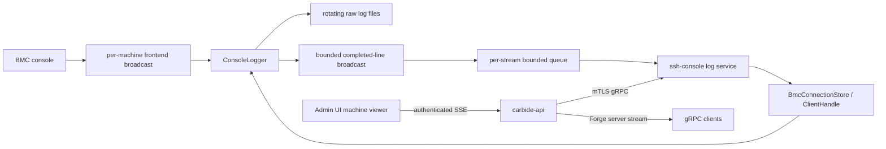

# Console Log Streaming

- **Issue:** [#5626](https://github.com/dsx-ai-factory/infra-controller/issues/5626)
- **Status:** Implemented

## Problem

Operators need to see console output from machines to debug things like boot failures, and this should work without
requiring an observability layer like grafana/loki to be deployed. `carbide-ssh-console` already writes console logs to
rotating files, but those files are local to the service and there is no API that joins recent history to a live stream.

This design exposes a live stream of console logs, defaulting to the last 1,000 complete lines, in order and without a
gap or duplicate at the history/live boundary. History stays on disk; memory is bounded to channels, line assembly, and
the requested tail being read.

## Architecture



`ConsoleLogger` is the single ordering point. It continues to consume the existing broadcast channel we already use for
console output, and converts console and connection-status messages into complete lines, strips ANSI escapes, and writes
the unchanged raw line to disk. After a successful write it assigns a process-local sequence and publishes the same line
on a bounded broadcast. The sequence is coordination metadata only and is not added to the file or public response.

`ClientHandle` owns a cloneable `ConsoleLogClient` containing a weak reference to the completed-line broadcast, and a
channel for sending commands to the logger actor. The logger actor keeps the strong broadcast sender, so its exit closes
all subscribers without a client handle extending its lifetime. `BmcConnectionStore` resolves an exact machine ID to
this client. This keeps streaming attached to the per-machine BMC client across BMC disconnect/reconnect cycles; it does
not subscribe directly to raw SSH chunks or duplicate line assembly in the API service.

## Seamless history-to-live handoff

For each request, the ssh-console service performs this protocol:

1. Subscribe to the logger's broadcast channel, then send a snapshot request to the logger actor.
2. When the logger actor handles the request, it flushes the current file and records the last published sequence as the
   snapshot "watermark". It then returns read-only handles for the current and rotated files, including each file's
   length, in the `snapshot` reply. The actor then resumes processing console data.
3. Start a per-stream "pump" with the broadcast receiver and watermark. It discards entries at or below the watermark,
   including any reported lag range covered by the snapshot, then uses non-blocking sends to place newer entries in a
   bounded `client_live_tx` queue owned only by this stream.
4. In parallel, another task reads prior logs from the file handles stored in `snapshot`, honoring the requested number
   of lines, and sends them oldest-first to the request channel. Once the client has received the prior logs, it
   then pumps messages from `client_live_tx` until the client disconnects.

This technique avoids pausing logging and does not race with rotation. It reads files in blocks
and stops once it has enough newline delimiters, rather than loading whole files. Lines split across a captured file
boundary are reassembled. A partial line at the end of the captured history is omitted; a partial line still in the
logger's assembly buffer remains there until its newline and later appears exactly once as live data.

The pump never waits for its gRPC client. If its queue is full, it counts the discarded lines. Before the next real line
it can enqueue, it first enqueues a synthetic "gap" line reporting the number of lines that have been discarded; if the
gap line or real line does not fit, the count remains pending. A one-second timer also retries a pending marker when
console output is idle. The aggregate `carbide_ssh_console_stream_lines_dropped_total` counter records the same loss
with only `client_queue_full` or `completed_line_broadcast_lag` as its reason, never a client or machine identifier.
Slow clients thus receive explicit gaps without blocking the logger or affecting other streams.

The no-gap/no-duplicate guarantee applies to a stream that does not overrun its own queue. A reconnect starts an
independent fresh snapshot; there is no durable way to resume logs from a prior session.

## APIs and security

The public Forge API gains a `StreamConsoleLogs` RPC. The private ssh-console service uses equivalent messages so
`carbide-api` can proxy responses without reframing them.

```protobuf
rpc StreamConsoleLogs(StreamConsoleLogsRequest)
    returns (stream ConsoleLogLine);

message StreamConsoleLogsRequest {
  common.MachineId machine_id = 1;
  uint32 tail_lines = 2;
}

message ConsoleLogLine {
  bytes data = 1;
}
```

`tail_lines = 0` means a default of 1,000; values greater than 1,000 are invalid. Each response is one ANSI-stripped
complete line, including its newline. `bytes` preserves console output that is not valid UTF-8. There is no pagination
beyond the initial tail.

The ssh-console service adds a configurable TLS gRPC listener, `api_listen_address`, defaulting to `[::]:1079`. It uses
`client_cert_path`, `client_key_path`, and `forge_root_ca_path`, which deployments point at the existing cert-manager
identity and CA mounted under `/var/run/secrets/spiffe.io`. TLS client-certificate validation and `carbide-authn`
principal extraction admit only `api_allowed_client_spiffe_id`; deployments render the exact `nico-api` SPIFFE service
identity. Anonymous and other CA-trusted service identities are rejected.

The private listener validates its initial TLS material before binding is reported ready. It reloads the certificate,
key, and client CA every five minutes for new handshakes, retains the last valid configuration on failure, and retries
after 15 seconds. TLS handshakes time out after ten seconds; existing connections and streams are unaffected by reloads.

`carbide-api` connects to the chart-derived `ssh_console_url`
(`https://nico-ssh-console-rs.<namespace>.svc.cluster.local:1079` by default), presenting its existing SPIFFE
certificate and validating the ssh-console DNS identity against the mounted CA. If the URL is omitted, the public RPC
is unavailable; if it is configured with invalid URL or TLS material, Core fails startup. Core refreshes the private
client transport every five minutes, retains the last valid transport and retries after 15 seconds on refresh failure,
and performs one rebuild-and-retry for a connection failure before response headers. Existing streams retain their
established transport.

The public RPC is restricted to `ForgeAdminCLI` by internal RBAC and remains behind the existing Forge authentication,
authorization, admission control, request logging, and cancellation layers. Private status codes pass through; Core
maps transport failures to `UNAVAILABLE`. Cancelling either downstream stream cancels the upstream stream promptly.

Errors map as follows:

| Condition                                      | gRPC status           |
|------------------------------------------------|-----------------------|
| Invalid limit                                  | `INVALID_ARGUMENT`    |
| Machine absent from the BMC pool               | `NOT_FOUND`           |
| Console logging disabled or logger unavailable | `FAILED_PRECONDITION` |
| Core has no `ssh_console_url`                  | `FAILED_PRECONDITION` |
| Log read/write failure                         | `INTERNAL`            |
| Private-service transport failure              | `UNAVAILABLE`         |

A BMC disconnect is not an API error. The stream remains open and includes the same connection status lines we already
write to the per-BMC logs, and live output resumes when the BMC reconnects. A line is published only after its file
write succeeds.

## Admin UI and deployment

Each machine detail page gains a **Console Logs** action opening an authenticated, machine-specific viewer. An API-web
SSE handler consumes the same Core stream with keepalives, decodes bytes with UTF-8 replacement for display, and writes
lines through DOM `textContent` into a 5,000-line `<pre>` view. Terminal Core errors become a named SSE error event with
a safe message before the connection closes. The page shows connection/error state, supports follow/pause and clear,
and replaces its contents with a fresh 1,000-line snapshot after reconnection.

The ssh-console chart and manifests expose the new `grpc` service port and pass the listener configuration. The nico-api
chart supplies the internal URL; both pods reuse their existing certificate volumes. A process-wide cancellation token
owns the ssh-console API, SSH server, metrics server, BMC pool, loggers, and per-stream tasks, and the process awaits
those server tasks during shutdown. The deployment remains one ssh-console replica with pod-local `emptyDir` log
storage.

## Non-goals

- Changing log retention, file format, or OpenTelemetry/Loki ingestion.
- Interactive console input or history beyond 1,000 lines/configured rotations.
- Durable cursors or transparent resume after a client or service restart.
- Go REST/OpenAPI, CLI support, or multi-replica ssh-console storage.
