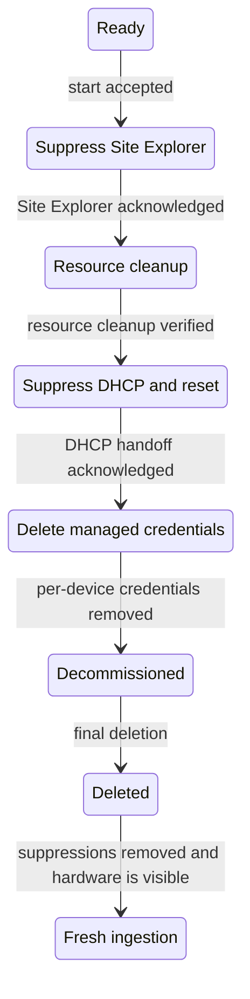

# Managed Resource Decommissioning Workflow

## Status

Draft — aligned with the managed-host, managed-switch, managed-power-shelf,
and Flow rack decommissioning implementations tracked under
[#1969](https://github.com/NVIDIA/infra-controller/issues/1969).

## Summary

This document defines the lifecycle behavior shared by NICo decommissioning
workflows. Decommissioning returns a managed resource to an unmanaged,
pre-ingestion state. An operator can then either physically remove the resource
or delete its NICo record and let still-connected hardware be discovered and
ingested again.

Resource-specific documents define the hardware cleanup and exact controller
states:

- [Managed host decommissioning](./managed-host-decommissioning.md)
  resets the host and its DPUs and installs a vanilla BFB on each managed DPU.
- [Managed switch decommissioning](./managed-switch-decommissioning.md)
  factory-resets NVOS and the switch BMC through the RMS backend.
- [Managed power shelf decommissioning](./managed-power-shelf-decommissioning.md)
  factory-resets the power-shelf PMC.
- [Rack-scale decommissioning with NICo Flow](./rack-decommissioning.md)
  orchestrates those workflows across an entire rack.

The same lifecycle defines dependency-safe ordering when an entire rack is
decommissioned.

## Terminology

- **Decommissioning** is the convergent hardware and control-plane cleanup that
  ends in a retained terminal record.
- **Final deletion** removes a successfully decommissioned resource from NICo.
  It is deliberately separate from decommissioning. Final deletion also removes
  that resource's BMC suppression rows so still-connected hardware becomes
  eligible for rediscovery.
- **Force deletion** is an administrative recovery mechanism. It does not prove
  that hardware is neutral and is not a substitute for decommissioning or final
  deletion.
- An **expected-resource record** is the corresponding `expected_machines`,
  `expected_switches`, or `expected_power_shelves` entry that permits Site
  Explorer to ingest known hardware. NICo does not own this data and must not
  delete it during decommissioning or final deletion.
- **BMC** is used collectively for a host or switch BMC or a power-shelf PMC.
- A **BMC suppression** is a row in `bmc_suppressions` that tells a subsystem
  (`site_explorer` or `dhcp`) to stop serving a MAC until the row is removed.

## Common invariants

Every resource-specific decommissioning workflow preserves these invariants:

1. There is at most one active decommissioning operation for a resource.
1. A decommissioning resource is excluded from allocation, reprovisioning,
   updates, repair, maintenance selection, and other exclusive operations.
1. The terminal `Decommissioned` substate performs no more hardware work.
1. Decommissioning and final deletion preserve the expected-resource record.
1. Per-device credentials remain available until the last operation that needs
   them has succeeded; credential deletion is the final step before
   `Decommissioned`.
1. A resource enters `Decommissioned` only after required hardware cleanup is
   verified and NICo-managed per-device credentials have been removed.
1. Retriable work is idempotent and resumes from persisted progress.
1. A switch or power shelf cannot begin decommissioning while any managed host
   on its rack is assigned to an instance.
1. Hardware cleanup does not begin until Site Explorer has acknowledged
   suppression for every required BMC MAC.
1. DHCP is suppressed before the reset or power cycle that forces the device
   back into DHCP discovery, and the resource does not advance until that
   suppression is acknowledged.

## Common lifecycle

The names of intermediate controller states are resource-specific, but every
workflow follows the same lifecycle:



### Rack dependency gate and ordering

The complete orchestration contract, Flow API, and operator workflow are
defined in
[Rack-scale decommissioning with NICo Flow](./rack-decommissioning.md).

Decommissioning a switch, power shelf, or whole rack must not interrupt a
managed host that is still in use. Before accepting a switch or power-shelf
start request, NICo Core verifies that no managed host on the associated rack
is assigned to an instance. Rack-scale Flow decommissioning additionally
decommissions every compute component before switches and power shelves.

A rack-wide decommissioning operation proceeds in dependency order:

1. decommission every managed host and wait for each one to reach
   `Decommissioned`;
1. decommission every managed switch and wait for each one to reach
   `Decommissioned`; and
1. decommission every managed power shelf and wait for each one to reach
   `Decommissioned`.


The parent rack operation persists per-resource progress so a retry does not
repeat a resource that already reached `Decommissioned`. Final deletion remains
an explicit operator action and is not part of this dependency sequence.

### Eligibility and preflight

A start request is accepted only when the target resource is exactly `Ready`
and resource-specific preconditions hold (for example, DPU Redfish BFB-install
capability for hosts, or the RMS switch backend for managed switches). The
start request atomically claims the resource into decommissioning; a duplicate
start against an already-decommissioning resource is rejected or treated as
already claimed.

Before changing hardware, NICo resolves:

- the canonical resource and all BMC MAC addresses required by the workflow;
- the expected-resource record;
- the credentials required by every cleanup operation; and
- all resource-specific reset artifacts, installation methods, and cleanup
  capabilities.

A missing required input fails preflight. NICo must not silently omit an
unsupported required cleanup operation.

### Discovery suppression

After the start request is accepted, the controller upserts a
`bmc_suppressions` row with `subsystem = 'site_explorer'` for every BMC MAC
that the workflow must quiesce. Site Explorer starts no new exploration for
that MAC. After it has observed the suppression and finished queued or
in-flight work for that BMC, Site Explorer sets `acknowledged_at`.

The decommissioning workflow waits for a non-null `acknowledged_at` on every
required Site Explorer suppression before leaving the initial suppression
state or changing hardware. The timestamp is therefore an acknowledgement from
Site Explorer, not merely the time at which the controller requested
suppression.

The suppression rows remain through decommissioning and terminal retention.
This prevents discovery from recreating or mutating a resource while NICo is
cleaning it up.

### Resource cleanup

Each resource-specific workflow defines a converge-and-verify procedure for the
configuration and credentials NICo placed on the hardware. A write is made only
when needed, required resets or power cycles are performed, and the result is
read back before advancing.

### DHCP suppression and controller reset

After hardware cleanup that still needs authenticated access, NICo performs a
DHCP handoff for every management interface the workflow owns:

1. Upsert a `bmc_suppressions` row with `subsystem = 'dhcp'` for each MAC.
1. Invalidate DHCP caches so subsequent requests observe the suppression.
1. Force the device back into DHCP discovery by power-cycling the host,
   factory-resetting NVOS, and/or factory-resetting the BMC, depending on the
   resource type.
1. Return `DHCPNAK` if the restarted client sends `DHCPREQUEST` for its old
   address, forcing the client back to INIT.
1. Suppress incoming `DHCPDISCOVER` (no `DHCPOFFER`) and set `acknowledged_at`
   on the DHCP suppression row when that discover is observed.
1. Wait for `acknowledged_at` on every required DHCP suppression before
   releasing old leases or deleting remaining per-device credentials.

Clearing `acknowledged_at` happens when a suppression is newly requested or
re-requested. A retry that finds suppression already present preserves an
existing acknowledgement. If any required acknowledgement remains null, the
resource remains in the waiting substate and retains the credentials needed to
retry the reset.

### Managed credential removal

Credential removal is the last step before `Decommissioned`. NICo retains
working credentials through factory reset and DHCP handoff, then deletes
per-device secrets and rotation state. Site-wide credentials and shared
lockdown input key material are not deleted.

### Final deletion and reingestion

Final deletion is accepted only from the terminal `Decommissioned` substate.
It removes the resource and its associated NICo state in the resource-specific
transaction boundary. The expected-resource record remains. Final deletion also
removes the resource's Site Explorer and DHCP suppression rows, which makes
still-connected expected hardware eligible for normal discovery and ingestion.

Physically absent hardware stays absent. An operator may remove the
expected-resource record separately after decommissioning when the hardware
should not be ingested again.

## BMC suppressions

Add a table owned by the site inventory domain:

```sql
CREATE TABLE bmc_suppressions (
    bmc_mac_address MACADDR NOT NULL,
    subsystem TEXT NOT NULL CHECK (
        subsystem IN ('site_explorer', 'dhcp')
    ),
    reason TEXT NOT NULL,
    requested_at TIMESTAMPTZ NOT NULL DEFAULT statement_timestamp(),
    acknowledged_at TIMESTAMPTZ,
    PRIMARY KEY (bmc_mac_address, subsystem)
);
```

Site Explorer loads this table and filters an endpoint as soon as its MAC is
known, before authentication, credential rotation, inventory persistence, power
control, or managed-resource creation. When it observes a `site_explorer`
suppression, it prevents new work for the MAC, waits for previously queued or
in-flight work for that MAC to finish, and then sets `acknowledged_at`. Site
Explorer is the only writer of the Site Explorer acknowledgement.

For a MAC with a `dhcp` suppression, NICo handles the message as follows:

- `DHCPREQUEST` returns a `DHCPNAK` disposition; and
- `DHCPDISCOVER` sets `acknowledged_at` and returns a no-offer disposition.

Host decommissioning also suppresses OOB underlay MACs for DHCP during the
host power-cycle handoff. Switch decommissioning suppresses the NVOS management
MAC for DHCP before the NVOS factory reset.

## Failure and retry behavior

Failures remain in the current decommissioning substate. The normal state
handler outcome records the redacted error, retry count, last-attempt time, and
retry schedule. Controllers resume from persisted progress; they do not
implicitly skip a required criterion.

Operations must be idempotent:

- an already absent account, password, or resource is successful only when the
  desired absence is verified;
- asynchronous operation identifiers are persisted before polling;
- a replacement credential is verified before the old secret is deleted; and
- deleting an already absent secret or suppression row succeeds.

There is no force-skip API that can claim successful decommissioning while a
required cleanup criterion remains unmet.

## Shared verification requirements

Every resource workflow must verify that:

- only an eligible `Ready` resource can begin decommissioning;
- switch and power-shelf decommissioning is rejected while any managed host on
  the rack is assigned to an instance;
- rack decommissioning completes hosts before switches and switches before
  power shelves;
- missing identity, expected-resource, credential, or capability inputs fail
  before hardware mutation;
- every substate resumes correctly after a controller restart;
- credentials remain until dependent hardware operations finish;
- every required BMC has a non-null Site Explorer `acknowledged_at` before
  hardware cleanup begins;
- ignored BMCs are neither explored nor served by DHCP while suppressed;
- DHCP suppression is requested before the reset or power cycle that forces
  rediscovery;
- a suppressed `DHCPREQUEST` receives `DHCPNAK`, and a suppressed
  `DHCPDISCOVER` receives no offer;
- every required DHCP suppression has a non-null `acknowledged_at` before
  credential deletion and the transition to `Decommissioned`;
- final deletion is rejected before `Decommissioned`;
- final deletion preserves the expected-resource record and removes suppression
  rows; and
- connected hardware is rediscovered only after its suppressions are removed,
  while absent hardware is not recreated.
