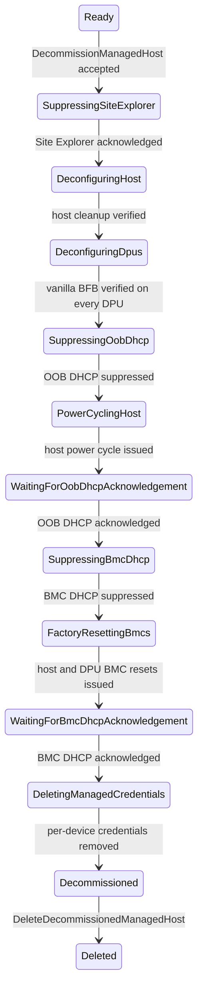

# Managed Host Decommissioning

## Status

Draft — aligned with the managed-host decommissioning implementation tracked
under [#1969](https://github.com/NVIDIA/infra-controller/issues/1969).

## Summary

This document defines the managed-host specialization of the
[shared decommissioning lifecycle](./decommissioning-workflow.md).
Decommissioning can be used for two purposes:

- physically removing the machine from the site; or
- returning the machine to a neutral state and then ingesting it again as a
  fresh machine.

Decommissioning starts only when the managed host is in `Ready`. NICo removes
the configurations it placed on the host and its DPUs, installs a vanilla BFB
on every managed DPU that supports Redfish BFB install, suppresses Site
Explorer and DHCP for the relevant MACs, factory-resets host and DPU BMCs, and
then deletes per-device credentials. The workflow ends in the terminal
`Decommissioned` substate.

The terminal record is retained until an operator explicitly requests final
deletion. Final deletion removes the machine and its associated state, removes
BMC and OOB DHCP suppressions, and does not touch the `expected_machines`
entry. Hardware that has been physically removed stays absent. The site manager
can remove the machine from `expected_machines` after the process is complete.

## Terminology and invariants

In this document, **managed host** means the host machine plus every DPU linked
to it. The host workflow inherits all
[common invariants](./decommissioning-workflow.md#common-invariants).
Therefore, the host and its DPUs are one decommissioning unit: no member can
participate in allocation, reprovisioning, update, repair, or rack maintenance
while the workflow is active, and the unit cannot enter `Decommissioned` until
cleanup has succeeded for every member.

## State model

`ManagedHostState` gains a `Decommissioning` variant that carries a
`DecommissioningState` substate. Terminal completion is the
`Decommissioning { Decommissioned }` substate.

```rust
Decommissioning {
    decommissioning_state: DecommissioningState,
},
```

Multi-DPU steps contain a map keyed by DPU machine ID so one completed DPU is
not repeated after another DPU fails. BMC factory-reset progress persists the
set of completed machine IDs.

```rust
enum DecommissioningState {
    SuppressingSiteExplorer,
    DeconfiguringHost {
        deconfiguring_state: DeconfiguringHostState,
    },
    DeconfiguringDpus {
        dpu_states: HashMap<MachineId, DeconfiguringDpuState>,
    },
    SuppressingOobDhcp,
    PowerCyclingHost,
    WaitingForOobDhcpAcknowledgement,
    SuppressingBmcDhcp,
    FactoryResettingBmcs {
        completed: HashSet<MachineId>,
    },
    WaitingForBmcDhcpAcknowledgement,
    DeletingManagedCredentials,
    Decommissioned,
}

enum DeconfiguringHostState {
    DisableLockdown,
    RebootAfterLockdown,
    ClearSuperNicLockdown,
    WaitForSuperNicLockdown,
    ClearUefiPassword,
    WaitForUefiPasswordJobScheduled { job_id: String },
    RebootAfterUefiPassword { job_id: String },
    WaitForUefiPasswordJobCompletion { job_id: String },
    ResetUefiSettings,
}

enum DeconfiguringDpuState {
    DeletingFromDpf,
    InstallingBfb,
    WaitForInstallComplete { task_id: String },
    WaitingForBootAfterBfbInstall,
    Complete,
}
```

Externally reported state strings include nested host-deconfigure detail, for
example `Decommissioning/DeconfiguringHost/DisableLockdown` and
`Decommissioning/DeconfiguringDpus`.

### State diagram



### Transition criteria

| From | To | Required criteria |
| --- | --- | --- |
| `Ready` | `SuppressingSiteExplorer` | Request authorized; host is exactly `Ready`; every linked DPU that must be cleaned supports Redfish BFB install; start claim recorded. |
| `SuppressingSiteExplorer` | `DeconfiguringHost` | Host and DPU BMC MACs resolved; every Site Explorer suppression has `acknowledged_at`. |
| `DeconfiguringHost` | `DeconfiguringDpus` | Lockdown disabled; SuperNIC lockdown cleared; host UEFI password cleared; UEFI settings reset; required reboots completed. |
| `DeconfiguringDpus` | `SuppressingOobDhcp` | Every DPU finished DPF cleanup when applicable, completed vanilla BFB install, and booted after install. Zero-DPU hosts skip this work. |
| `SuppressingOobDhcp` | `PowerCyclingHost` | DHCP suppressions exist for every OOB underlay MAC. |
| `PowerCyclingHost` | `WaitingForOobDhcpAcknowledgement` | Host power cycle issued. |
| `WaitingForOobDhcpAcknowledgement` | `SuppressingBmcDhcp` | Every OOB DHCP suppression has `acknowledged_at`. |
| `SuppressingBmcDhcp` | `FactoryResettingBmcs` | DHCP suppressions exist for every host and DPU BMC MAC. |
| `FactoryResettingBmcs` | `WaitingForBmcDhcpAcknowledgement` | Factory reset issued for every host and DPU BMC. |
| `WaitingForBmcDhcpAcknowledgement` | `DeletingManagedCredentials` | Every BMC DHCP suppression has `acknowledged_at`. |
| `DeletingManagedCredentials` | `Decommissioned` | Per-device BMC and DPU credentials and rotation markers removed. |
| `Decommissioned` | deleted | `DeleteDecommissionedManagedHost` authorized; machine rows and suppressions removed; `expected_machines` remains. |

## State behavior

### `SuppressingSiteExplorer`

The start API records a decommission request against a `Ready` host and the
controller enters this substate. It upserts Site Explorer suppressions for the
host BMC and every DPU BMC, then waits for acknowledgement before any
destructive work.

### `DeconfiguringHost`

Host cleanup converges through nested substates:

- disable BIOS/BMC lockdown and reboot when required;
- clear SuperNIC lockdown and wait for confirmation;
- clear the host UEFI administrator password through the Redfish job path,
  rebooting when required; and
- reset UEFI settings.

Each operation is converge-and-verify. Unsupported required operations block
decommissioning.

### `DeconfiguringDpus`

For every managed DPU:

1. If DPF was used for ingestion, delete the DPF node and related resources.
1. Install the vanilla pre-ingestion BFB through Redfish.
1. Wait for the Redfish update task to complete.
1. Wait for the DPU to boot after install.

The parent state advances only after every DPU reports `Complete`.

### OOB DHCP handoff

`SuppressingOobDhcp`, `PowerCyclingHost`, and
`WaitingForOobDhcpAcknowledgement` suppress DHCP for underlay OOB MACs, power
cycle the host so those interfaces rediscover, and wait for DHCP
acknowledgement. This prevents NICo from re-serving the old OOB addresses
during later BMC work.

### BMC DHCP handoff and factory reset

`SuppressingBmcDhcp`, `FactoryResettingBmcs`, and
`WaitingForBmcDhcpAcknowledgement` suppress DHCP for every host and DPU BMC,
factory-reset those BMCs, and wait for DHCP acknowledgement. Credentials remain
available through this phase so resets can be retried.

### `DeletingManagedCredentials`

After DHCP handoff succeeds, NICo deletes machine-specific credential material,
including BMC root credentials, DPU SSH/HBN credentials, and related rotation
markers. Site-wide credentials are retained.

### `Decommissioned`

NICo retains inventory for operator verification. The machine is excluded from
capacity and health remediation. The only normal mutation accepted in this
substate is final deletion.

## APIs and authorization

### Start decommissioning

```protobuf
rpc DecommissionManagedHost(DecommissionManagedHostRequest)
    returns (DecommissionManagedHostResponse);

message DecommissionManagedHostRequest {
  common.MachineId machine_id = 1;
}

message DecommissionManagedHostResponse {}
```

The request requires a host machine ID. DPU IDs are rejected. The host must be
exactly `Ready`, and every linked DPU that participates in cleanup must support
Redfish BFB installation.

Admin CLI:

```bash
nico-admin-cli managed-host decommission <machine-id>
```

### Final deletion

```protobuf
rpc DeleteDecommissionedManagedHost(DeleteDecommissionedManagedHostRequest)
    returns (DeleteDecommissionedManagedHostResponse);

message DeleteDecommissionedManagedHostRequest {
  common.MachineId machine_id = 1;
}

message DeleteDecommissionedManagedHostResponse {}
```

The request is accepted only from
`Decommissioning { Decommissioned }`. It deletes the host, associated DPUs,
interfaces, retained boot-interface records, DPU network allocations and
mappings, and Site Explorer / DHCP suppressions for the host BMC, DPU BMC, and
OOB MACs covered by the workflow.

The `expected_machines` row is deliberately preserved.

Admin CLI:

```bash
nico-admin-cli managed-host delete-decommissioned <machine-id>
```

Existing force-delete APIs do not perform or prove this cleanup and are not
substitutes for decommissioning.

## Failure and retry behavior

The host follows the
[shared failure and retry behavior](./decommissioning-workflow.md#failure-and-retry-behavior).
In addition:

- "already unlocked," "password absent," "account absent," and "resource not
  found" are successful results when verified;
- asynchronous Redfish and DPF task IDs are persisted before polling; and
- DPU secret deletion treats an absent key as success.

## Verification plan

In addition to the
[shared verification requirements](./decommissioning-workflow.md#shared-verification-requirements),
unit and integration tests should cover:

- rejection when any required DPU lacks Redfish BFB-install support;
- hardware cleanup waits for Site Explorer acknowledgement for every host and
  DPU BMC;
- zero-, one-, and multi-DPU transitions, including one DPU retrying after a
  sibling completes;
- OOB DHCP suppression and acknowledgement before BMC reset;
- BMC DHCP suppression before factory reset;
- credential deletion only after BMC DHCP acknowledgement; and
- final deletion removing suppressions while preserving `expected_machines`.

Hardware qualification must exercise each supported host vendor, BlueField
generation, multi-DPU topology, and required power cycle.
