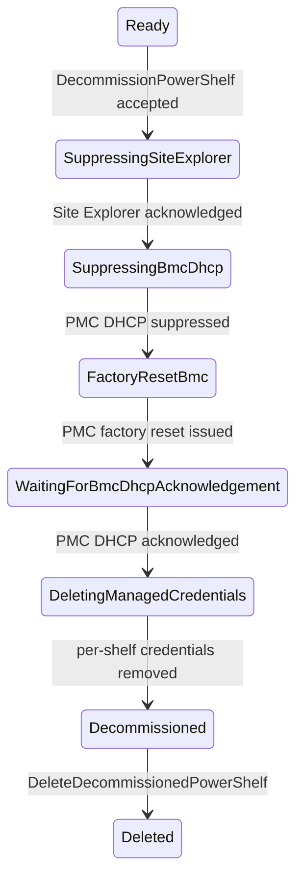

# Managed Power Shelf Decommissioning

## Status

Draft — aligned with the managed power-shelf decommissioning implementation
tracked under [#1969](https://github.com/NVIDIA/infra-controller/issues/1969).

## Summary

This document defines the managed-power-shelf specialization of the
[shared decommissioning lifecycle](./decommissioning-workflow.md).
A managed power shelf is returned to a neutral state by suppressing Site
Explorer, suppressing PMC DHCP, factory-resetting the PMC, verifying DHCP
handoff, and then removing NICo's stored per-shelf credential state. This
workflow does not change shelf power state or firmware beyond the PMC reset
needed for DHCP handoff.

Decommissioning starts only from `Ready` and is rejected while any managed host
on the power shelf's rack is assigned to an instance. It ends in the retained
terminal `Decommissioned` substate. Final deletion preserves the
`expected_power_shelves` record so a connected shelf can be discovered and
ingested again.

## Invariants

The power-shelf workflow inherits all
[common invariants](./decommissioning-workflow.md#common-invariants).
In particular:

1. PMC DHCP is suppressed before the PMC factory reset.
1. Credentials remain until DHCP handoff is acknowledged.
1. Decommissioning does not change shelf power state or firmware beyond the PMC
   reset used for handoff.
1. `expected_power_shelves` is preserved by decommissioning and final deletion.

## State model

```rust
Decommissioning {
    decommissioning_state: PowerShelfDecommissioningState,
},
```

```rust
enum PowerShelfDecommissioningState {
    SuppressingSiteExplorer,
    SuppressingBmcDhcp,
    FactoryResetBmc,
    WaitingForBmcDhcpAcknowledgement,
    DeletingManagedCredentials,
    Decommissioned,
}
```

Externally reported state strings are `Decommissioning/<substate>`.

### State diagram



### Transition criteria

| From | To | Required criteria |
| --- | --- | --- |
| `Ready` | `SuppressingSiteExplorer` | Request authorized; power shelf is exactly `Ready`; no managed host on the rack is assigned to an instance. |
| `SuppressingSiteExplorer` | `SuppressingBmcDhcp` | PMC MAC resolved; Site Explorer suppression has `acknowledged_at`. |
| `SuppressingBmcDhcp` | `FactoryResetBmc` | DHCP suppression exists for the PMC MAC. |
| `FactoryResetBmc` | `WaitingForBmcDhcpAcknowledgement` | PMC factory reset issued through Redfish. |
| `WaitingForBmcDhcpAcknowledgement` | `DeletingManagedCredentials` | PMC DHCP suppression has `acknowledged_at`. |
| `DeletingManagedCredentials` | `Decommissioned` | Per-shelf PMC credentials removed. |
| `Decommissioned` | Deleted | `DeleteDecommissionedPowerShelf` authorized; power-shelf state and suppressions removed; `expected_power_shelves` remains. |

## State behavior

### `SuppressingSiteExplorer`

The start API claims a `Ready` power shelf into decommissioning. The controller
upserts a Site Explorer suppression for the PMC MAC and waits for
acknowledgement before destructive work.

### PMC reset and DHCP handoff

`SuppressingBmcDhcp`, `FactoryResetBmc`, and
`WaitingForBmcDhcpAcknowledgement` suppress PMC DHCP, factory-reset the PMC,
and wait for DHCP acknowledgement. The PMC reset restarts the management
controller so its DHCP client begins a new exchange against the suppressed
service.

### `DeletingManagedCredentials`

After handoff succeeds, NICo deletes per-shelf PMC credential material and
related rotation markers.

### `Decommissioned`

NICo retains inventory for operator verification. The shelf is excluded from
rack health remediation, maintenance, firmware, and power operations. The only
normal mutation accepted in this substate is final deletion.

## APIs and authorization

### Start decommissioning

```protobuf
rpc DecommissionPowerShelf(DecommissionPowerShelfRequest)
    returns (DecommissionPowerShelfResponse);

message DecommissionPowerShelfRequest {
  PowerShelfId power_shelf_id = 1;
}

message DecommissionPowerShelfResponse {}
```

Admin CLI:

```bash
nico-admin-cli power-shelf decommission <power-shelf-id>
```

### Final deletion

```protobuf
rpc DeleteDecommissionedPowerShelf(DeleteDecommissionedPowerShelfRequest)
    returns (DeleteDecommissionedPowerShelfResponse);

message DeleteDecommissionedPowerShelfRequest {
  PowerShelfId power_shelf_id = 1;
}

message DeleteDecommissionedPowerShelfResponse {}
```

The request is accepted only from
`Decommissioning { Decommissioned }`. It removes the power shelf, associated
interfaces and address state, and PMC suppressions. The
`expected_power_shelves` record is deliberately preserved.

Admin CLI:

```bash
nico-admin-cli power-shelf delete-decommissioned <power-shelf-id>
```

Existing `DeletePowerShelf` and force-delete operations do not perform or prove
this cleanup and are not substitutes for decommissioning.

## Verification plan

In addition to the
[shared verification requirements](./decommissioning-workflow.md#shared-verification-requirements),
unit, integration, and hardware qualification must cover:

- rejection while any managed host on the rack is assigned;
- Site Explorer acknowledgement before PMC reset;
- PMC DHCP suppression before factory reset;
- no unintended shelf power-state or firmware change;
- credential deletion only after PMC DHCP acknowledgement; and
- final deletion preserving `expected_power_shelves` and removing suppressions.
