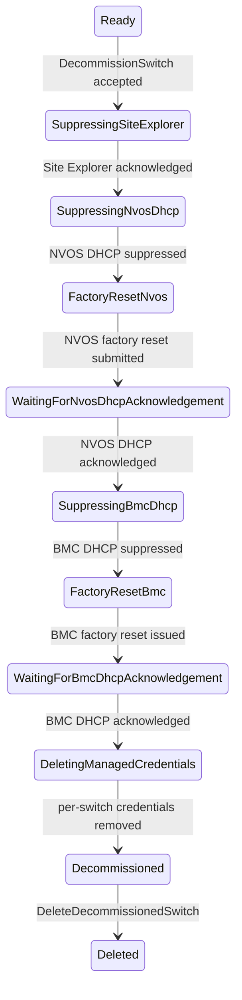

# Managed Switch Decommissioning

## Status

Draft — aligned with the managed-switch decommissioning implementation tracked
under [#1969](https://github.com/NVIDIA/infra-controller/issues/1969).

## Summary

This document defines the managed-switch specialization of the
[shared decommissioning lifecycle](./decommissioning-workflow.md).
A managed switch is returned to a neutral state by factory-resetting NVOS,
factory-resetting its BMC, verifying DHCP handoff for both, and then removing
NICo's stored per-switch credential state.

Decommissioning starts only from `Ready`, requires the RMS component-manager
backend for NVSwitch, and is rejected while any managed host on the switch's
rack is assigned to an instance. It ends in the retained terminal
`Decommissioned` substate. Final deletion preserves the `expected_switches`
record so a connected switch can be discovered and ingested again.

## Invariants

The switch workflow inherits all
[common invariants](./decommissioning-workflow.md#common-invariants).
In particular:

1. NVOS DHCP is suppressed before the NVOS factory reset so post-reset
   discovers are ignored.
1. BMC DHCP is suppressed before the BMC factory reset.
1. Credentials remain until both DHCP handoffs are acknowledged.
1. `expected_switches` is preserved by decommissioning and final deletion.

## State model

```rust
Decommissioning {
    decommissioning_state: SwitchDecommissioningState,
},
```

```rust
enum SwitchDecommissioningState {
    SuppressingSiteExplorer,
    SuppressingNvosDhcp,
    FactoryResetNvos,
    WaitingForNvosDhcpAcknowledgement,
    SuppressingBmcDhcp,
    FactoryResetBmc,
    WaitingForBmcDhcpAcknowledgement,
    DeletingManagedCredentials,
    Decommissioned,
}
```

Externally reported state strings are `Decommissioning/<substate>`, for
example `Decommissioning/FactoryResetNvos`.

### State diagram



### Transition criteria

| From | To | Required criteria |
| --- | --- | --- |
| `Ready` | `SuppressingSiteExplorer` | Request authorized; switch is exactly `Ready`; NVSwitch backend is RMS; no managed host on the rack is assigned to an instance. |
| `SuppressingSiteExplorer` | `SuppressingNvosDhcp` | BMC MAC resolved; Site Explorer suppression has `acknowledged_at`. |
| `SuppressingNvosDhcp` | `FactoryResetNvos` | DHCP suppression exists for the NVOS management MAC. |
| `FactoryResetNvos` | `WaitingForNvosDhcpAcknowledgement` | Destructive RMS NVOS factory-reset job submitted. Completion is not polled; progress continues via DHCP acknowledgement because NVOS DHCP is already suppressed. |
| `WaitingForNvosDhcpAcknowledgement` | `SuppressingBmcDhcp` | NVOS DHCP suppression has `acknowledged_at`. |
| `SuppressingBmcDhcp` | `FactoryResetBmc` | DHCP suppression exists for the BMC MAC. |
| `FactoryResetBmc` | `WaitingForBmcDhcpAcknowledgement` | BMC factory reset issued. |
| `WaitingForBmcDhcpAcknowledgement` | `DeletingManagedCredentials` | BMC DHCP suppression has `acknowledged_at`. |
| `DeletingManagedCredentials` | `Decommissioned` | Per-switch BMC and NVOS credentials removed. |
| `Decommissioned` | Deleted | `DeleteDecommissionedSwitch` authorized; switch state and suppressions removed; `expected_switches` remains. |

## State behavior

### `SuppressingSiteExplorer`

The start API claims a `Ready` switch into decommissioning. The controller
upserts a Site Explorer suppression for the BMC MAC and waits for
acknowledgement before destructive work.

### NVOS reset and DHCP handoff

`SuppressingNvosDhcp`, `FactoryResetNvos`, and
`WaitingForNvosDhcpAcknowledgement` suppress NVOS DHCP, submit the RMS NVOS
factory-reset job, and wait for DHCP acknowledgement. Because NVOS DHCP is
already suppressed, job completion cannot be observed reliably through normal
management paths; acknowledgement of the suppressed discover is the progress
signal.

### BMC reset and DHCP handoff

`SuppressingBmcDhcp`, `FactoryResetBmc`, and
`WaitingForBmcDhcpAcknowledgement` suppress BMC DHCP, factory-reset the BMC
through Redfish, and wait for DHCP acknowledgement.

### `DeletingManagedCredentials`

After both handoffs succeed, NICo deletes per-switch BMC and NVOS credential
material and related rotation markers.

### `Decommissioned`

NICo retains inventory for operator verification. The switch is excluded from
rack capacity, health remediation, maintenance, reprovisioning, and firmware
work. The only normal mutation accepted in this substate is final deletion.

## APIs and authorization

### Start decommissioning

```protobuf
rpc DecommissionSwitch(DecommissionSwitchRequest)
    returns (DecommissionSwitchResponse);

message DecommissionSwitchRequest {
  SwitchId switch_id = 1;
}

message DecommissionSwitchResponse {}
```

Admin CLI:

```bash
nico-admin-cli managed-switch decommission <switch-id>
```

### Final deletion

```protobuf
rpc DeleteDecommissionedSwitch(DeleteDecommissionedSwitchRequest)
    returns (DeleteDecommissionedSwitchResponse);

message DeleteDecommissionedSwitchRequest {
  SwitchId switch_id = 1;
}

message DeleteDecommissionedSwitchResponse {}
```

The request is accepted only from
`Decommissioning { Decommissioned }`. It removes the switch, associated
interfaces and address state, and BMC/NVOS suppressions. The
`expected_switches` record is deliberately preserved.

Admin CLI:

```bash
nico-admin-cli managed-switch delete-decommissioned <switch-id>
```

Existing `DeleteSwitch` and force-delete operations do not perform or prove
this cleanup and are not substitutes for decommissioning.

## Verification plan

In addition to the
[shared verification requirements](./decommissioning-workflow.md#shared-verification-requirements),
unit, integration, and hardware qualification must cover:

- rejection when the NVSwitch backend is not RMS;
- rejection while any managed host on the rack is assigned;
- Site Explorer acknowledgement before NVOS reset;
- NVOS DHCP suppression before factory reset;
- BMC DHCP suppression before BMC factory reset;
- credential deletion only after both DHCP acknowledgements; and
- final deletion preserving `expected_switches` and removing suppressions.
