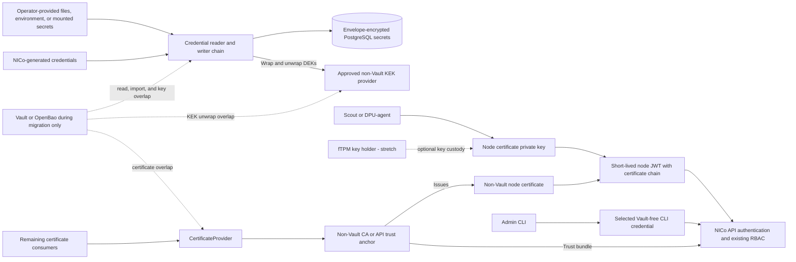

# Vault-Free NICo Runtime

## High-Level Design

## Revision History

| Version | Date | Modified By | Description |
| :---: | :---: | :--- | :--- |
| 0.1 | 2026-08-27 | Bill Minckler | Initial high-level design across the three Vault-elimination epics |
| 0.2 | 2026-08-28 | Bill Minckler | Reconcile the design with the current epic subtasks and implementation |
| 0.3 | 2026-08-28 | Bill Minckler | Separate the completed target design from implementation status and cross-epic intermediate states |
| 0.4 | 2026-09-02 | Bill Minckler | Add the Vault touchpoint inventory and Vault-free installation; keep mTLS for backward compatibility; make fTPM certificate provisioning an open question; defer KEK mechanics to the operator page; refresh status |
| 0.5 | 2026-09-09 | Bill Minckler | Make fTPM-backed JWT signing an optional stretch goal; retain the merged node-certificate signing model in the required Vault-free end state |
| 0.6 | 2026-09-09 | Bill Minckler | Broaden phase 2 to API authentication, with separate Scout and DPU-agent JWT and admin CLI workstreams |
| 0.7 | 2026-09-09 | Bill Minckler | Reconcile service, REST, bootstrap, and legacy-cleanup Vault touchpoints with the current deployment |
| 0.8 | 2026-09-10 | Bill Minckler | Add missing certificate and trust-rollover paths, clarify credential ownership, and link the implementation work |
| 0.9 | 2026-09-10 | Bill Minckler | Clarify the separate DPU and Scout server-CA rollover paths |
| 0.10 | 2026-09-10 | Bill Minckler | Cover every API client in CA rollover, add the installer authentication dependency, and require individual node-credential revocation enforcement |

## 1. Purpose and Scope

This document defines the target architecture for running NICo without
Vault/OpenBao. It covers the three related epics:

- [Phase 1: credential storage](https://github.com/dsx-ai-factory/infra-controller/issues/195)
- [Phase 2: API authentication](https://github.com/dsx-ai-factory/infra-controller/issues/5199)
- [Phase 3: remaining key and certificate services](https://github.com/dsx-ai-factory/infra-controller/issues/5200)

The design is intentionally high level. The following subsystem designs remain
authoritative for their implementation:

- [PostgreSQL-backed secret storage](postgres-secrets/README.md)
- [Secrets-storage operator contract](../configuration/secrets-storage.md)
- [Credential sources](../configuration/credential-sources.md)
- [Node-auth bearer JWTs](machine-identity/node-auth-jwt.md)
- [Machine-identity JWT-SVIDs and signing-key storage](machine-identity/spiffe-svid-sdd.md)
- [DPU bootstrap CA trust](../dpu-management/dpu_configuration.md#bootstrap-ca-trust)
- [NVSwitch mTLS certificates](../../helm/README.md#nvswitch-mtls-certificates)
- [Certificate-provider separation implementation](https://github.com/dsx-ai-factory/infra-controller/pull/2881)

The three phases are tracking boundaries, not a requirement to implement each
part serially. Work can proceed in parallel where the dependencies in
[Section 4](#4-migration-and-dependency-order) permit it.

### 1.1 Goals

- Make Vault/OpenBao optional during migration and absent from the supported
  steady-state installation, runtime, and recovery path.
- Preserve credential confidentiality, machine identity, and existing RBAC
  semantics.
- Migrate live sites incrementally, with explicit overlap and rollback paths.
- Keep storage, key custody, node authentication, and certificate issuance as
  separate provider boundaries.
- Fail clearly when a required non-Vault provider or node credential is
  unavailable.

### 1.2 Non-Goals

- Repeating the low-level designs linked above.
- Removing TLS or certificates from every NICo service. Phase 2 changes API
  authentication for Scout, DPU-agent, and the admin CLI so it no longer depends
  on Vault-issued credentials; transport TLS and other certificate consumers
  remain, and a selected Vault-free authentication method may retain mTLS.
- Removing mTLS on a fixed date. Machine mTLS remains supported for backward
  compatibility for as long as a deployment needs it; each site disables it
  after the criteria in [Section 3.2](#32-phase-2-api-authentication) are
  met.
- Requiring a hardware-backed node-JWT signing key to complete Vault removal.
  The required design retains the merged node-certificate signing model and
  moves its certificate issuer off Vault. BF3/BF4 fTPM-backed signing in
  [#5272](https://github.com/dsx-ai-factory/infra-controller/issues/5272) is a
  stretch goal. The BlueField IRoT key remains unsuitable because the DPU OS
  cannot use it to prove possession.
- Defining full measured-boot or runtime attestation for DPUs.

## 2. End-State Design Summary

| Phase | Completed state |
| :--- | :--- |
| 1 — credentials | `nico-api` credentials written through the API or generated by NICo are envelope-encrypted in PostgreSQL; credentials explicitly owned by local configuration can come from file, environment, or mounted-secret sources; no `nico-api` credential consumer constructs or depends directly on a Vault client |
| 2 — API authentication | API access no longer depends on Vault-issued mTLS credentials: Scout and DPU-agent use short-lived bearer JWTs while the admin CLI uses the selected Vault-free credential; existing principals and RBAC policy are preserved; machine mTLS remains available for backward compatibility; fTPM-backed DPU signing is an optional stretch goal |
| 3 — keys and certificates | An approved non-Vault provider owns the PostgreSQL KEKs; machine-identity signing-key encryption uses the shared KMS-backed envelope; every required certificate is issued and validated through a non-Vault provider; a site is installed and operated without deploying Vault |

### 2.1 Vault Touchpoints

The table is the inventory that the three epics replace. The phase column names
the epic that owns the replacement.

| Component | Vault use | End state | Phase |
| :--- | :--- | :--- | :---: |
| `nico-api` persistent credentials written through the API or generated by NICo | KV v2 store behind the credential chain | Envelope-encrypted PostgreSQL journal | 1 |
| `nico-api` credentials explicitly supplied through local configuration, including UFM and configured factory or site defaults | KV v2 store or process configuration | Environment, file, or mounted-secret sources, with live reload where an integration requires rotation without restart; API-written credentials remain in PostgreSQL unless local configuration owns them | 1 |
| `nico-api` PostgreSQL KEKs | Transit wrap and unwrap when KEK custody is in Vault | Qualified non-Vault KMS provider | 3 |
| `nico-api` machine-identity signing-key encryption | Master key read through the credential chain, which may be Vault-backed | Shared KMS-backed envelope on the same non-Vault provider | 3 |
| Node certificates issued at discovery, attestation, and renewal (`DiscoverMachine`, `AttestQuote`, `RenewMachineCertificate`) | Vault PKI through `CertificateProvider` | Non-Vault certificate provider; API authentication uses node JWTs and enforces individual credential disablement or revocation | 2, 3 |
| UFM TLS certificates issued through `SetCredential` | Vault PKI through `CertificateProvider` | Non-Vault certificate provider | 3 |
| Service transport TLS for `nico-api`, `bmc-proxy`, `dhcp`, `dns`, `dsx-exchange-consumer`, `flow`, `hardware-health`, `machine-a-tron`, `pxe`, and `ssh-console-rs`, plus the reference-installed site-agent and RMS | cert-manager `ClusterIssuer` `vault-nico-issuer`, signed by Vault PKI | cert-manager with a non-Vault issuer; trust bundle rolled over as in [Section 3.3](#33-phase-3-kek-custody-and-certificate-issuance) | 3 |
| Optional `nico-api` NVSwitch mTLS certificates: NICo client and NMX-C/NVUE server | `nvSwitchTls.issuerRef` defaults to `vault-nico-issuer` | Non-Vault issuer, with the client and switch trust paths rolled over as defined by the [Helm contract](../../helm/README.md#nvswitch-mtls-certificates) | 3 |
| Admin CLI client certificates | Vault PKI role `nico-cli-client`, issued by an operator | Operator-managed non-Vault PKI or a replacement credential ([Section 7](#7-open-questions)) | 2, 3 |
| DPF BMC-root setup job | `helm-prereqs` reads the Vault root token and issues an admin CLI certificate through `nicoca/issue/nico-cluster` | Use the selected phase-2 admin credential; if it remains certificate-based, issue it through the phase-3 non-Vault CA | 2, 3 |
| `dsx-exchange-consumer` credentials | Default credential chain, which always constructs a Vault client | Vault-free source and an optional Vault reader, tracked by [#5957](https://github.com/dsx-ai-factory/infra-controller/issues/5957) | 3 |
| `bmc-proxy` chart configuration | Vault AppRole, token, and cluster information are injected even though BMC credentials are fetched from `nico-api` over gRPC | Remove the Vault environment and configuration references under [#5957](https://github.com/dsx-ai-factory/infra-controller/issues/5957) | 3 |
| `machine-a-tron` chart values | Stale Vault `envFrom` values remain but are not consumed by the deployment template | Remove the dead values under [#5957](https://github.com/dsx-ai-factory/infra-controller/issues/5957); its live TLS dependency is covered by the service-certificate row | 3 |
| Legacy Flow PSM and NSM upgrade cleanup | The cleanup script uses the Vault root token when it finds legacy token resources; current Flow deployments do not run PSM or NSM containers | Run the one-time cleanup, when required, before retiring Vault; fresh installations have no runtime dependency | 3 |
| REST `powershelf-manager` and `nvswitch-manager` credentials in persistent mode | Vault-backed credential managers store device credentials | Use a non-Vault credential backend under [#5954](https://github.com/dsx-ai-factory/infra-controller/issues/5954) | 3 |
| Deployment tooling: `helm-prereqs` and chart defaults | Installs and unseals Vault; creates PKI roles, policies, and token jobs; charts default to the Vault issuer, Secrets, and `vault-cluster-info` ConfigMap | Vault-optional installation and defaults under [#5958](https://github.com/dsx-ai-factory/infra-controller/issues/5958) | 3 |

The reference REST installation generates `ca-signing-secret` and uses
`nico-rest-ca-issuer` for the REST cert-manager, site-manager, and related
transport certificates. Those certificate paths are already independent of
Vault and are not migration touchpoints in this design.

## 3. Target Architecture

The end state has four independent security boundaries:

1. PostgreSQL stores encrypted credential records; an approved non-Vault KEK
   provider owns the KEKs.
2. Nodes sign their own short-lived authentication tokens with the private key
   corresponding to their non-Vault-issued node certificate. The API maps the
   verified certificate identity to the same machine principal used by the
   current RBAC policy. An fTPM may protect the DPU key as a stretch goal, but
   is not required for the Vault-free runtime.
3. Certificate consumers use a provider backed by a non-Vault CA. Node
   authentication no longer requires a Vault-issued mTLS certificate, but the
   node JWT design still requires a certificate corresponding to its signing
   key and chaining to a trust anchor that remains after Vault PKI is retired.
4. The admin CLI uses the selected Vault-free credential: either mTLS backed by
   an operator-managed non-Vault PKI or a replacement authentication method.

### 3.1 Phase 1: Credential Storage

Every `nico-api` credential consumer uses the credential-provider abstraction
rather than constructing or depending directly on a Vault client. Credentials
written through the API or generated by NICo are written to the
envelope-encrypted PostgreSQL journal. Credentials explicitly owned by local
configuration are read from configured environment, file, or mounted-secret
sources, including live reload where an integration requires rotation without
restarting NICo. Remaining services outside `nico-api` move off direct Vault
credential backends in phase 3, and the shared default chain constructs its
Vault reader only when configured.

The reader chain makes source ownership and precedence explicit. A locally
authoritative integration never falls through to a persistent backend and
rejects persistent mutations, while a migration configuration may prefer local
data and fall through to PostgreSQL. All other writes use the configured
persistent writer. The UFM integration implements this contract
([#1837](https://github.com/dsx-ai-factory/infra-controller/issues/1837));
[Credential Sources](../configuration/credential-sources.md) defines the
operator-facing local-source behavior delivered by
[#5732](https://github.com/dsx-ai-factory/infra-controller/issues/5732).

The [PostgreSQL secret-storage design](postgres-secrets/README.md) remains
authoritative for the credential chain, envelope encryption, Vault import, KEK
routing, re-wrap, and rollback behavior. [Secrets Storage](../configuration/secrets-storage.md)
defines the operator-facing persistent-store contract.

### 3.2 Phase 2: API Authentication

Phase 2 removes Vault-backed mTLS as the authentication dependency for the API
clients named by [#5199](https://github.com/dsx-ai-factory/infra-controller/issues/5199):
Scout, DPU-agent, and the admin CLI. The authentication mechanisms may differ,
but all preserve the existing principal and RBAC authorization boundaries.

#### Scout and DPU-agent

Scout and DPU-agent authenticate to the API with the bearer-JWT model defined by
[Node-auth bearer JWTs](machine-identity/node-auth-jwt.md). The token format,
short lifetime, API validation, machine-principal mapping, and RBAC behavior are
unchanged. Nodes re-mint tokens locally as expiration approaches; there is no
server-side token issuance or refresh RPC.

The required end state retains the credential model implemented by
[#355](https://github.com/dsx-ai-factory/infra-controller/issues/355):

- Scout and DPU-agent sign locally with the private key of the machine mTLS
  certificate. The certificate chain accompanies the JWT for API validation.
- The node certificate is reissued through a non-Vault certificate provider and
  chains to an API-accepted trust anchor that remains after Vault PKI is
  retired. Moving the issuer, rather than changing the key holder, removes the
  JWT path's Vault dependency.
- Certificate issuance binds the public key to the intended machine identity;
  a valid chain alone is not sufficient to assert an arbitrary machine
  principal. The API continues to map the verified identity to the existing
  RBAC principal.
- Token lifetime, audience checks, TLS transport, and the dual-auth migration
  gate remain as designed in the completed JWT work.
- Machine mTLS remains supported for backward compatibility for as long as a
  deployment needs it. A site disables it only after every supported Scout and
  DPU-agent path can mint and locally re-mint tokens and replace and recover the
  non-Vault signing credential and certificate, and after the API can disable or
  revoke one compromised signing credential without rotating the CA.

As an optional stretch goal,
[#5272](https://github.com/dsx-ai-factory/infra-controller/issues/5272) moves the
DPU signing key into the BF3/BF4 fTPM. How its certificate reaches the DPU
remains an open question ([Section 7](#7-open-questions)): an operator installs
it manually, or the API issues it through the non-Vault certificate provider
from a signing request made by the fTPM key. The current `CertificateProvider`
returns a server-generated private key, so API issuance for a key that cannot
leave the TPM would require a signing operation. These fTPM-specific additions
are not prerequisites for the Vault-free runtime.

#### Admin CLI

The admin CLI authenticates without a Vault-issued credential. The final design
may retain admin mTLS with an operator-managed non-Vault PKI or define a
replacement authentication method; either choice preserves the existing admin
authorization boundary.

### 3.3 Phase 3: KEK Custody and Certificate Issuance

#### Production non-Vault KMS

An approved production non-Vault implementation owns KEKs behind the KMS
interface. Deployment-specific implementations may use a managed cloud KMS, an
on-premises HSM or KMIP service, or a hardened Integrated deployment whose key
is supplied by a CSI secrets-store or External-Secrets mount. The selected
provider must support workload-appropriate authentication, availability,
auditability, rotation, backup restore, and recovery without placing plaintext
KEKs directly in NICo configuration.

The Integrated provider's key sources and their production restrictions are
defined in [Secrets Storage](../configuration/secrets-storage.md). A mounted-key
Integrated deployment receives the same production qualification for custody,
availability, rotation, and recovery as an external provider.

Migration reuses the existing multi-provider, routing, and re-wrap behavior:
new DEKs are wrapped by the non-Vault provider while the Transit provider remains
available to unwrap old records. Vault Transit can be removed only after all
records have been re-wrapped, recovery has been tested, no retained backup within
the restore window requires it, and the rollback window has ended.

#### Non-Vault certificate provider

Certificate vending is separate from credential storage, as defined by the
[certificate-provider separation implementation](https://github.com/dsx-ai-factory/infra-controller/pull/2881).
The non-Vault provider implements that interface, preserves the SPIFFE ID from
which the machine principal is derived, and provides a CA rollover period in
which old and new trust roots are accepted. The API's client-certificate trust
bundle carries both roots during that overlap. Separately, before the API
serving chain moves to a new root, every supported API client receives and
verifies an old-plus-new server-CA bundle. This includes Scout, DPU-agent, the
site-agent, and in-cluster service clients such as DHCP, DNS, and PXE. After the
new serving chain is verified, clients can drop the old root. The existing
[DPU bootstrap CA trust](../dpu-management/dpu_configuration.md#bootstrap-ca-trust)
contract defines this rollout for DPUs. Scout independently consumes its
configured root-CA bundle; the DPU setting does not modify it. Other clients use
their configured CA mounts. The migration tracked by
[#5956](https://github.com/dsx-ai-factory/infra-controller/issues/5956) applies
and verifies the same overlap ordering for every supported API client before
the API serving chain changes.

The certificate consumers are inventoried in
[Section 2.1](#21-vault-touchpoints): node certificates issued at discovery,
attestation, and renewal; UFM TLS certificates; service transport and optional
NVSwitch certificates issued through cert-manager; and admin CLI client
certificates. Moving Scout and DPU-agent API authentication to JWT does not
remove those needs. If the optional fTPM stretch goal uses API certificate
issuance, the provider interface also gains a signing operation for keys that
never leave the node.

#### Encryption convergence

Machine-identity signing-key encryption uses the same KMS-backed envelope
primitive as credential storage. The machine-identity data model and behavior
remain defined by the [JWT-SVID design](machine-identity/spiffe-svid-sdd.md);
only encryption and KEK custody converge. Each subsystem retains its own storage
while using per-record DEKs wrapped by the approved non-Vault KEK provider.

## 4. Migration and Dependency Order

1. **Adopt the phase-1 provider chain.** Import existing secrets, make
   PostgreSQL authoritative, and retain Vault read fallback until every required
   credential has been verified.
2. **Move services outside `nico-api` off Vault credential paths.**
   `dsx-exchange-consumer` reads credentials from environment, file, or mounted
   Secrets, and the default credential chain constructs its Vault reader only
   when configured. Persistent `powershelf-manager` and `nvswitch-manager`
   deployments use a non-Vault credential backend. Remove the Vault environment
   and configuration references from `bmc-proxy` and the dead Vault values from
   `machine-a-tron`. Where an upgraded site still has legacy Flow PSM or NSM
   token resources, run the existing cleanup while Vault remains available.
3. **Migrate API authentication.** Run Scout and DPU-agent bearer JWTs and
   machine mTLS in parallel and verify that both produce the same principals and
   authorization results. Select the admin CLI credential, stage it alongside
   the Vault-issued credential, and preserve the existing admin authorization
   boundary. If the CLI retains mTLS, its non-Vault certificate arrives in step
   5.
4. **Introduce the production non-Vault KMS.** Route new wraps to it, retain
   Transit for old records, re-wrap, and test recovery. Keep both providers
   configured through the defined rollback and backup-retention windows; the
   rollback procedure is defined in
   [Secrets Storage](../configuration/secrets-storage.md).
5. **Introduce the non-Vault certificate provider.** Run an explicit trust-root
   overlap under [#5956](https://github.com/dsx-ai-factory/infra-controller/issues/5956).
   Distribute and verify the old-plus-new server-CA bundle on every API client
   before changing the API serving chain. Reissue the node certificates used
   for JWT signing, enable individual node-credential revocation or disablement
   in API validation, migrate the service and optional NVSwitch certificate
   consumers, and retire Vault PKI only after renewal and rollback have been
   exercised. Do not retire either side's old root while a client or certificate
   still depends on it.
6. **Make installation Vault-optional.** `helm-prereqs` phases and chart
   defaults (the cert-manager issuer, the Vault AppRole and token Secrets, and
   the `vault-cluster-info` ConfigMap) become optional so that a new site is
   installed without deploying Vault; an existing site keeps Vault only for the
   migration overlap.
7. **Complete the API-authentication cutover and disable Vault.** Confirm that
   Scout, DPU-agent, and admin CLI authentication no longer depend on
   Vault-issued credentials. Remove Vault from active configuration and prove
   startup, steady-state operation, rotation, backup restore, and failure
   recovery with Vault unavailable.
8. **Converge machine-identity encryption.** After the production non-Vault KEK
   provider is available, move machine-identity signing-key encryption to the
   shared envelope primitive. This completes the shared KEK-custody model but
   does not have to precede the Vault runtime cutover when the existing
   encryption key is already sourced through the Vault-free credential chain.

Steps 4 and 5 can be developed in parallel, but their migrations and trust
retirement must be coordinated as described above. Step 6 depends on steps 2
through 5 for a new site; its step-3 dependency includes the DPF BMC-root job's
admin credential. Step 7 depends on all active Vault credential, Transit, and
PKI paths having replacements and on the phase-2 CLI authentication decision.
Step 8 depends on step 4 but can otherwise proceed independently.

After step 5, the optional fTPM stretch goal can move the DPU signing key into
hardware. It requires the certificate-provisioning and lifecycle decisions in
[Section 7](#7-open-questions), but it does not gate any required migration
step or Vault retirement.

## 5. Failure, Security, and Availability Boundaries

- Vault fallback is enabled only during an explicit migration stage. A
  steady-state Vault-free deployment does not silently reconnect to Vault.
- Loss of a node signing key or certificate prevents new JWTs and, when the same
  credential is used for mTLS, also prevents machine mTLS. The non-Vault
  certificate lifecycle therefore defines renewal, replacement, revocation,
  and recovery. If the fTPM stretch goal is adopted, that lifecycle also covers
  loss or replacement of the non-exportable key.
- The certificate enrollment authority must bind each approved public key and
  identity to the intended inventory record. Before machine mTLS is removed,
  the API validation path enforces individual credential disablement or
  revocation through the CRL, OCSP, denylist, or equivalent mechanism selected
  by [#5956](https://github.com/dsx-ai-factory/infra-controller/issues/5956).
  Issuance-side revocation without validation enforcement does not meet this
  requirement. The selected design also provides a compromise recovery
  procedure.
- The old KMS provider remains available until no live record and no retained
  backup within the restore window references it, and until the rollback window
  ends. Re-wrap is resumable and does not change credential plaintext.
- Credential reads synchronously unwrap DEKs through the KEK provider, so an
  external KMS outage fails affected credential operations, and an Integrated
  provider whose mounted key is unavailable cannot restart or scale out while
  already-running instances continue. Runtime availability, startup
  availability, rotation by controlled restart, and recovery are therefore part
  of provider qualification. Provider mechanics are defined in
  [Secrets Storage](../configuration/secrets-storage.md) and the
  [PostgreSQL secret-storage design](postgres-secrets/README.md).
- Old CA roots remain trusted only for the bounded certificate rollover window.
  Removing a root is coordinated with certificate renewal and rollback testing.
- Credential plaintext, private keys, and bearer tokens are never logged.
  Production KEKs come from mounted files, environment sources, or an external
  KMS; [Secrets Storage](../configuration/secrets-storage.md) defines why inline
  key material is limited to development and test.
- Provider credentials use workload identity or mounted secret sources where
  supported and are independently rotatable from the data they protect.
- Multi-replica NICo deployments use shared PostgreSQL state and highly
  available KMS and CA endpoints; no replica owns unique recovery material.

## 6. Completion Criteria

The overall effort is complete when a supported site can:

- install a new site with `helm-prereqs` and the Helm charts without deploying
  Vault/OpenBao;
- start and run every NICo service, including those outside `nico-api`, with
  Vault/OpenBao unavailable;
- read, write, rotate, back up, and restore credentials using PostgreSQL and a
  qualified production non-Vault KEK provider;
- bootstrap and authenticate Scout and DPU-agent, locally re-mint their tokens,
  and rotate, revoke, or recover their signing credentials without a
  Vault-issued mTLS certificate;
- authenticate the admin CLI with the selected Vault-free credential while
  preserving its authorization boundary;
- issue and rotate every still-required certificate through a non-Vault
  provider;
- preserve machine identity and RBAC behavior through migration;
- roll forward from a Vault-backed deployment without credential loss or an
  authentication outage;
- demonstrate rollback at every provider-overlap stage before retiring the old
  credential, KEK, or CA trust path; and
- protect machine-identity signing keys with the shared envelope and the
  qualified non-Vault KEK provider.

## 7. Open Questions

1. Does phase 2 retain admin CLI mTLS with an operator-managed non-Vault PKI, or
   replace it with another authentication method? This decision is tracked by
   [#5955](https://github.com/dsx-ai-factory/infra-controller/issues/5955).
2. Which production KMS, HSM, KMIP, or hardened Integrated deployment is
   qualified first, and what is the minimum supported recovery configuration?
3. Which non-Vault CA backs the certificate-provider interface, and which
   cert-manager issuer replaces `vault-nico-issuer` for service transport
   certificates? How does API validation enforce individual node signing-
   credential disablement or revocation before certificate expiry without a
   CA-wide rotation? These decisions are tracked by
   [#5956](https://github.com/dsx-ai-factory/infra-controller/issues/5956).
4. Does `dsx-exchange-consumer` require live credential reload, or is rotation
   by restart sufficient? This decision is tracked by
   [#5957](https://github.com/dsx-ai-factory/infra-controller/issues/5957).
5. Is Vault-free installation selected explicitly or inferred from provider
   configuration, and what upgrade and rollback window remains supported? This
   decision is tracked by
   [#5958](https://github.com/dsx-ai-factory/infra-controller/issues/5958).
6. If the optional fTPM stretch goal is adopted, is its certificate installed
   manually by an operator or issued by the API from an fTPM-signed request?
   The decision also defines supported hardware and the renewal, replacement,
   revocation, and recovery lifecycle for the non-exportable key.

## 8. Implementation Status

This section is a status snapshot dated 2026-09-10. Sections 1 through 7 define
the end-state design and remain independent of implementation order. Phase 1
([#195](https://github.com/dsx-ai-factory/infra-controller/issues/195)) is complete
apart from this document
([#3251](https://github.com/dsx-ai-factory/infra-controller/issues/3251)) and is with
QA; remaining credential-related work is tracked under
[#5200](https://github.com/dsx-ai-factory/infra-controller/issues/5200). The tables
below record the intentional intermediate states created when one epic lands
before a dependency owned by another epic.

### 8.1 Intermediate States Between Epics

| Boundary | Intermediate state | Resolving work |
| :--- | :--- | :--- |
| Phase 1 credential-storage boundary | After [#195](https://github.com/dsx-ai-factory/infra-controller/issues/195), credentials can be authoritative in PostgreSQL while their per-record DEKs are still wrapped by a KEK in Vault/OpenBao Transit. PostgreSQL removes Vault as the credential database but does not yet remove the transitive KEK dependency. | [#3253](https://github.com/dsx-ai-factory/infra-controller/issues/3253) supplies the production non-Vault KEK provider; the migration then routes new wraps to it, re-wraps live records, and retains Transit only through the rollback and backup-retention windows. |
| Services outside `nico-api` | Phase 1 made the `nico-api` chain Vault-optional, but the default chain used by `dsx-exchange-consumer` still constructs a Vault client, persistent `powershelf-manager` and `nvswitch-manager` deployments still use Vault credential managers, and the `bmc-proxy` chart still injects Vault configuration. The `machine-a-tron` Vault values are stale and unused rather than a runtime dependency. | [#5957](https://github.com/dsx-ai-factory/infra-controller/issues/5957) covers the DSX Exchange and chart work; [#5954](https://github.com/dsx-ai-factory/infra-controller/issues/5954) covers the persistent REST credential backends. |
| Legacy Flow cleanup before Vault retirement | Current Flow deployments do not include the retired PSM and NSM containers, but upgraded sites may still have their legacy Vault token resources. | [#5324](https://github.com/dsx-ai-factory/infra-controller/issues/5324) owns the existing cleanup path, which runs while Vault is still available; no new runtime credential path is required. |
| DPF bootstrap admin credential | `_dpf_set_bmc_root` still reads the Vault root token and issues a temporary admin CLI certificate from Vault before running the in-cluster admin job. | [#5955](https://github.com/dsx-ai-factory/infra-controller/issues/5955) selects the Vault-free admin credential and updates the DPF job; [#5956](https://github.com/dsx-ai-factory/infra-controller/issues/5956) supplies its non-Vault issuer if it remains certificate-based. |
| Initial phase 2 JWT boundary | [#355](https://github.com/dsx-ai-factory/infra-controller/issues/355) provides bearer JWTs and permits machine mTLS to be disabled at the transport-authentication layer, but the JWT is still signed with the Vault-issued mTLS certificate key and carries that certificate chain. The validator does not enforce individual certificate revocation, so certificate expiry or CA-wide rotation is the containment path for a compromised key. | [#5956](https://github.com/dsx-ai-factory/infra-controller/issues/5956) reissues the node credential from a lasting non-Vault trust anchor and adds API-side individual disablement or revocation enforcement. The fTPM work in [#5272](https://github.com/dsx-ai-factory/infra-controller/issues/5272) is an optional stretch goal, not the resolution required for Vault retirement. |
| Optional fTPM credential before PKI retirement | The fTPM stretch goal still needs a certificate that chains to an API trust anchor; moving token signing into the fTPM would not by itself remove Vault PKI. | If the stretch goal is adopted, [#5272](https://github.com/dsx-ai-factory/infra-controller/issues/5272) owns the DPU signing holder and the certificate-provisioning decision remains open. [#5956](https://github.com/dsx-ai-factory/infra-controller/issues/5956) supplies the lasting trust anchor. |
| Phase 2 agent boundary versus CLI | The Scout and DPU-agent workstream can be Vault-free while the admin CLI still uses mTLS. An operator-managed external admin CA removes the CLI's Vault dependency but does not resolve whether the API-authentication epic requires replacing CLI mTLS itself. | [#5955](https://github.com/dsx-ai-factory/infra-controller/issues/5955) records and implements the decision to retain non-Vault admin mTLS or replace it. |
| Certificate-provider separation boundary | [#2880](https://github.com/dsx-ai-factory/infra-controller/issues/2880) separates certificate vending from credential storage, but the production certificate-provider implementations remain Vault-backed. | [#5956](https://github.com/dsx-ai-factory/infra-controller/issues/5956) adds the non-Vault provider, migrates the consumers in [Section 2.1](#21-vault-touchpoints), and rolls over trust roots. |
| Non-Vault KEK before encryption convergence | After [#3253](https://github.com/dsx-ai-factory/infra-controller/issues/3253), the PostgreSQL envelope and the machine-identity encryption-key credential can both be protected without Vault, but machine-identity signing keys still use a separate encryption primitive. | [#3255](https://github.com/dsx-ai-factory/infra-controller/issues/3255) converges machine-identity encryption on the shared KMS envelope. This completes the target custody model but does not independently block the Vault runtime cutover. |

### 8.2 Work-Item Status

| Area | Status at this snapshot | Tracking |
| :--- | :--- | :--- |
| PostgreSQL credential store, design, and migration | Implemented; detailed behavior remains in the existing design | [#353](https://github.com/dsx-ai-factory/infra-controller/issues/353), [#354](https://github.com/dsx-ai-factory/infra-controller/issues/354), [PostgreSQL secret-storage design](postgres-secrets/README.md) |
| Operator file/environment foundation | Implemented and documented, including file-backed UFM credentials with live reload and an authoritative local mode | [#357](https://github.com/dsx-ai-factory/infra-controller/issues/357), [#1837](https://github.com/dsx-ai-factory/infra-controller/issues/1837), [#5732](https://github.com/dsx-ai-factory/infra-controller/issues/5732), [Credential Sources](../configuration/credential-sources.md) |
| Remaining credential consumers outside `nico-api` | Open for the DSX Exchange consumer, BMC proxy chart, machine-a-tron cleanup, and persistent REST device managers | [#5957](https://github.com/dsx-ai-factory/infra-controller/issues/5957), [#5954](https://github.com/dsx-ai-factory/infra-controller/issues/5954) |
| NVSwitch OS credentials | Closed as not planned: NSM is deprecated in favor of RMS, which reads switch credentials from NICo | [#1852](https://github.com/dsx-ai-factory/infra-controller/issues/1852) |
| Node bearer JWT and dual-auth rollout | Implemented, with the Vault-issued mTLS certificate key as the intermediate signing credential | [#355](https://github.com/dsx-ai-factory/infra-controller/issues/355), [Node-auth bearer JWTs](machine-identity/node-auth-jwt.md) |
| fTPM signing credential | Optional stretch goal for BF3/BF4; certificate provisioning and lifecycle remain open and do not block the required Vault-free runtime | [#5272](https://github.com/dsx-ai-factory/infra-controller/issues/5272) |
| IRoT identity and API-issued refresh | Never merged; closed as not planned because the DPU OS cannot access the IRoT key and so cannot prove possession; the merged JWT path instead re-mints locally with the node certificate key | [#2917](https://github.com/dsx-ai-factory/infra-controller/issues/2917), [#3254](https://github.com/dsx-ai-factory/infra-controller/issues/3254) |
| Admin CLI authentication | Open; includes the DPF BMC-root setup job | [#5955](https://github.com/dsx-ai-factory/infra-controller/issues/5955) |
| Certificate-provider separation | Implemented; production providers remain Vault-backed | [#2880](https://github.com/dsx-ai-factory/infra-controller/issues/2880), [implementation](https://github.com/dsx-ai-factory/infra-controller/pull/2881) |
| Non-Vault certificate provider | Open; includes all certificate consumers, both sides of trust-root rollover, and API-side enforcement of individual node-signing credential disablement or revocation | [#5956](https://github.com/dsx-ai-factory/infra-controller/issues/5956) |
| Vault-optional installation and bootstrap | Open; includes chart defaults and depends on the separate admin, runtime, REST, KMS, certificate, and legacy Flow work | [#5958](https://github.com/dsx-ai-factory/infra-controller/issues/5958) |
| Production non-Vault KEK provider | Open | [#3253](https://github.com/dsx-ai-factory/infra-controller/issues/3253) |
| Machine-identity encryption convergence | Open after #3253; not an independent Vault-cutover gate | [#3255](https://github.com/dsx-ai-factory/infra-controller/issues/3255) |
| Shared UFM/NMX-C cache lifecycle | Open, non-blocking refactor that preserves #1837 behavior | [#5516](https://github.com/dsx-ai-factory/infra-controller/issues/5516) |
| Overall high-level design | This document | [#3251](https://github.com/dsx-ai-factory/infra-controller/issues/3251) |
