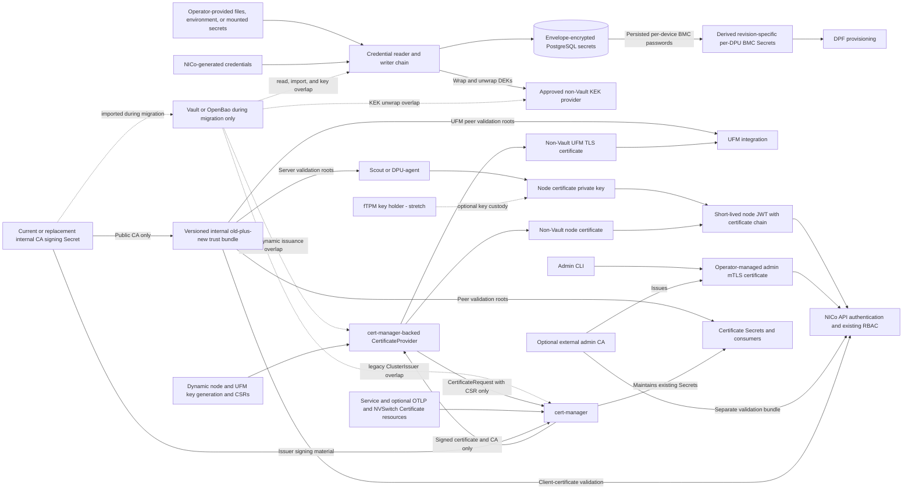

# Vault-Free NICo Runtime

## High-Level Design

## Revision History

| Version | Date | Modified By | Description |
| :---: | :---: | :--- | :--- |
| 0.1 | 2026-08-27 | Bill Minckler | Initial high-level design across the three Vault-elimination epics |
| 0.2 | 2026-08-28 | Bill Minckler | Reconcile the design with the current epic subtasks and implementation |
| 0.3 | 2026-08-28 | Bill Minckler | Separate the completed target design from implementation status and cross-epic intermediate states |
| 0.4 | 2026-09-02 | Bill Minckler | Add the Vault touchpoint inventory and Vault-free installation; keep mTLS for backward compatibility; make fTPM certificate provisioning an open question; defer KEK mechanics to the operator page; refresh status |
| 0.5 | 2026-09-09 | Bill Minckler | Make fTPM-backed JWT signing an optional stretch goal; retain the merged node-certificate signing model in the required Vault-free end state |
| 0.6 | 2026-09-09 | Bill Minckler | Broaden phase 2 to API authentication, with separate Scout and DPU-agent JWT and admin CLI workstreams |
| 0.7 | 2026-09-09 | Bill Minckler | Reconcile service, REST, bootstrap, and legacy-cleanup Vault touchpoints with the current deployment |
| 0.8 | 2026-09-10 | Bill Minckler | Add missing certificate and trust-rollover paths, clarify credential ownership, and link the implementation work |
| 0.9 | 2026-09-10 | Bill Minckler | Clarify the separate DPU and Scout server-CA rollover paths |
| 0.10 | 2026-09-10 | Bill Minckler | Cover every API client in CA rollover, add the installer authentication dependency, and require individual node-credential revocation enforcement |
| 0.11 | 2026-09-14 | Bill Minckler | Remove the DPF admin-job dependency, define local-source ownership for BMC credential version 0, preserve DPF access through BMC rotation, and retain operator-managed mTLS for the admin CLI |
| 0.12 | 2026-09-15 | Bill Minckler | Define restart-safe local version-0 ownership, immutable ingestion targets, fenced mutation and validation, target binding and advancement recovery, and rollout, backfill, and downgrade fencing |
| 0.13 | 2026-09-15 | Bill Minckler | Clarify the detailed DPF design boundary, correct the current Flow deployment state, and record the remaining DPF and KMS decisions |
| 0.14 | 2026-09-15 | Bill Minckler | Clarify shared DPF Secret retention between the bootstrap and per-device credential work |
| 0.15 | 2026-09-15 | Bill Minckler | Record legacy bootstrap-secret cleanup and the local-v0 startup and registration safety boundary |
| 0.16 | 2026-09-18 | Bill Minckler | Select direct cert-manager issuance, preserve the existing internal PKI during migration, define the Kubernetes-resource abstraction and supported predecessor, retain the dedicated admin issuer boundary, and support post-cutover CA rollover |
| 0.17 | 2026-09-19 | Bill Minckler | Use CSR-only dynamic issuance, preserve the current certificate-usage profile, and include optional DPU OTLP mTLS in trust rollover |

## 1. Purpose and Scope

This document defines the target architecture for running NICo without
Vault/OpenBao. It covers the three related epics:

- [Phase 1: credential storage](https://github.com/dsx-ai-factory/infra-controller/issues/195)
- [Phase 2: API authentication](https://github.com/dsx-ai-factory/infra-controller/issues/5199)
- [Phase 3: remaining key and certificate services](https://github.com/dsx-ai-factory/infra-controller/issues/5200)

The design is intentionally high level except for version-0 credential ownership
and DPF BMC credential delivery, whose cross-component state and recovery
contracts are defined here. Outside those areas, the following subsystem designs
remain authoritative for their implementation:

- [PostgreSQL-backed secret storage](postgres-secrets/README.md)
- [Secrets-storage operator contract](../configuration/secrets-storage.md)
- [Credential sources](../configuration/credential-sources.md)
- [Node-auth bearer JWTs](machine-identity/node-auth-jwt.md)
- [Machine-identity JWT-SVIDs and signing-key storage](machine-identity/spiffe-svid-sdd.md)
- [DPU bootstrap CA trust](../dpu-management/dpu_configuration.md#bootstrap-ca-trust)
- [NVSwitch mTLS certificates](../../helm/README.md#nvswitch-mtls-certificates)
- [Admin client certificates](../../helm/PREREQUISITES.md#admin-client-certificates)
- [Certificate-provider separation implementation](https://github.com/dsx-ai-factory/infra-controller/pull/2881)

The three phases are tracking boundaries, not a requirement to implement each
part serially. Work can proceed in parallel where the dependencies in
[Section 4](#4-migration-and-dependency-order) permit it.

### 1.1 Goals

- Make Vault/OpenBao optional during migration and absent from the supported
  steady-state installation, runtime, and recovery path.
- Preserve credential confidentiality, machine identity, and existing RBAC
  semantics.
- Migrate live sites incrementally, with explicit overlap and rollback paths.
- Preserve the existing internal node, UFM, service-transport, optional DPU OTLP,
  and optional NVSwitch certificate authorities, trust chains, leaf certificates,
  and private keys when removing Vault PKI; that cutover must not require a coordinated
  certificate rotation or reissuance. The separate admin-credential migration
  replaces its Vault-issued client credential as described in
  [Section 3.2](#32-phase-2-api-authentication).
- Keep storage, key custody, node authentication, and certificate issuance as
  separate provider boundaries.
- Fail clearly when a required non-Vault provider or node credential is
  unavailable.

### 1.2 Non-Goals

- Repeating the low-level designs linked above.
- Removing TLS or certificates from every NICo service. Phase 2 changes API
  authentication for Scout, DPU-agent, and the admin CLI so it no longer depends
  on Vault-issued credentials; transport TLS and other certificate consumers
  remain, and the admin CLI retains mTLS with an operator-managed CA.
- Removing mTLS on a fixed date. Machine mTLS remains supported for backward
  compatibility for as long as a deployment needs it; each site disables it
  after the criteria in [Section 3.2](#32-phase-2-api-authentication) are
  met.
- Requiring a hardware-backed node-JWT signing key to complete Vault removal.
  The required design retains the merged node-certificate signing model and
  moves its certificate issuer off Vault. BF3/BF4 fTPM-backed signing in
  [#5272](https://github.com/dsx-ai-factory/infra-controller/issues/5272) is a
  stretch goal. The BlueField IRoT key remains unsuitable because the DPU OS
  cannot use it to prove possession.
- Defining full measured-boot or runtime attestation for DPUs.

## 2. End-State Design Summary

| Phase | Completed state |
| :--- | :--- |
| 1 — credentials | `nico-api` credentials written through the API or generated by NICo are envelope-encrypted in PostgreSQL; credentials explicitly owned by local configuration can come from file, environment, or mounted-secret sources; no `nico-api` credential consumer constructs or depends directly on a Vault client |
| 2 — API authentication | API access no longer depends on Vault-issued mTLS credentials: Scout and DPU-agent use short-lived bearer JWTs while the admin CLI retains mTLS with an operator-managed non-Vault CA; existing principals and RBAC policy are preserved; machine mTLS remains available for backward compatibility; fTPM-backed DPU signing is an optional stretch goal |
| 3 — keys and certificates | An approved non-Vault provider owns the PostgreSQL KEKs; machine-identity signing-key encryption uses the shared KMS-backed envelope; cert-manager issues the node, UFM, service-transport, optional DPU OTLP, and optional NVSwitch certificates in the Core PKI migration from the existing trust anchors without Vault or forced certificate rotation; a site is installed and operated without deploying Vault |

### 2.1 Vault Touchpoints

The table is the inventory that the three epics replace. The phase column names
the epic that owns the replacement.

| Component | Vault use | End state | Phase |
| :--- | :--- | :--- | :---: |
| `nico-api` persistent credentials written through the API or generated by NICo | KV v2 store behind the credential chain | Envelope-encrypted PostgreSQL journal | 1 |
| `nico-api` credentials explicitly supplied through local configuration, including UFM and configured factory or site defaults | KV v2 store or process configuration | Environment, file, or mounted-secret sources, with live reload where an integration requires rotation without restart; API-written credentials remain in PostgreSQL unless local configuration owns them | 1 |
| `nico-api` PostgreSQL KEKs | Transit wrap and unwrap when KEK custody is in Vault | Qualified non-Vault KMS provider | 3 |
| `nico-api` machine-identity signing-key encryption | Master key read through the credential chain, which may be Vault-backed | Shared KMS-backed envelope on the same non-Vault provider | 3 |
| Node certificates issued at discovery, attestation, and renewal (`DiscoverMachine`, `AttestQuote`, `RenewMachineCertificate`) | Vault PKI through `CertificateProvider` | cert-manager-backed `CertificateProvider` generates an ECDSA P-256 key only in process memory and submits its public key through a CSR-only `CertificateRequest` to the existing issuing CA; the existing digital-signature, key-agreement, key-encipherment, client-auth, and server-auth usages are retained, the private key is never stored in Kubernetes, existing certificates remain valid until normal renewal, and API authentication enforces individual credential disablement or revocation | 2, 3 |
| UFM TLS certificates issued through `SetCredential` | Vault PKI through `CertificateProvider` | The same CSR-only cert-manager provider keeps the generated key out of Kubernetes and uses the existing issuing CA, ECDSA P-256 profile, existing SANs and usages, and 720-hour maximum lifetime; `SetCredential` retains the restricted pod-local files used for manual installation on UFM and removes staging material after verified handoff and rollback | 3 |
| Service transport TLS for `nico-api`, `bmc-proxy`, `dhcp`, `dns`, `dsx-exchange-consumer`, `flow`, `hardware-health`, `machine-a-tron`, `pxe`, and `ssh-console-rs`, plus the reference-installed site-agent and RMS | cert-manager `ClusterIssuer` `vault-nico-issuer`, signed by Vault PKI | Existing cert-manager `Certificate` resources, Secrets, and certificate/key mounts remain in place; validation roots move from leaf-Secret `ca.crt` values to the versioned trust bundle, and a direct non-Vault issuer backed by the same CA handles normal renewal | 3 |
| Optional DPU OTLP mTLS between the DPU collector and site gateway | Gateway `Certificate` already uses direct `site-issuer`; the gateway validates the DPU machine certificate with the leaf Secret's `ca.crt`, and the DPU pins the same `site-root` for the gateway | Keep the gateway `Certificate` and both existing leaves; move gateway client validation and DPU server validation to the versioned trust bundle and include both directions in CA rollover | 3 |
| Optional `nico-api` NVSwitch mTLS certificates: NICo client and NMX-C/NVUE server | `nvSwitchTls.issuerRef` defaults to `vault-nico-issuer` | Existing cert-manager resources, Secrets, and certificate/key mounts remain in place; NICo and switch validation roots use the versioned trust bundle before a direct non-Vault issuer backed by the same CA handles normal renewal | 3 |
| Admin CLI client certificates | Vault PKI role `nico-cli-client`, issued by an operator | An operator-managed non-Vault admin CA is added to API trust and issues a new client certificate and key; the CLI continues to use its existing mTLS mechanism and inputs | 2 |
| DPF BMC credential bootstrap | `helm-prereqs` reads the Vault root token, issues a temporary admin certificate, and runs an in-cluster CLI job to store the initial password | The local environment/file chain can authoritatively supply version 0; after ingestion, `nico-api` mirrors each DPU's persisted current credential into a namespace-local Secret referenced by its `DPUDevice`, so mixed-version rotation remains usable; version 1 and later remain in the persistent backend | 3 |
| `dsx-exchange-consumer` credentials | Default credential chain, which always constructs a Vault client | Vault-free source and an optional Vault reader, tracked by [#5957](https://github.com/dsx-ai-factory/infra-controller/issues/5957) | 3 |
| `bmc-proxy` chart configuration | Vault AppRole, token, and cluster information are injected even though BMC credentials are fetched from `nico-api` over gRPC | Remove the Vault environment and configuration references under [#5957](https://github.com/dsx-ai-factory/infra-controller/issues/5957) | 3 |
| `machine-a-tron` chart values | Stale Vault `envFrom` values remain but are not consumed by the deployment template | Remove the dead values under [#5957](https://github.com/dsx-ai-factory/infra-controller/issues/5957); its live TLS dependency is covered by the service-certificate row | 3 |
| Legacy Flow PSM and NSM upgrade cleanup | Predecessor Flow deployments can retain bundled PSM and NSM containers and their Vault-backed resources; the current chart is Flow-only, and setup fails closed while an older deployment or active pod remains | Operators upgrade the Flow release through the guarded procedure and rerun setup, which removes the stranded security resources before Vault is retired | 3 |
| REST `powershelf-manager` and `nvswitch-manager` credentials in persistent mode | Vault-backed credential managers store device credentials | Use a non-Vault credential backend under [#5954](https://github.com/dsx-ai-factory/infra-controller/issues/5954) | 3 |
| Deployment tooling: `helm-prereqs` and chart defaults | Installs and unseals Vault; creates PKI roles, policies, and token jobs; charts default to the Vault issuer, Secrets, and `vault-cluster-info` ConfigMap | Vault-optional installation and defaults under [#5958](https://github.com/dsx-ai-factory/infra-controller/issues/5958) | 3 |

The reference REST installation generates `ca-signing-secret` and uses
`nico-rest-ca-issuer` for the REST cert-manager, site-manager, and related
transport certificates. Those certificate paths are already independent of
Vault and are not migration touchpoints in this design.

## 3. Target Architecture

The end state has four independent security boundaries:

1. PostgreSQL stores encrypted credential records; an approved non-Vault KEK
   provider owns the KEKs.
2. Nodes sign their own short-lived authentication tokens with the private key
   corresponding to their non-Vault-issued node certificate. The API maps the
   verified certificate identity to the same machine principal used by the
   current RBAC policy. An fTPM may protect the DPU key as a stretch goal, but
   is not required for the Vault-free runtime.
3. cert-manager uses the existing internal issuing CA without Vault. Existing
   service, optional DPU OTLP, and optional NVSwitch `Certificate` resources
   remain declarative,
   while a Rust provider generates dynamic node and UFM keys only in process
   memory and submits CSR-only `CertificateRequest` resources. Node JWTs retain
   a certificate corresponding to their signing key and chaining to the same
   API trust anchor; the dynamic private key is not stored in Kubernetes.
4. The admin CLI retains mTLS. Its optional external admin CA bundle is a
   separate validation input and is not used as cert-manager signing material.
   That bundle may anchor at the same root as internal trust, but admin client
   leaves use a dedicated intermediate with a globally unique issuer CN. The
   shared or root CA CN is never an admin identity classifier.

### 3.1 Phase 1: Credential Storage

Every `nico-api` credential consumer uses the credential-provider abstraction
rather than constructing or depending directly on a Vault client. Credentials
written through the API or generated by NICo are written to the
envelope-encrypted PostgreSQL journal. Credentials explicitly owned by local
configuration are read from configured environment, file, or mounted-secret
sources, including live reload where an integration requires rotation without
restarting NICo. Remaining services outside `nico-api` move off direct Vault
credential backends in phase 3, and the shared default chain constructs its
Vault reader only when configured.

The reader chain makes source ownership and precedence explicit. A locally
authoritative integration never falls through to a persistent backend and
rejects persistent mutations, while a migration configuration may prefer local
data and fall through to PostgreSQL. All other writes use the configured
persistent writer. The UFM integration implements this contract
([#1837](https://github.com/dsx-ai-factory/infra-controller/issues/1837));
[Credential Sources](../configuration/credential-sources.md) defines the
operator-facing local-source behavior delivered by
[#5732](https://github.com/dsx-ai-factory/infra-controller/issues/5732).

The site-wide BMC root applies the same ownership model only to version 0. The
`bmc_site_wide_root_source` policy selects `local_first` (the default),
`backend`, or `local`. `local_first` reads environment, file, then backend and
writes to the backend; `backend` ignores local entries; and `local` reads only
environment then file, leaves an initially missing value unavailable without
fallback, and rejects API add or delete operations for version 0. Local
activation always uses a durable site-wide ownership-transition fence honored
by every API replica. The same activation applies when `local_first` resolves
version 0 from the environment or file; a mutable local value is never consumed
directly by ingestion. When `local_first` resolves version 0 from the backend,
the acknowledged backend ownership epoch applies and no local snapshot is
created. Here, ingestion intent means the durable device-scoped record defined
in [DPF BMC credential delivery](#dpf-bmc-credential-delivery) and tracked by
[#6147](https://github.com/dsx-ai-factory/infra-controller/issues/6147).
Managed ownership means the persisted post-registration binding between a DPU
and its credential record, also defined in that section.
An active version-0 consumer is any host, DPU, network-switch, or power-shelf
BMC whose recorded, hardware-confirmed credential still resolves to that
ownership epoch. It exists from successful hardware application until
coordinated rotation or verified retirement, regardless of DPF registration or
intent state. Site-fence proofs, migration backfill, and device reservations
enumerate every class.
A force-abandon tombstone is the durable, device-scoped fence created by any
authorized force-abandon transition, whether it originates in failed intent
recovery, restore, or decommission and deletion. Every origin has the same
effect: it prevents credential reuse until documented out-of-band recovery
confirms the hardware state.

A device reservation is a durable, device-scoped exclusivity record bound to a
persisted operation ID and phase. Only its owning credential or lifecycle
transition—including ingestion, rotation, version-0 activation, reset or
rollback, migration, restore, decommission, force-abandon, and recovery—may
change that device's credential state. The owner retains it through hardware
verification and terminal-result commit; restart resumes or safely takes over
the same operation rather than granting a second reservation.

On an existing site with an active version-0 consumer, the local candidate
must resolve, exactly match the accepted backend version 0, and authenticate to
every BMC that still relies on that version. A fresh site uses the
same activation before its first ingestion intent; a site whose prior baseline
was consumed and fully retired uses the retired-baseline reset below. Either may
skip comparison with the prior backend value and hardware checks only after the
fence proves that the target is absent or version 0 and that no non-retired
intent, managed ownership, tombstone, or active version-0 consumer references
the prior epoch. A target
later than version 0 rejects creation of a new local baseline. For `local_first`,
an allowed transition also prepares the same candidate through the backend-v0
prepare-and-retire protocol below and publishes that record identity with the
new epoch, so later local-source disappearance cannot expose a stale baseline.

An active version-0 ownership epoch that has never been consumed can also be
retargeted, whether its current source is local or backend. The fence must prove
that no non-retired intent, managed ownership, tombstone, or active version-0
consumer references it; the site target may reference only that unconsumed
epoch. The transition stages the new source-specific identity—an immutable
snapshot for a local candidate or an exact writer record for a backend
candidate—and atomically replaces the ownership epoch and site-target
reference. A local candidate under
`local_first` also stages the fallback replacement through that protocol. The
transition does not require
the new value to equal the unused backend value or validate retired hardware.
Pre-commit failure leaves the prior epoch and target intact; post-commit recovery
follows the normal acknowledgement path.

A consumed version-0 epoch can be retired or replaced only through an explicit
retired-baseline reset transition. Under the site fence and device reservations,
the controller proves that every prior intent is audit-only, no managed
ownership or active version-0 consumer remains, and no force-abandon tombstone
exists. It may then atomically mark the old epoch unavailable and clear the site
target if it still references version 0. When the target is absent or version 0,
the same transaction may instead stage a local snapshot or exact backend record
and publish a replacement epoch and target without an intermediate unavailable
state. A target later than version 0 remains unchanged and rejects creation of a
new version-0 baseline. The retired authority remains through its audit and
backup-retention boundary. Failure before commit leaves the old epoch and target
intact; restart after commit resumes acknowledgement.

Activation acquires the site fence and drains version-0 API mutations,
ingestion, and credential rotation. A persisted transition record moves through
prepared, snapshot-written, committed, and acknowledged phases. When a prior
epoch has non-retired intent, managed-ownership references, or an active
version-0 consumer, the transition
next takes each device reservation. It does not acquire a host barrier until
every required reservation is held. Any activation or rollback that
authenticates against an existing DPU then acquires the host-wide DPF barrier
described in [DPF BMC credential delivery](#dpf-bmc-credential-delivery), waits
for its quiesced acknowledgement, and retains it until the ownership transition
either commits and is acknowledged or safely cancels. Under the barrier, the
controller recovers any uncertain intent and validates the candidate. This
site-fence, device-reservation, host-barrier order is also used after restart and
serializes ownership validation with `DPUNodeMaintenance` and NodeEffect
processing. Exact candidate equality and successful hardware authentication
allow the controller to stage every surviving reference against the candidate
epoch without changing hardware. The epoch, version-0 site target,
and all staged reference rebindings publish atomically when the site target is
still version 0. If the site target has advanced, the transaction publishes the
epoch and reference rebindings but leaves that later persistent target
unchanged. A reference that cannot be proven or reserved blocks the cutover
without publishing a partial rebind.
The prior authority remains retained until acknowledgement and the applicable
intent-retirement or backup-retention boundary. A force-abandon path retains the
recovery record through the tombstone's recovery boundary.
The controller generates a random opaque snapshot ID unrelated to the
credential plaintext and creates an immutable, revision-named Kubernetes Secret
containing the credential, ID, and source provenance. It reads the Secret back,
then atomically commits the new ownership epoch referencing its name, Kubernetes
UID, and snapshot ID, conditionally moves a version-0 site-target reference from
the prior epoch to the new one, and publishes the staged reference rebindings. A
later target remains unchanged. Deletion and recreation cannot preserve the
referenced UID, and immutability prevents data replacement in place. Credential
plaintext is neither hashed nor persisted in the transition record. After
commit, the controller projects the referenced data into the fixed-name
`bmc-shared-password` required by the existing DPF API; that mutable Secret is
derived and never establishes authority. The acknowledged phase means every
ready API replica has reported the committed epoch and target binding, verified
the immutable snapshot identity, and reconciled the projection. Only then does
the controller release the fence and allow ingestion or credential operations.
Replicas that do not support the fence prevent cutover, and backend-mode
replicas reject version-0 mutation while a transition is active or committed.
A failed validation leaves the prior ownership unchanged.

Restart resumes the persisted transition with the fence held. Before epoch
commit, the previously committed local, backend, or uninitialized ownership and
site target remain effective, and a staged Secret is not an accepted local
snapshot. The controller either revalidates and proceeds or deletes the staged
candidate and cancels without changing the current projection. After commit,
only the immutable Secret whose name, UID, and opaque snapshot ID match the
epoch is accepted. If that Secret is missing or
mismatched, the controller fails closed; it never rebuilds an accepted snapshot
from a mutable local source whose equality can no longer be proven. Backup
recovery is never an in-place replacement: the operator uses the external
restore-marker flow below, which validates the restored data against hardware
and commits a new epoch bound to its new Kubernetes UID. The controller never
infers ownership from the mutable projection or Secret metadata alone.

Before any non-retired ingestion intent or active version-0 consumer references
the active epoch, a changed
local value is accepted only by running the same fenced snapshot transition and
committing a new epoch. Snapshot transition acquisition, consumer registration,
and ingestion-intent acquisition are mutually exclusive; each consumer or
intent records the accepted epoch and snapshot ID it resolves. Once either
references that epoch, changed reloads are rejected. Audit-only retired intents do not block an
explicit new-baseline transition after the retirement checks above pass. Thus a
watcher cannot accept one version-0 value while ingestion applies another. For a
local-to-local change, the prior immutable snapshot and projection remain active
until the candidate epoch commits. The prior snapshot remains recoverable until
the new epoch is acknowledged and its backup-retention boundary has passed.

Direct API add or delete of the site-wide backend version 0 uses the same fence.
When `local_first` resolves a local candidate but has no acknowledged ownership
epoch, the fenced request first completes or resumes local activation and waits
for its acknowledgement. The API-supplied mutation is not applied before
activation; activation still writes the local candidate as required by
`local_first`. If activation cannot complete, the request returns retryable
unavailability without applying the requested mutation. After acknowledgement,
the request follows the local fallback-only branch below if the epoch remains
unconsumed; otherwise it returns a conflict.
With effective backend ownership, before a non-retired intent, managed
ownership, or active version-0 consumer references that epoch and while no
force-abandon tombstone remains,
an ownership-changing add or delete is allowed only when the site target is
absent or references an unconsumed version 0 epoch. Every backend-v0 writer used
by this flow must support durable preparation with immutable record identity and
deferred retirement. An add prepares the record first, then one database
transaction publishes its identity with the new ownership epoch and site-target
reference; a pre-commit failure leaves only an inactive record for cleanup. A
delete commits the cleared target and unavailable epoch while retaining the old
record, then retires that record only after every replica acknowledges the
commit and its retention boundary permits deletion. Restart resumes publication,
acknowledgement, or cleanup from the persisted phase. A writer without this
prepare-and-retire contract is rejected before mutation. This protocol also
applies to the fallback-only branch below. A target later than version 0 makes
both operations return a conflict without writing, so neither can regress the
target. When an acknowledged local snapshot is
active under `local_first`, a pre-consumer add or delete instead mutates only the
fallback writer record and retains the local ownership epoch, snapshot,
projection, and site-target reference; changing effective ownership requires
the explicit fenced transition. Ingestion remains blocked throughout either
form of mutation. After an active consumer references the epoch, or while a
tombstone remains, direct add and delete return a conflict without writing and
direct the operator to coordinated versioned rotation, tombstone recovery, or
the retired-baseline reset after every consumer retires. Thus local precedence
is preserved and one effective target version cannot silently name two
credentials.

Rollback to backend ownership uses the same fence in reverse and does not
change hardware. It drains the same operations, validates the accepted local
snapshot against every BMC that still uses version 0, prepares or
verifies an exact copy through the backend-v0 protocol, and atomically commits a
new backend ownership epoch while moving all staged surviving references to it. The same
transaction moves the site-target reference only when it still names version 0;
a later persistent target remains unchanged.
Effective ownership follows the durable epoch rather than an individual
replica's requested mode. A stale replica remains unready for version-0 work,
and backend mutations stay blocked until every ready replica acknowledges the
new epoch and target binding. Failure before epoch commit leaves local ownership
active; failure after commit resumes acknowledgement and transition-record
cleanup after restart rather than reverting implicitly.

Until every registered DPU has an explicit per-device Secret, disappearance of
a previously accepted local value is an invalid post-ingestion update. On
acceptance, the immutable snapshot is the durable source across API replica
restarts. Its opaque ID contains no information derived from the credential
plaintext. The watcher retains that proven snapshot and its derived
`bmc-shared-password` projection and alerts the operator. It never treats an
unmarked or backend-derived projection as an accepted local snapshot. If both
the local source and the authoritative snapshot are lost before backfill,
reconciliation fails closed for operator recovery instead of falling back to a
different credential. After per-DPU backfill, an unavailable local value deletes
the derived shared Secret; reconciliation recreates it only after the value
appears. The authoritative snapshot remains subject to its epoch and backup
retention rules rather than being confused with the projection. The same retry
loop copies the first valid BMC root into the dedicated
[lockdown IKM](../architecture/supernic_lockdown_key_management.md) version 0
only when that entry is absent. Dependent lockdown work remains unavailable
until the persistent write succeeds, and the seed never overwrites a previously
stored IKM. Version 1 and later always use the persistent backend.

The local environment/file chain can supply or correct the initial value before
any non-retired ingestion intent or active version-0 consumer references the
active epoch. The environment entry precedes the watched file, so a mounted
Kubernetes Secret owns version 0
only when that environment entry is absent. Version 0 is the ingestion baseline,
not a post-ingestion rotation channel: once an intent or active consumer captures
it, password changes use coordinated rotation to version 1 or later in the
persistent backend. The local value is
applied to newly ingested hardware only while the site target remains version 0.
Target advancement and ingestion-intent acquisition use the same site fence.
The advance first blocks new intents, then acquires each admitted intent's
device reservation. An ingestion worker must acquire that same reservation
immediately before hardware dispatch and compare-and-swap the persisted intent
generation, then hold the reservation through outcome persistence. After
waiting for another owner, it re-reads the target and phase. The advance waits
for a dispatched worker to persist its outcome before classifying the intent.
It persists a prepared target-advance record containing the proposed target and
the prior identity of every intent that has made no hardware or `DPUDevice`
change. Replacement per-device records and intent generations remain staged and
invisible. One transaction publishes the new site target together with every
rebased intent and staged-record identity; it cannot expose a partial rebase or
leave old staged data paired with the new target. An intent with possible side
effects instead completes the recovery defined in
[DPF BMC credential delivery](#dpf-bmc-credential-delivery), records the
hardware-confirmed revision as an existing unconverged consumer, and no longer
applies a credential after the target commit. Restart before commit either
resumes preparation or deletes all staged replacements and retains the old
target and intent identities. Restart after commit resumes acknowledgement; the
fence never releases a mixed state. Only after every ready replica acknowledges
the committed target does ingestion resume. An intent admitted afterward
captures and applies the current persistent target version and never regresses a
new device to the local baseline.

The [PostgreSQL secret-storage design](postgres-secrets/README.md) remains
authoritative for the credential chain, envelope encryption, Vault import, KEK
routing, re-wrap, and rollback behavior. [Secrets Storage](../configuration/secrets-storage.md)
defines the operator-facing persistent-store contract.

### 3.2 Phase 2: API Authentication

Phase 2 removes Vault-backed mTLS as the authentication dependency for the API
clients named by [#5199](https://github.com/dsx-ai-factory/infra-controller/issues/5199):
Scout, DPU-agent, and the admin CLI. The authentication mechanisms may differ,
but all preserve the existing principal and RBAC authorization boundaries.

#### Scout and DPU-agent

Scout and DPU-agent authenticate to the API with the bearer-JWT model defined by
[Node-auth bearer JWTs](machine-identity/node-auth-jwt.md). The token format,
short lifetime, API validation, machine-principal mapping, and RBAC behavior are
unchanged. Nodes re-mint tokens locally as expiration approaches; there is no
server-side token issuance or refresh RPC.

The required end state retains the credential model implemented by
[#355](https://github.com/dsx-ai-factory/infra-controller/issues/355):

- Scout and DPU-agent sign locally with the private key of the machine mTLS
  certificate. The certificate chain accompanies the JWT for API validation.
- The current node certificate and key remain valid through the cutover. At
  normal renewal or replacement, the cert-manager-backed provider generates an
  ECDSA P-256 key in `nico-api` process memory and submits only a CSR through a
  `CertificateRequest` to the same API-accepted trust anchor. It retains the
  current digital-signature, key-agreement, key-encipherment, client-auth, and
  server-auth usages and the machine SPIFFE URI SAN. The provider validates the
  returned chain against that key before the
  existing API response delivers the credential to the node. It does not create
  a cert-manager `Certificate` or a Kubernetes Secret for this dynamic path, so
  the private key is not copied into cluster etcd or backups. This preserves the
  ES256-only JWT minter and validator contract and the key-custody boundary in
  the authoritative node-auth design.
- Before non-Vault renewal or CA rollover is enabled, the node credential
  installer stages and validates a complete certificate, key, and chain
  generation, atomically promotes it behind the existing paths, and retains the
  prior valid generation for rollback. Startup recovery discards an incomplete
  staged generation and selects the last validated pair. The JWT minter's
  key/certificate mismatch check remains defense in depth, not recovery from a
  crash between file writes.
- Certificate issuance binds the public key to the intended machine identity;
  a valid chain alone is not sufficient to assert an arbitrary machine
  principal. The API continues to map the verified identity to the existing
  RBAC principal.
- Token lifetime, audience checks, TLS transport, and the dual-auth migration
  gate remain as designed in the completed JWT work.
- Machine mTLS remains supported for backward compatibility for as long as a
  deployment needs it. A site disables it only after every supported Scout and
  DPU-agent path can mint and locally re-mint tokens and replace and recover the
  non-Vault signing credential and certificate, and after the API can disable or
  revoke one compromised signing credential without rotating the CA.

As an optional stretch goal,
[#5272](https://github.com/dsx-ai-factory/infra-controller/issues/5272) moves the
DPU signing key into the BF3/BF4 fTPM. How its certificate reaches the DPU
remains an open question ([Section 7](#7-open-questions)): an operator installs
it manually, or the API issues it through the cert-manager-backed certificate
provider from a signing request made by the fTPM key. The current
`CertificateProvider` returns a server-generated private key, so API issuance
for a key that cannot leave the TPM would require a signing operation. These
fTPM-specific additions are not prerequisites for the Vault-free runtime.

#### Admin CLI

The admin CLI retains its existing mTLS mechanism without a Vault-issued
credential. The operator adds a non-Vault admin CA or rotation bundle to the
separate API admin trust configuration, configures the matching issuer identity
for the existing admin authorization boundary, and installs a client
certificate and key for the CLI. The bundle may share its root with internal
trust, but a dedicated admin-client intermediate issues the leaf certificate;
only that intermediate's globally unique Subject CN is configured as the admin
issuer identity. A shared or root CA CN is never used for this classification.
The CLI does not require JWT support. The DPF BMC bootstrap does not use the
admin CLI, so it creates no installer dependency on this credential. The existing
[admin client certificate contract](../../helm/PREREQUISITES.md#admin-client-certificates)
defines the configuration and its trust-boundary constraints.

### 3.3 Phase 3: Remaining Vault Dependencies

#### Production non-Vault KMS

An approved production non-Vault implementation owns KEKs behind the KMS
interface. Deployment-specific implementations may use a managed cloud KMS, an
on-premises HSM or KMIP service, or a hardened Integrated deployment whose key
is supplied by a CSI secrets-store or External-Secrets mount. The selected
provider must support workload-appropriate authentication, availability,
auditability, rotation, backup restore, and recovery without placing plaintext
KEKs directly in NICo configuration.

The Integrated provider's key sources and their production restrictions are
defined in [Secrets Storage](../configuration/secrets-storage.md). A mounted-key
Integrated deployment receives the same production qualification for custody,
availability, rotation, and recovery as an external provider.

Migration reuses the existing multi-provider, routing, and re-wrap behavior:
new DEKs are wrapped by the non-Vault provider while the Transit provider remains
available to unwrap old records. Vault Transit can be removed only after all
records have been re-wrapped, recovery has been tested, no retained backup within
the restore window requires it, and the rollback window has ended.

#### cert-manager-backed certificate provider

The reference installation already starts cert-manager before Vault. It uses a
self-signed bootstrap issuer to create the `site-root` CA Secret and a direct CA
issuer to create Vault's listener and Raft certificates. After Vault starts, a
configuration job imports the same `site-root` certificate and private key into
Vault PKI. Chart-managed service and optional NVSwitch `Certificate` resources
then use the Vault-backed `vault-nico-issuer`, while dynamic node and UFM
issuance calls the Vault-backed `CertificateProvider`. Vault is therefore still
the steady-state signing backend even though cert-manager owns much of the
certificate lifecycle.

The target design keeps cert-manager and the existing issuing CA, but removes
Vault from that path. A new Rust crate, patterned after
[`carbide-dpf`](../../crates/dpf/README.md), encapsulates the cert-manager
Kubernetes resources and their lifecycle behind a narrow interface. Its
`CertificateProvider` implementation handles dynamic node and UFM issuance.
For each request, it generates the private key only in `nico-api` process
memory, builds the CSR, and creates a namespaced `CertificateRequest`; it never
creates a `Certificate` or private-key Secret for a dynamic credential. The
resource therefore contains the CSR and, after issuance, the certificate and CA
chain, but no private key. The provider observes readiness or failure, validates
that the result matches the locally held key and requested identity and profile,
returns the existing `CertificateProvider` result to its caller, and cleans up
the request. Request naming, retry, and orphan cleanup are encapsulated in the
crate. Selecting this provider never constructs or requires a Vault client.

After that common issuance boundary, custody follows the existing consumer
contract. A node certificate and its in-memory key are returned in the existing
machine-certificate API response. For UFM, the current `SetCredential` contract stages
`{fabric}-ufm-ca-intermediate.crt`, `{fabric}-ufm-server.crt`, and
`{fabric}-ufm-server.key` under `/var/run/secrets` in the `nico-api` pod for the
manual installation on UFM. The migration hardens that contract: the handler
publishes a complete validated set, opens the private-key file with mode `0600`,
and never logs its contents. This is an ephemeral handoff location, not a
persistent certificate store.
The operator installs the staged set on UFM, verifies mTLS, and removes the
staged private key after the rollback window; a pod restart before handoff loses
the staging files and requires the operator to rerun issuance. The prior
installed UFM credential remains the rollback source until the new connection is
verified.

Before the direct CA issuer is enabled, the reference
deployment installs a compatible cert-manager approver-policy controller and
CRDs, waits for the controller to become ready, and installs default-deny
policies and `use` RBAC for every supported certificate path. During migration,
the policies cover both the existing Vault issuer and the disabled direct issuer
so current renewal and rollback remain available. Because disabling the built-in
approver is cluster-wide, the policy inventory also covers independent REST and
DPF certificate requests and every other supported cert-manager consumer. The
deployment then disables cert-manager's built-in automatic CertificateRequest
approver and verifies that a request for every supported profile is approved
while out-of-profile requests are denied. Only after those checks does it enable
the direct issuer. The policies restrict requests to the intended issuer,
namespaces, identities, SAN patterns, usages, and lifetimes supported by the
selected controller. A CSR-aware validating webhook or approver plugin also
rejects an unsupported key algorithm, curve, or size on every request path; the
dynamic provider pins those fields when it creates the key and validates the
returned certificate before releasing it. RBAC and stock approval policy alone
are not treated as complete profile enforcement.
The node and UFM profiles remain ECDSA P-256 with the current
digital-signature, key-agreement, key-encipherment, server-auth, and client-auth
usages. The node retains its existing machine SPIFFE URI SAN; UFM retains its
existing SPIFFE URI and requested DNS SANs. Dynamic certificates retain the
current lifetime policy: node requests
without an explicit TTL use a randomized duration from 432 hours inclusive to
720 hours exclusive, and no request exceeds 720 hours. The UFM caller's `365d`
request is therefore clamped to 720 hours, matching the current Vault role
instead of extending the certificate lifetime.

Service-transport and optional NVSwitch certificates continue to use their
existing cert-manager `Certificate` resources and Kubernetes Secrets. Their
issuer backend changes from Vault PKI to direct signing with the existing CA;
their identities, SANs, usages, lifetimes, and certificate/key mounts do not
change. The optional DPU OTLP gateway certificate already uses the direct
`site-issuer` and remains in place. Its gateway-side DPU client validation and
DPU-side gateway validation move off the gateway leaf Secret's `ca.crt` and the
single-root DPU file onto the same versioned trust-bundle contents. Before Vault
retirement, every internal verifier in the touchpoint
inventory stops using the `ca.crt` copied into a leaf-certificate Secret and
instead reads the separate versioned trust bundle from a stable validation-CA
mount or configuration path. Charts preserve the certificate and key paths;
consumers that cannot reload CA data are rolled after the bundle changes.
An upgraded supported reference deployment reuses the existing `site-root`
Secret; a new site creates that CA and its direct issuer without deploying
Vault. A custom deployment can use the automatic path only when its active CA
certificate and signing key are available to the direct issuer and match the
deployed chain. The REST `nico-rest-ca-issuer` path remains independent, as
described in [Section 2.1](#21-vault-touchpoints).

The supported automatic-upgrade predecessor is the reference installation
introduced by [#1051](https://github.com/dsx-ai-factory/infra-controller/pull/1051),
which creates the `site-root` certificate and key with cert-manager before
importing them into Vault. A historical, manual, or custom deployment whose CA
key is non-exportable inside Vault is outside this automatic migration boundary.
Preflight leaves its existing issuer and Vault PKI unchanged and reports that a
separately designed operator migration is required; it never generates a
replacement root or rotates certificates to make the site fit this design.

The retained `site-root` Secret becomes static signing material before the
direct issuer is enabled. The reference chart does not enable cert-manager
Secret owner references. Preflight verifies that the `site-root` Secret is not
owned by the bootstrap `Certificate`; if it is, setup stops before mutation and
requires a separate operator procedure to orphan or copy and verify the signing
material. Only after the certificate, key, and absence of a deleting owner
reference are verified does setup remove the bootstrap `Certificate` and issuer.
A fresh site creates its root without that owner reference and detaches it in the
same way. Root renewal or rekey is never an automatic cert-manager action.
Consumer trust is distributed from a separate,
versioned bundle Secret that can contain both old and new roots, rather than
directly mirroring the mutable signing Secret. The migration mounts or
configures that bundle for the API's client-certificate verifier and for every
client and server peer named in the touchpoint inventory, initially containing
only the existing root. It verifies each path before Vault PKI is retired; a
component's leaf Secret `ca.crt` is not its steady-state trust source.

The control plane continuously monitors each signing CA's `notAfter`. The
mandatory planned-rollover threshold is the longest configured child-certificate
lifetime plus the time budget for trust-bundle distribution, peer verification,
and the rollback window. Reaching that threshold raises a critical condition and
requires planned rollover. The issuance guard rejects any request whose requested
`notAfter` is not earlier than the issuing CA's `notAfter`; it never silently
issues a child that outlives the root. If an operator does not complete rollover,
renewal eventually fails closed rather than creating an invalid chain.

Preserving certificates is a hard migration requirement. The cutover retains
the current CA certificate and signing key, issuer compatibility, Kubernetes
Secrets, leaf certificates, and private keys. It preserves stable issuer
references or uses another migration mechanism proven not to trigger issuance.
Existing leaves continue to authenticate until their normal renewal or
replacement, at which point cert-manager uses the direct non-Vault path. Before
the cutover, the migration validates that the direct issuer produces the same
CA chain and that the CA remains valid for the cutover and rollback window plus
the longest configured child-certificate lifetime. It stops rather than
introducing a new trust root or forcing a coordinated certificate rollout. This
hard preservation requirement covers the internal node, UFM, service-transport,
optional DPU OTLP, and optional NVSwitch PKI; the separately managed admin CLI
migration replaces its Vault-issued leaf and key before Vault retirement.

After Vault retirement, planned CA rollover remains a supported operation rather
than a migration step. The operator creates a replacement CA, adds it to the
separate trust-bundle Secret, and distributes old-plus-new trust to both sides of
every affected path before changing an issuer. This includes the
API client-certificate bundle; the server-CA bundles used by Scout, DPU-agent,
site-agent, and in-cluster API clients; both sides of the optional DPU OTLP mTLS
path; and the applicable optional NVSwitch peer trust. The new provider coordinates
dynamic node and UFM issuance, while the existing cert-manager resources handle
service and optional OTLP gateway and NVSwitch certificates. The old root
is removed only after affected leaves have moved, every peer has been verified,
and the rollback window has closed. Optional DPU and NVSwitch distribution follow the
existing [DPU bootstrap CA trust](../dpu-management/dpu_configuration.md#bootstrap-ca-trust)
and [NVSwitch mTLS](../../helm/README.md#nvswitch-mtls-certificates) contracts.
Scout independently consumes its configured root-CA bundle; the DPU setting does
not modify it. Other clients use their configured CA mounts.
No node leaf moves to the replacement CA until the atomic credential-set
installer is deployed on Scout and DPU-agent paths. Each node promotes and
verifies the new pair before its prior generation becomes eligible for cleanup.
When DPU OTLP is enabled, the operator distributes the old-plus-new bundle to the gateway's
client-certificate verifier and the DPU collector's gateway trust before moving
either leaf. It then moves the gateway server leaf and DPU machine client leaf
one at a time, reloading or rolling the affected collector and verifying mTLS
after each change.
For UFM, the operator first installs the old-plus-new CA bundle in NICo's UFM
server-trust input and UFM's NICo-client trust configuration and verifies the
existing connection. The UFM server leaf and NICo service client leaf then move
to the new CA one at a time, with mTLS verified after each change; the old root
is removed only after both peers use the new CA.
The external admin trust bundle has its own operator-managed rollover and
is not coupled to the internal rollover.

Compromise recovery is fail-secure and does not use the planned-rollover
rollback window. The compromised signer and issuer are disabled immediately and
are never a rollback target. After replacement trust and leaves are available on
an affected path, that path removes the compromised root without delay; a peer
that cannot move is isolated rather than causing the compromised issuer to be
re-enabled. Recovery completes only after every path has removed the root and
rejected certificates chaining to it. Availability can be reduced during this
emergency procedure rather than continuing to trust a known-compromised CA.

The internal node and UFM trust input, the service-transport and API-serving
trust paths, and the optional external admin validation bundle remain
separately configurable; they may anchor at the same root but are not conflated.
The admin bundle contains public trust material only, and admin leaves come from
a dedicated intermediate whose unique issuer CN defines the authorization
boundary. The admin CLI continues to use the operator-managed PKI described in
[Section 3.2](#32-phase-2-api-authentication), outside this provider.

Moving Scout and DPU-agent API authentication to JWT does not remove the node
certificate: its chain remains in the token's `x5c` header. API validation also
enforces individual node-signing credential disablement or revocation before
expiry. If the optional fTPM stretch goal uses API certificate issuance, the
provider interface also gains a signing operation for keys that never leave the
node.

#### Encryption convergence

Machine-identity signing-key encryption uses the same KMS-backed envelope
primitive as credential storage. The machine-identity data model and behavior
remain defined by the [JWT-SVID design](machine-identity/spiffe-svid-sdd.md);
only encryption and KEK custody converge. Each subsystem retains its own storage
while using per-record DEKs wrapped by the approved non-Vault KEK provider.

#### DPF BMC credential delivery

`bmc_retain_credentials=true` selects a target-independent ingestion branch.
Under the device reservation, NICo persists a retain intent, validates the
operator-supplied current credential against the BMC, and stores it as the
immutable encrypted per-device record without changing hardware or requiring a
site target. The verified record remains staged under the retain intent while
NICo creates downstream resources. For a DPU, NICo first derives the per-DPU
Secret, creates `DPUDevice` with that reference, and only after successful
registration transitions the intent to managed ownership. Registration failure
leaves the non-retired intent and record for restart recovery; the normal
no-side-effect cancellation proof may retire them only when no `DPUDevice` was
created. Missing or invalid input fails before resource creation. Target
advancement does not rebase retained intent or ownership. A later explicit
rotation uses that record as the prior login credential and converges the device
to the exact authority of the then-current site target.

For every other ingestion, local ownership applies only to the site-wide
version-0 key. During ingestion,
NICo first reads the current site target and its committed authority: the
acknowledged version-0 ownership epoch or the committed persistent target record
for a later version. If version 0 has no acknowledged epoch, the site-wide fence
resolves the configured source policy and finishes or resumes activation before
the API accepts a device-scoped ingestion intent. If no credential resolves or
activation cannot complete, ingestion returns a retryable
credential-unavailable result without persisting the intent. After commit,
ingestion never re-resolves environment, file, or backend precedence. A local
epoch reads its named immutable snapshot even if the mutable source disappears;
a backend epoch reads its exact writer, revision, and record identity. Once the
applicable authority is ready, NICo persists the intent before it resolves or
applies a BMC credential. The intent survives delayed or failed DPF registration
and transitions to managed ownership after registration; that ownership remains
until successful retirement. Before NICo changes hardware or creates a
`DPUDevice`, the explicit cancellation path described below may clear a blocked
intent after proving those side effects did not occur. NICo then applies the
site target captured when the intent is created or atomically rebased before any
side effect: the immutable snapshot name, UID, epoch, and snapshot ID for
locally resolved version 0, or the persistent writer, credential revision, and
record identity for every backend-resolved target, including backend version 0.
NICo reads and applies only that intent-bound record. It never re-reads a
mutable local source or re-resolves the generic backend chain after the intent
commits. During intent preparation and before hardware dispatch, NICo also
resolves the exact prior login credential, including an expected or factory
credential when no per-device record exists, and stores it as an immutable,
encrypted recovery record in the transactional writer. The intent pins that
record's writer, revision, and identity. Intent acquisition fences mutation of
the originating source until this snapshot commits; later source changes do not
alter recovery. A missing prior credential blocks before hardware work, and the
recovery record remains until the intent reaches a proven terminal state or an
authorized force-abandon tombstone takes ownership. NICo then stages the
resulting per-device BMC root through the persistent writer and records that
staged identity and a pre-hardware phase in the intent, so failure to persist
cannot follow a password change. After applying the intent-bound target, NICo
authenticates with it and atomically makes the staged record active while
advancing the intent phase.

Restart recovery never repeats an uncertain change blindly. If the hardware
step may have run but active-record commit did not, NICo authenticates with the
captured target and the recorded prior credential under the host barrier. A
working target completes verification and activates the staged record. A
working prior credential either safely retries the recorded operation or
restores the prior state according to its persisted phase. If neither
authenticates, the intent remains blocked for documented out-of-band recovery.
The same recovery runs before target advancement can classify that intent as an
existing unconverged consumer. Thus the per-device record remains available
even when the site-wide baseline is local, and no delayed intent applies its old
captured target after a newer site target commits. After ingestion,
`nico-api` derives an immutable, revision-named, namespace-local Secret for
each DPU from that
persisted credential and references it from the `DPUDevice`. For a new device,
reconciliation creates the Secret first and creates the `DPUDevice` with its
explicit reference already set; it never exposes a new resource that can fall
back to the shared password. It then patches the Secret's Kubernetes
`ownerReferences` to the new `DPUDevice`. For an existing device, restart-safe
reconciliation creates or repairs the Secret before patching the reference and
removes orphans left by deletion or partial creation.

[#6147](https://github.com/dsx-ai-factory/infra-controller/issues/6147) adds an
upstream host-wide DPF barrier with acquire, acknowledged-quiesced, controlled
credential validation, release, and acknowledged-released transitions, plus the
required NICo RBAC. Each request and acknowledgement carries a persisted
operation ID. The barrier covers every sibling DPU because DPF has no per-device
pause.

The barrier arbiter serializes credential work with `DPUNodeMaintenance` and
NodeEffect processing. A pending credential acquisition waits for active
maintenance to drain; it does not prevent that maintenance from releasing. New
maintenance waits while a credential barrier is held. The quiesced
acknowledgement is emitted only after no maintenance is active and the affected
lifecycle workers have paused. Persisted ownership restores this ordering after
restart rather than allowing either workflow to infer that the other completed.

Secret identity uses a globally non-reusable credential-revision ID persisted
with the per-device credential and operation; the site-wide rotation version is
not sufficient. Every accepted password change for a registered DPU allocates a
fresh revision, while an ordinary restart reuses the persisted identity.
Reconciliation never overwrites an immutable Secret or reuses an acknowledged
identity.

Point-in-time database recovery requires an operator-triggered restore mode. With
NICo stopped, the procedure creates a globally unique external restore marker in
Kubernetes outside the restored database, restores PostgreSQL and the credential
Secret backups, then restarts NICo. The external restore marker defines a new
external restore epoch and blocks normal DPF reconciliation before it can
allocate a revision. Full-cluster
backup exports credential Secrets without `ownerReferences`; restore applies
those ownerless copies before any recreated `DPUDevice`, and NICo attaches the
new owner UID only after validation. This prevents garbage collection through a
stale owner UID.

While the external restore marker is active, restore mode holds the internal
migration admission fence and compares the restored database with surviving or
restored revision-specific Secrets. If a newer Secret authenticates to the BMC,
NICo adopts it into the encrypted persistent record under the external restore
epoch, then issues a fresh validation operation.
If the restored credential authenticates, normal change-then-verify recovery may
use it. If neither credential is available or valid, the device remains blocked
for documented out-of-band BMC password recovery. NICo never guesses a value or
overwrites hardware without a credential that first authenticates. A merely
blocked device does not complete restore. Before NICo releases and acknowledges
the internal migration admission fence and acknowledges the external restore
marker, every device must either be adopted and rebound
or enter the authorized force-abandon path. For a live `DPUDevice`, that path
first persists a prepared force-abandon operation under the device reservation,
then holds the host barrier until DPF acknowledges that lifecycle workers are
quiesced and the resource and stale credential reference are removed. While the
barrier remains held, it commits the tombstone and removes the credential from
active ownership, then releases only after that commit is acknowledged. Restart
resumes the prepared operation with the barrier effective. If the DPF resource
cannot be quiesced or removed, restore stays blocked with the barrier and
external restore marker held. The tombstone prevents later ingestion or mutation
until out-of-band recovery. Only after those conditions hold does the operator
clear the external restore marker. The database and authoritative credential
Secrets share one declared backup and recovery window.

This set includes every immutable local-v0 snapshot referenced by an ownership
epoch and every revision-specific per-DPU Secret; restore applies them before
NICo starts. Kubernetes assigns each restored Secret a new UID. While the
external restore marker holds reconciliation, NICo validates a restored local-v0
snapshot against every device still using it, then atomically records a new
local-v0 ownership epoch within the external restore epoch and rebinds ownership
to the new UID. The same transaction rebinds every surviving non-retired intent
and managed-ownership reference from the restored epoch, snapshot UID, and ID to
the replacement identity. A reference that cannot be proven and rebound keeps
restore mode blocked unless the authorized force-abandon transition moves that
consumer to its fenced tombstone and removes the active reference. When there
are no version-0 consumers, the controller retires the old ownership epoch as
unavailable instead of accepting an unprovable value. The same transaction
clears the site-target reference when it still points to that epoch and records
version 0 as uninitialized; it leaves a newer persistent target unchanged.

Before retirement, every intent that captured that epoch must either have
completed retirement or follow the persisted cancellation path after proving no
hardware change and no `DPUDevice` creation; an intent with uncertain side
effects counts as a consumer and requires validation. A later version-0
initialization requires an explicit fenced operation that first proves the site
target, every non-retired ingestion intent, and managed ownership no longer
reference the retired epoch and that no force-abandon tombstone remains for any
former consumer. If hardware validation fails or is unavailable while a
consumer remains, version 0 stays blocked for operator recovery. The mutable
`bmc-shared-password` projection is rebuilt only after rebinding and is not an
independent backup source.

This rule covers coordinated rotation and `bmc-machine set-root-password`; both
persist intent, acquire the host barrier, and wait for quiescence before changing
hardware. Direct per-MAC credential add or delete operations are rejected as
soon as persisted ingestion or rotation intent exists, throughout every
non-retired managed-ownership state, and while any force-abandon tombstone
remains because they cannot coordinate hardware and persistence. Ownership or
intent acquisition and a raw mutation use the same device-scoped database
transaction, held from the
no-intent check through both credential-writer and terminal-result commit. A
writer that cannot participate in that transaction rejects raw per-MAC mutation
during migration; its data must first move through the coordinated migration
path. If the raw mutation wins, the transaction records its terminal add or
delete result, writer, and credential-record identity. Ingestion reads that
result and the writer directly instead of resolving the multi-backend fallback
chain. A committed add names the exact writer record as an operator-provided
current-credential candidate; ingestion validates it
against the BMC and aborts without changing hardware if it fails. A committed
delete is terminal absence for that operation, suppresses lower-priority
fallback, and selects the normal site-target bootstrap path. After intent or
managed ownership exists, DPF per-device reads remain on the recorded writer;
the generic migration fallback contract is unchanged for other consumers. If
intent wins, the raw mutation is rejected. Delayed or failed DPF registration
therefore does not reopen the raw write path. Direct writes remain available
only while the identity has no non-retired intent, managed ownership, active
hardware consumer, or tombstone, including after verified normal retirement. A
failed pre-ingestion
candidate leaves the intent in a blocked state. An explicit cancellation
operation may clear it only
after proving NICo made no hardware change and created no `DPUDevice`;
cancellation and the proof use the same reservation. The operator can then
correct or delete the raw candidate and retry ingestion, which creates a new
operation ID and re-reads the terminal mutation state. Restart resumes either
the blocked intent or the persisted cancellation instead of clearing it
opportunistically.

Before replacing the first outgoing replica, the orchestrator persists an
external legacy admission fence that blocks ingestion, manual BMC password
changes, rotation, raw per-MAC writes, DPU registration, deletion, resource
creation, and credential-reference repair before they reach an API or Kubernetes
reconciler. Fence activation atomically closes those entry points and records a
durable grandfather set of active work from the outgoing deployment. The
external admission layer assigns each entry a fence-owned operation ID from the
outgoing pod UID and stable device or resource identity, so an older release
does not need to understand the new intent protocol. Only authenticated writes
that map to an entry and are required to reach its recorded safe terminal state
may pass; the entry closes at that state. If active work cannot be identified,
the rollout stays in pre-replacement recovery and no old pod exits. The
orchestrator waits for the grandfather set to drain or complete
change-then-verify recovery while the old pods remain alive. Failure to drain
keeps only the external legacy admission fence held; a
persisted recovery or cancellation path finishes the operation before that
fence can release, so rollout does not pause a dependency needed for recovery.
The fence also grants the authenticated migration controller a narrowly scoped
exception for writes tagged with the persisted rollout operation ID, which
remains stable across repair and retry attempts. Each attempt has a nested ID
for staging and audit, but fence admission never changes owners between
attempts. The rollout identity may stage and publish the fencing epoch, backfill or repair the
per-DPU Secrets and references, and perform the documented downgrade cleanup;
it cannot admit ordinary API requests or unrelated lifecycle work. Fence
enforcement validates the controller identity and operation ID, and every such
write remains idempotent and auditable under that operation.

After the admitted operations drain, the orchestrator acquires an external DPF
lifecycle gate that outgoing API replicas cannot bypass. DPF acknowledges that
gate only after it pauses new processing of existing `DPUNodeMaintenance` and
NodeEffect resources and drains their active lifecycle workers. Inability to
prove DPF quiescence aborts replacement with both gates held; cancellation
releases and acknowledges the external DPF lifecycle gate before the external
legacy admission fence. Both gates survive orchestrator restart and remain
active across pod replacement. Before
the external legacy admission fence is acknowledged, it also freezes mutation of watched local
BMC source objects and denies legacy refresh writers from updating
`bmc-shared-password`; only the controller operation holding the external legacy
admission fence may update the projection. This closes background paths that do
not enter the ordinary API request path.

The per-DPU rollout then deploys a compatibility release that understands the
internal migration admission fence but does not activate backfill. Migration activation
requires a capability heartbeat from every ready `nico-api` replica and no pod
from the outgoing deployment revision. If membership changes or an incapable
replica appears, acknowledgement is withdrawn and migration work holds. The
orchestrator does not roll back to an incapable release until controlled
downgrade completes. The compatibility release retains only the legacy
registered-DPU rejection check while outgoing replicas remain and does not
activate intent-based behavior.

On a new site with no outgoing API revision, existing DPU, or stored per-device
credential, the compatibility release is the initial release. The external
gates, old-operation drain, and device backfill are empty steps. Before
DPF ingestion is enabled, every ready replica still acknowledges the capability
and a persisted intent-fencing epoch with an empty device-ownership and mutation
baseline. Site-target ownership remains separately required at ingestion, so a
credential supplied later follows the local or backend activation path above.
Target absence is valid only for this acknowledged empty baseline; the first
ingestion cannot persist its intent until activation publishes a target.

After the capability and outgoing-pod checks pass, the migration installs a
persisted internal migration admission fence that blocks new BMC password operations, raw per-MAC
writes, ingestion, DPU registration, deletion, resource creation, and
credential-reference repair.
Already-active operations are grandfathered and drain to a safe terminal state;
an unknown or changed-hardware rotation completes change-then-verify recovery
rather than being cancelled. Every ready replica must acknowledge the internal
fence, but the orchestrator retains the external legacy admission fence through epoch
commit. The same authenticated, stable-rollout-ID migration exception applies
to the internal fence. Once lifecycle work is quiesced, the controller
enumerates every ingested host, DPU, network switch, and power shelf whose
hardware-confirmed credential is version 0 and backfills its durable binding to
the candidate ownership epoch. For each DPU it also backfills managed ownership
for the existing `DPUDevice` or persisted ingested DPU. It
also enumerates every known or stored pre-ingestion per-MAC key, resolves its
effective migration-chain value once under the fence, stages any value in the
transactional writer, and records either that staged record or terminal absence
as the fencing baseline. For a legacy site whose target is version 0 but has no
ownership epoch, the controller also resolves the exact effective value, stages
it in the transactional writer
when necessary, and records its writer, revision, and record identity as the
candidate backend ownership epoch. The version-0 target is staged to reference
that candidate epoch. If the target has already advanced, the controller instead
resolves the exact current-version record from the persistent writer and stages
its writer, revision, and record identity as the target authority. Migration
never rewrites the numeric target. On any site with legacy device, credential,
or mutation state, a missing target or missing or ambiguous current target
record keeps backfill blocked. Staged records and target bindings
are invisible to the credential reader until the fencing epoch atomically
publishes them. Missing or ambiguous ownership or baseline state persists a
backfill-blocked result. The operator may repair it
under the fence by authenticating a selected credential through the host
barrier. Otherwise cancellation discards the uncommitted fencing epoch and all
of its staged writer records while retaining the legacy registered-DPU guard.
That transaction also records the old attempt cancelled and creates a new
attempt ID under the same stable rollout operation ID. The external and internal
fence exceptions therefore remain valid without ownership transfer. Because
the compatibility release has not yet activated durable intent semantics, both
external gates remain held and normal ingestion, raw writes, and hardware work
stay blocked. Every ready replica acknowledges the new attempt generation before
repair or retry writes begin; restart sees either the old attempt with staging
or the new attempt without staging, never a stale exception. The only pre-commit path that
releases them is an explicit rollout rollback: restore and
verify the outgoing revision and prior source policy, release and acknowledge
the external DPF lifecycle gate, then release and acknowledge the external legacy admission fence.
Failure at any rollback or release phase remains safely fenced.

On success, the controller atomically publishes the staged records
and commits the intent-fencing epoch together with an incomplete-migration
marker, any candidate backend ownership epoch, and its
staged site-target authority binding in one transaction. Every ready replica
acknowledges the committed fencing, ownership, and target state. On the initial
rollout, the internal migration admission fence and both external gates remain held while
the controller immediately runs preflight and per-DPU Secret backfill. The
deployment guard prevents an incapable replica from serving; membership or
capability changes keep the gates active.

Preflight requires rotation to be fully converged. A pending or quarantined
device makes the controller persist cancellation and release and acknowledge
the internal migration admission fence. If the external gates remain from initial rollout, it then
releases and acknowledges the external DPF lifecycle gate followed by the
external legacy admission fence. Normal work resumes only after every applicable release is
acknowledged. The incomplete-migration marker remains: it blocks general rotation
and site-target advancement but permits marker-scoped recovery and convergence
to the frozen target, unrelated normal work, and new durable-intent ingestion at
the unchanged target. A convergence operation may be created only for a device
recorded below that target, carries the marker ID, and cannot change the target
or choose another credential. That ingestion never reopens
the raw write path merely because a device predates ingestion intent. Retry uses
a new operation ID and, after capability and deployment-revision checks,
acquires and acknowledges a new persisted internal migration admission fence before
preflight or backfill. With no outgoing incapable replica, it does not reacquire
the legacy external gates.

On successful preflight, the internal migration admission fence remains held through per-DPU Secret
backfill. For each shared-credential device, NICo creates the candidate
revision-specific Secret
and asks DPF to validate it under the host barrier before patching the
`DPUDevice` reference. Only a matching fresh acknowledgement permits the patch.
`status.bmcCredentialSecretName` reflects the last successful Secret but is not
by itself a fresh acknowledgement.

A validation failure or timeout leaves that device on the shared credential,
records the candidate as quarantined, revalidates the shared Secret with the
same operation, and releases its host barrier only after that acknowledgement.
After every host is safe, the controller cancels and releases and acknowledges
the internal migration admission fence and, when still held, releases and
acknowledges the external gates in DPF-then-admission order. It retains the
existing incomplete-migration marker. Devices already
converted keep their explicit references, while the operator repairs the failed
credential and retries under a newly acknowledged internal migration admission fence. After every
`DPUDevice` has an explicit reference and matching validation acknowledgement,
the controller clears the marker, releases and acknowledges the internal migration admission fence,
and releases any external gates still held in the same DPF-then-admission order.

Rotation atomically wins site-fence admission and persists its operation in one
transaction; if activation already owns the fence, no active rotation record is
published. It then takes its device reservation and only then acquires the host
barrier before changing the password. The site fence and reservation remain
held through terminal-result commit. Restart
recovery reconciles hardware and the per-device backend, creates the new
revision-specific Secret, patches the reference, and requests
validation while lifecycle work remains quiesced. The old Secret remains until
the matching validation acknowledgement; reconciliation then deletes it and
waits for release acknowledgement. A failure proven to precede the hardware
change keeps the old reference, records quarantine, requests a fresh validation
correlated with the operation, and releases only after that acknowledgement. An
unknown or changed-hardware outcome keeps the barrier held while
change-then-verify recovery completes.

Decommission, DPU deletion, and force deletion first persist delete intent and
block new credential operations. They do not delete the `DPUDevice`, its status,
or its owner Secrets until an active credential operation reaches a safe terminal
state and releases its barrier. An explicit force-abandon path records a
prepared force-abandon operation under the device reservation, acquires and
holds the host barrier through removal of the `DPUDevice` and stale credential
reference, then commits the tombstone and active-ownership removal. Restart
resumes that prepared operation, and the barrier releases only after the commit
is acknowledged. Normal retirement
transitions managed ownership to retired only after resource removal, Secret
cleanup, and credential consistency are persisted under the device reservation;
the same commit archives the prior intent and terminal mutation baseline as
audit-only and clears their active binding. Only then can pre-ingestion raw
writes reopen for that identity, and later ingestion creates a new operation and
baseline. Force-abandon keeps its tombstone fenced until documented out-of-band
recovery confirms the hardware credential before a later ingestion or raw
mutation.

Clearing a tombstone is a separate operator-authorized recovery operation; no
generic delete can clear it. The controller persists the recovery operation,
takes any applicable site-wide fence, then the device reservation, and then the
host DPF barrier when the resource still exists. Restart recovery preserves this
global order and never reacquires an earlier lock while holding a later one. The
operator supplies an exact current credential or a verifiable out-of-band reset result. NICo must
authenticate to the hardware or verify the controlled reset before it atomically
binds the proven credential to new managed ownership, or records the recovered
identity as safely unowned after resource removal. The same commit retires the
old recovery record and clears the tombstone. Failure before commit leaves the
tombstone effective; restart after commit resumes acknowledgement and releases
the host barrier and fences only after every applicable owner observes the new
state. If hardware state cannot be proven, the tombstone remains.

Controlled downgrade is serialized with upgrade by one persisted rollout
operation. Before preflight or any incapable pod starts, the orchestrator
persists the external legacy admission fence, drains its grandfathered
operations, acquires and acknowledges the external DPF lifecycle gate, and then
installs the internal migration admission fence. The internal fence blocks and
drains every new password mutation, ingestion and ingestion-intent acquisition,
registration, deletion, and reference repair. Restart reacquires no earlier
gate while holding a later one. All gates remain held through persisted handoff,
so no new intent can appear after preflight. The preflight rejects
pending or quarantined devices and any unresolved force-abandon tombstone; an
older release cannot run until out-of-band recovery clears every tombstone.
Every non-retired ingestion intent must also finish into managed ownership or
follow the no-side-effect cancellation path before handoff. It also requires
every persisted per-device credential to equal the proposed shared credential;
a common rotation version is not proof of equality.

While every per-DPU reference remains in place, preflight also writes or verifies
the exact shared credential in the persistent backend selected by the older
release's read precedence. The downgrade operation records the prior backend
identity and encrypted value before replacement, then validates the staged
result through the older release's configured reader contract. Failure, or an
unavailable legacy backend, rejects downgrade and restores the prior backend
state. A pre-commit cancellation does the same. Only a forward downgrade commit
retains the legacy-readable value. The downgraded configuration must omit or
disable any local BMC override so the older release resolves that validated
backend record; if this cannot be enforced, downgrade is rejected. Rejection persists
cancellation and waits for release acknowledgement before normal work resumes.

After successful preflight, persisted per-host phases synchronize the shared
Secret, remove references under the barrier, and require operation-correlated
validation of `bmc-shared-password`. Per-DPU Secrets remain until commit. Before
the first reference is removed, cancellation restores the prior shared Secret
and releases and acknowledges the internal migration admission fence followed
by the external DPF lifecycle gate and external legacy admission fence. After
that point, restart recovery proceeds forward by default; an explicit rollback
restores every retained per-DPU reference and its matching validation
acknowledgement, the prior shared Secret, and the recorded
prior backend identity and encrypted value before releasing all applicable
gates. Registration remains quiesced until every barrier release is
acknowledged and either the older release is running on the shared contract or
rollback has completed. Successful handoff atomically commits a downgrade
generation that supersedes the local-v0 ownership and intent-fencing epochs as
active authority while retaining their audit history. The same transaction
marks the internal migration admission fence superseded and released; every
ready new-release replica acknowledges that terminal state before its pod exits.
A later upgrade treats that generation as requiring fresh capability
acknowledgement, admission fencing, ownership and baseline backfill; it never
revives the superseded epochs. The orchestrator
releases and acknowledges the external DPF lifecycle gate and then the external
legacy admission fence only after that commit, every new-release pod is gone,
and the older release owns the validated shared contract. Rollback holds both
external gates until compatible replicas have restored and acknowledged the
internal migration admission fence. DPF never receives access to the credential
file, PostgreSQL, or the rotation table.

## 4. Migration and Dependency Order

1. **Adopt the phase-1 provider chain.** Import existing secrets, make
   PostgreSQL authoritative, and retain Vault read fallback until every required
   credential has been verified.
2. **Move services outside `nico-api` off Vault credential paths.**
   `dsx-exchange-consumer` reads credentials from environment, file, or mounted
   Secrets, and the default credential chain constructs its Vault reader only
   when configured. Persistent `powershelf-manager` and `nvswitch-manager`
   deployments use a non-Vault credential backend. Remove the Vault environment
   and configuration references from `bmc-proxy` and the dead Vault values from
   `machine-a-tron`. On a site with a predecessor Flow deployment, setup stops
   before mutation while PSM or NSM containers remain. After the operator moves
   any site-specific manager dependencies and upgrades and verifies the
   Flow-only release, rerun setup to remove the stranded Vault tokens, policies,
   Secrets, and RBAC while Vault remains available.
3. **Migrate API authentication.** Run Scout and DPU-agent bearer JWTs and
   machine mTLS in parallel and verify that both produce the same principals and
   authorization results. Add the operator-managed admin CA to API trust, issue
   and install the non-Vault CLI certificate, stage it alongside the Vault-issued
   credential, and preserve the existing admin authorization boundary.
4. **Introduce the production non-Vault KMS.** Route new wraps to it, retain
   Transit for old records, re-wrap, and test recovery. Keep both providers
   configured through the defined rollback and backup-retention windows; the
   rollback procedure is defined in
   [Secrets Storage](../configuration/secrets-storage.md).
5. **Introduce the cert-manager-backed certificate provider.** Retain the
   existing CA certificate, signing key, issuer compatibility, certificate
   Secrets, leaf certificates, and private keys. Preflight requires the CA
   certificate and signing key to be available to the direct issuer, to match
   the active chain, and to have no bootstrap-Certificate owner reference that
   can garbage-collect the Secret. It also requires enough CA validity for the
   cutover and rollback window plus the longest configured child-certificate
   lifetime. If any check fails, stop before mutation and leave Vault PKI active; that site
   is outside the automatic upgrade boundary. Otherwise, install and verify the
   approver-policy controller and CRDs, add approval policies and `use` RBAC for
   the current and direct issuers plus independent REST, DPF, and other supported
   cert-manager consumers, and install key-profile validation for every request
   path. Disable built-in automatic approval, then prove supported requests are
   approved and out-of-profile requests are denied.
   Keep the direct issuer disabled until these checks pass. Detach the validated
   root Secret from automatic Certificate reconciliation and create its separate
   trust-bundle source. Route every internal validation-CA mount and config from
   leaf-Secret `ca.crt` data to that bundle, roll consumers without live reload,
   and verify every client/server path while it still contains only the current
   root. Start continuous signing-CA expiry monitoring and the guard that rejects
   requests which would outlive their issuer. Then deploy the
   Kubernetes-resource abstraction and route new dynamic node and UFM requests
   through its in-memory-key, CSR-only `CertificateRequest` path. Keep the
   existing service and optional OTLP gateway and NVSwitch `Certificate` resources
   in place; move the Vault-backed issuer references off Vault without triggering
   reissuance, while the already-direct OTLP issuer remains unchanged. Enable
   individual node-credential
   revocation or disablement in API validation. Retire Vault PKI only after new
   issuance and a canary renewal through the atomic node credential installer
   succeed with Vault unavailable; a CA,
   production leaf, or private-key rotation is not a migration step.
6. **Roll out per-DPU BMC credentials.** Persist the external legacy admission
   fence, drain its enumerated old operations, then acquire and acknowledge the
   external DPF lifecycle gate before replacing an outgoing API pod. Roll the
   fence-compatible release to every replica without activating migration. After
   capability and deployment-revision checks pass, install and acknowledge the
   internal migration admission fence. Before the DPF lifecycle gate is
   acquired, a drain failure retains only the legacy admission fence through
   recovery or cancellation. A pre-replacement quiescence failure releases the
   DPF lifecycle gate before the legacy admission fence. After replacement
   begins and before the intent-fencing epoch commits, a failed attempt keeps
   both external gates through repair and retry; only a verified rollback to the
   outgoing revision releases them. After epoch commit,
   retain all gates while running converged-rotation preflight and creating and
   acknowledging every revision-specific per-DPU Secret. On success or a safely
   cancelled post-commit attempt, release the external DPF lifecycle gate before
   the external legacy admission fence; a later retry reacquires only the internal migration
   admission fence. Enable the persisted host-wide barrier before versioned BMC
   rotation is allowed.
   Validate controlled downgrade while the new reconciler remains installed. On
   a new site, install that release initially, skip the empty legacy drain and
   backfill, and acknowledge its capability and empty intent-fencing baseline
   before enabling DPF ingestion.
7. **Make installation Vault-optional.** `helm-prereqs` phases and chart
   defaults (the cert-manager issuer, the Vault AppRole and token Secrets, and
   the `vault-cluster-info` ConfigMap) become optional so that a new site is
   installed without deploying Vault; an existing site keeps Vault only for the
   migration overlap. DPF starts in the initial Core rollout without a BMC
   credential, after step 6 has installed its ingestion fence. An operator may
   supply version 0 through the local environment/file chain before that rollout,
   including a watched Secret when no environment entry overrides it, or
   populate a configured persistent backend afterward. The local path needs no
   admin credential. The persistent path uses the operator's normal admin mTLS
   credential and credential API, but neither path requires an installer-created
   temporary credential, an in-cluster CLI job, or a second Core rollout.
8. **Complete the API-authentication cutover and disable Vault.** Confirm that
   Scout, DPU-agent, and admin CLI authentication no longer depend on
   Vault-issued credentials. Remove Vault from active configuration and prove
   startup, steady-state operation, rotation, backup restore, and failure
   recovery with Vault unavailable.
9. **Converge machine-identity encryption.** After the production non-Vault KEK
   provider is available, move machine-identity signing-key encryption to the
   shared envelope primitive. This completes the shared KEK-custody model but
   does not have to precede the Vault runtime cutover when the existing
   encryption key is already sourced through the Vault-free credential chain.

Steps 4 and 5 can be developed in parallel, but KEK migration and Vault PKI
retirement must be coordinated as described above. Step 6 can proceed
independently of Vault retirement but must complete before a DPF site enables
local-v0 ingestion or versioned BMC rotation. For a new site, step 7 depends on
steps 2 through 5 plus step 6's capable release and empty-baseline
initialization, not step 6's upgrade-specific drain and backfill. DPF BMC
bootstrap no longer introduces an admin CLI dependency. Step 8 depends on all
active Vault credential, Transit, and PKI paths having replacements, including
the operator-managed CLI certificate. Step 9 depends on step 4 but can otherwise
proceed independently.

After step 5, the optional fTPM stretch goal can move the DPU signing key into
hardware. It requires the certificate-provisioning and lifecycle decisions in
[Section 7](#7-open-questions), but it does not gate any required migration
step or Vault retirement.

## 5. Failure, Security, and Availability Boundaries

- Vault fallback is enabled only during an explicit migration stage. A
  steady-state Vault-free deployment does not silently reconnect to Vault.
- Loss of a node signing key or certificate prevents new JWTs and, when the same
  credential is used for mTLS, also prevents machine mTLS. The non-Vault
  certificate lifecycle therefore defines renewal, replacement, revocation,
  and recovery. If the fTPM stretch goal is adopted, that lifecycle also covers
  loss or replacement of the non-exportable key.
- The certificate enrollment authority must bind each approved public key and
  identity to the intended inventory record. Before machine mTLS is removed,
  the API validation path enforces individual credential disablement or
  revocation through the CRL, OCSP, denylist, or equivalent mechanism selected
  by [#5956](https://github.com/dsx-ai-factory/infra-controller/issues/5956).
  Issuance-side revocation without validation enforcement does not meet this
  requirement. The selected design also provides a compromise recovery
  procedure.
- The old KMS provider remains available until no live record and no retained
  backup within the restore window references it, and until the rollback window
  ends. Re-wrap is resumable and does not change credential plaintext.
- Credential reads synchronously unwrap DEKs through the KEK provider, so an
  external KMS outage fails affected credential operations, and an Integrated
  provider whose mounted key is unavailable cannot restart or scale out while
  already-running instances continue. Runtime availability, startup
  availability, rotation by controlled restart, and recovery are therefore part
  of provider qualification. Provider mechanics are defined in
  [Secrets Storage](../configuration/secrets-storage.md) and the
  [PostgreSQL secret-storage design](postgres-secrets/README.md).
- The direct cert-manager issuer must use the current CA certificate and signing
  key. A chain mismatch, unavailable signing key, insufficient remaining CA
  validity, or migration action that would force reissuance stops the cutover
  while the existing certificates and Vault PKI remain available. A deployment
  whose signing key is non-exportable inside Vault is not automatically
  migrated. A `site-root` Secret owned by the bootstrap `Certificate` also stops
  automatic migration before that Certificate can be deleted.
- A compatible approver-policy controller is installed and ready before built-in
  CertificateRequest auto-approval is disabled. Default-deny policies cover the
  current and direct issuers during overlap and enforce every supported identity,
  SAN, usage, and lifetime profile before the direct issuer becomes usable.
  Key algorithm, curve, and size are enforced by a validating admission or
  approver extension on every path and revalidated by the dynamic provider.
- Dynamic node and UFM `CertificateRequest` resources contain CSRs and signed
  certificate material, never private keys; the dynamic provider does not create
  certificate Secrets. Node keys remain in process memory until returned in the
  existing machine-certificate response. UFM keys leave process memory only for
  the restricted, pod-local manual-handoff file, which is removed after verified
  installation and the rollback window.
- Node certificate and key generations are validated and promoted atomically
  behind the existing paths, with the prior valid pair retained for rollback and
  startup recovery from incomplete staging.
- The retained CA signing Secret is not automatically renewed or rekeyed.
  Consumer roots come from a separate versioned trust bundle that supports
  overlap; root replacement occurs only through the coordinated rollover.
- Signing-CA expiry is continuously monitored. Planned rollover begins while
  remaining validity still covers the longest child lifetime plus distribution,
  verification, and rollback; issuance that would outlive the CA fails closed.
- Every internal verifier reads that versioned bundle instead of a leaf Secret's
  issuer-populated `ca.crt`. Certificate/key mounts remain stable; CA mounts or
  configuration and non-reloading consumers are updated before Vault retirement.
- Future CA rollover uses an old-plus-new trust overlap on both sides of every
  affected authentication path. The old root remains until replacement leaves
  and peers are verified and the rollback window has closed.
- Compromise recovery disables the signer immediately and removes its root from
  each path as soon as replacement trust and leaves work. The compromised CA is
  never retained for rollback or re-enabled to preserve availability.
- Credential plaintext, private keys, and bearer tokens are never logged.
  Production KEKs come from mounted files, environment sources, or an external
  KMS; [Secrets Storage](../configuration/secrets-storage.md) defines why inline
  key material is limited to development and test.
- The operator-managed local BMC credential chain owns only version 0, with the
  environment source ahead of the watched file. Its Kubernetes Secret and
  DPF's derived per-device Secrets are namespace-local and independently
  access-controlled. Once a non-retired ingestion intent or active version-0
  consumer references the active epoch, changing the local value is not a
  supported rotation because a consumer may already depend on it; version 1 and later stay in the persistent
  backend. Retired audit history does not prevent a fenced new baseline after
  the retirement checks pass. Each registered
  `DPUDevice` continues to reference the credential matching that device while
  coordinated rotation leaves the fleet on mixed versions.
- Provider credentials use workload identity or mounted secret sources where
  supported and are independently rotatable from the data they protect.
- Multi-replica NICo deployments use shared PostgreSQL state and highly
  available KMS and CA endpoints; no replica owns unique recovery material.

## 6. Completion Criteria

The overall effort is complete when a supported site can:

- install a new site with `helm-prereqs` and the Helm charts without deploying
  Vault/OpenBao;
- start and run every NICo service, including those outside `nico-api`, with
  Vault/OpenBao unavailable;
- read, write, rotate, back up, and restore credentials using PostgreSQL and a
  qualified production non-Vault KEK provider;
- preserve DPF Redfish access to every registered DPU while coordinated BMC
  rotation leaves the fleet on mixed credential versions;
- bootstrap and authenticate Scout and DPU-agent, locally re-mint their tokens,
  and rotate, revoke, or recover their signing credentials without a
  Vault-issued mTLS certificate;
- authenticate the admin CLI with an operator-issued non-Vault mTLS credential
  while preserving its authorization boundary;
- issue and normally renew every node, UFM, service-transport, optional DPU OTLP,
  and optional NVSwitch certificate in the Core PKI migration through cert-manager
  with the existing identity, SAN, usage, algorithm, and lifetime contracts,
  without forcing migration-time CA, leaf, or private-key rotation;
- issue dynamic node and UFM certificates without storing their private keys in
  Kubernetes Secrets or cluster etcd;
- install renewed node certificate/key pairs atomically and recover the prior
  valid generation after an interrupted promotion;
- perform planned internal-CA rotation after Vault retirement through a verified
  old-plus-new trust overlap without an authentication outage;
- recover from CA compromise without falling back to or retaining the
  compromised issuer after replacement paths are ready;
- prevent automatic root renewal and unapproved certificate profiles from
  bypassing the coordinated trust and identity boundaries;
- validate every peer in the Core PKI migration through the versioned trust
  bundle rather than a leaf Secret's single-issuer `ca.crt` before exercising CA
  rollover; the independent REST Go PKI remains outside this bundle;
- preserve machine identity and RBAC behavior through migration;
- roll forward from a Vault-backed deployment without credential loss or an
  authentication outage;
- demonstrate rollback at every credential or KEK provider-overlap stage and
  prove the same-CA cert-manager path before retiring Vault PKI; and
- protect machine-identity signing keys with the shared envelope and the
  qualified non-Vault KEK provider.

## 7. Open Questions

1. Which operator-managed PKI issues the admin CLI certificate, and what
   renewal, revocation, and recovery procedure is required for it? The API and
   CLI retain their existing mTLS mechanism; this operational decision is
   tracked by [#5955](https://github.com/dsx-ai-factory/infra-controller/issues/5955).
2. Which production KMS, HSM, KMIP, or hardened Integrated deployment is
   qualified first, and what is the minimum supported recovery configuration?
   This decision is tracked by
   [#3253](https://github.com/dsx-ai-factory/infra-controller/issues/3253).
3. How does API validation enforce individual node signing-credential
   disablement or revocation before certificate expiry without a CA-wide
   rotation? The cert-manager control plane, same-CA migration, and new Rust
   Kubernetes-resource abstraction are selected; request naming, cleanup, and
   retry mechanics remain implementation details. The validation decision is
   tracked by
   [#5956](https://github.com/dsx-ai-factory/infra-controller/issues/5956).
4. Does `dsx-exchange-consumer` require live credential reload, or is rotation
   by restart sufficient? This decision is tracked by
   [#5957](https://github.com/dsx-ai-factory/infra-controller/issues/5957).
5. Is Vault-free installation selected explicitly or inferred from provider
   configuration, and what upgrade and rollback window remains supported? This
   decision is tracked by
   [#5958](https://github.com/dsx-ai-factory/infra-controller/issues/5958).
6. What Kubernetes resource represents the external DPF restore marker and its
   acknowledgement? This decision is tracked by
   [#6147](https://github.com/dsx-ai-factory/infra-controller/issues/6147).
7. Does the host-wide DPF credential barrier extend `DPUNodeMaintenance` or use
   a new DPF API? This decision is tracked by
   [#6147](https://github.com/dsx-ai-factory/infra-controller/issues/6147).
8. If the optional fTPM stretch goal is adopted, is its certificate installed
   manually by an operator or issued by the API from an fTPM-signed request?
   The decision also defines supported hardware and the renewal, replacement,
   revocation, and recovery lifecycle for the non-exportable key.

## 8. Implementation Status

This section is a status snapshot dated 2026-09-19. Sections 1 through 7 define
the end-state design and remain independent of implementation order. Phase 1
([#195](https://github.com/dsx-ai-factory/infra-controller/issues/195)) implementation
is complete; this document
([#3251](https://github.com/dsx-ai-factory/infra-controller/issues/3251)) remains
open. Remaining credential-related work is tracked under
[#5200](https://github.com/dsx-ai-factory/infra-controller/issues/5200). The tables
below record the intentional intermediate states created when one epic lands
before a dependency owned by another epic.

### 8.1 Intermediate States Between Epics

| Boundary | Intermediate state | Resolving work |
| :--- | :--- | :--- |
| Phase 1 credential-storage boundary | After [#195](https://github.com/dsx-ai-factory/infra-controller/issues/195), credentials can be authoritative in PostgreSQL while their per-record DEKs are still wrapped by a KEK in Vault/OpenBao Transit. PostgreSQL removes Vault as the credential database but does not yet remove the transitive KEK dependency. | [#3253](https://github.com/dsx-ai-factory/infra-controller/issues/3253) supplies the production non-Vault KEK provider; the migration then routes new wraps to it, re-wraps live records, and retains Transit only through the rollback and backup-retention windows. |
| Services outside `nico-api` | Phase 1 made the `nico-api` chain Vault-optional, but the default chain used by `dsx-exchange-consumer` still constructs a Vault client, persistent `powershelf-manager` and `nvswitch-manager` deployments still use Vault credential managers, and the `bmc-proxy` chart still injects Vault configuration. The `machine-a-tron` Vault values are stale and unused rather than a runtime dependency. | [#5957](https://github.com/dsx-ai-factory/infra-controller/issues/5957) covers the DSX Exchange and chart work; [#5954](https://github.com/dsx-ai-factory/infra-controller/issues/5954) covers the persistent REST credential backends. |
| Legacy Flow upgrade before Vault retirement | The current chart is Flow-only, but a site still running the predecessor three-container deployment cannot resume setup until an operator upgrades Flow. Its legacy Vault resources remain until setup resumes. | The Flow-only chart, fail-closed guard, and cleanup landed in the [Flow-only deployment implementation](https://github.com/dsx-ai-factory/infra-controller/pull/5325), tracked by [#5324](https://github.com/dsx-ai-factory/infra-controller/issues/5324). After the operator completes and verifies the supported Flow upgrade, setup removes the stranded security resources while Vault is still available. |
| DPF BMC bootstrap | The released installer still uses `_dpf_set_bmc_root`, a Vault-issued temporary admin certificate, and a two-stage Core rollout. The BMC-specific local-source selector is not released, and the existing target-wide `bmc-shared-password` mirror cannot represent a fleet on mixed credential versions. | [#5958](https://github.com/dsx-ai-factory/infra-controller/issues/5958) adds the config, Helm, API, and operator-documentation contract for version-0 ownership, removes the job, cleans residual bootstrap credential Secrets, and deploys Core once with DPF enabled. In that intermediate shared-Secret state, an absent source leaves a fresh site unwritten but retains any already-published Secret; an existing shared-Secret consumer blocks Core startup when authoritative local v0 is absent, and new registration remains blocked until the credential is accepted and published. It does not list consumers and then race device registration by deleting the Secret. [#6147](https://github.com/dsx-ai-factory/infra-controller/issues/6147) adds the ingestion-intent and ownership fence plus per-DPU credential Secrets so each registered device remains usable during rotation and coordinated cleanup is safe. |
| Initial phase 2 JWT boundary | [#355](https://github.com/dsx-ai-factory/infra-controller/issues/355) provides bearer JWTs and permits machine mTLS to be disabled at the transport-authentication layer, but the JWT is still signed with the Vault-issued mTLS certificate key and carries that certificate chain. The validator does not enforce individual certificate revocation, so certificate expiry or CA-wide rotation is the containment path for a compromised key. | [#5956](https://github.com/dsx-ai-factory/infra-controller/issues/5956) moves normal node issuance and renewal to cert-manager using the same CA, without replacing the current certificate or key during migration, and adds API-side individual disablement or revocation enforcement. The fTPM work in [#5272](https://github.com/dsx-ai-factory/infra-controller/issues/5272) is an optional stretch goal, not the resolution required for Vault retirement. |
| Optional fTPM credential before PKI retirement | The fTPM stretch goal still needs a certificate that chains to an API trust anchor; moving token signing into the fTPM would not by itself remove Vault PKI. | If the stretch goal is adopted, [#5272](https://github.com/dsx-ai-factory/infra-controller/issues/5272) owns the DPU signing holder and the certificate-provisioning decision remains open. [#5956](https://github.com/dsx-ai-factory/infra-controller/issues/5956) supplies the lasting trust anchor. |
| Phase 2 agent boundary versus CLI | The Scout and DPU-agent workstream can be Vault-free while the admin CLI continues to use mTLS. The selected CLI path is a certificate from an operator-managed external admin CA, installed through the existing trust and CLI inputs. | [#5955](https://github.com/dsx-ai-factory/infra-controller/issues/5955) documents and validates issuance, renewal, revocation, and recovery for the non-Vault admin credential. |
| Certificate-provider separation boundary | [#2880](https://github.com/dsx-ai-factory/infra-controller/issues/2880) separates certificate vending from credential storage, but the production certificate-provider implementations remain Vault-backed. | [#5956](https://github.com/dsx-ai-factory/infra-controller/issues/5956) adds the cert-manager-backed provider; moves node, UFM, service-transport, and optional NVSwitch issuance off Vault; retains the already-direct optional DPU OTLP issuer; and moves their validation roots to the versioned trust bundle while preserving existing CA, certificate, key, Secret, and mount contracts. Automatic upgrade requires the active CA certificate and signing key outside Vault; preflight leaves unsupported Vault-internal-key deployments unchanged. |
| Non-Vault KEK before encryption convergence | After [#3253](https://github.com/dsx-ai-factory/infra-controller/issues/3253), the PostgreSQL envelope and the machine-identity encryption-key credential can both be protected without Vault, but machine-identity signing keys still use a separate encryption primitive. | [#3255](https://github.com/dsx-ai-factory/infra-controller/issues/3255) converges machine-identity encryption on the shared KMS envelope. This completes the target custody model but does not independently block the Vault runtime cutover. |

### 8.2 Work-Item Status

| Area | Status at this snapshot | Tracking |
| :--- | :--- | :--- |
| PostgreSQL credential store, design, and migration | Implemented; detailed behavior remains in the existing design | [#353](https://github.com/dsx-ai-factory/infra-controller/issues/353), [#354](https://github.com/dsx-ai-factory/infra-controller/issues/354), [PostgreSQL secret-storage design](postgres-secrets/README.md) |
| Operator file/environment foundation | Implemented and documented, including file-backed UFM credentials with live reload and an authoritative local mode; the BMC version-0 selector is not yet released | [#357](https://github.com/dsx-ai-factory/infra-controller/issues/357), [#1837](https://github.com/dsx-ai-factory/infra-controller/issues/1837), [#5732](https://github.com/dsx-ai-factory/infra-controller/issues/5732), [#5958](https://github.com/dsx-ai-factory/infra-controller/issues/5958), [Credential Sources](../configuration/credential-sources.md) |
| Remaining credential consumers outside `nico-api` | Open for the DSX Exchange consumer, BMC proxy chart, machine-a-tron cleanup, and persistent REST device managers | [#5957](https://github.com/dsx-ai-factory/infra-controller/issues/5957), [#5954](https://github.com/dsx-ai-factory/infra-controller/issues/5954) |
| NVSwitch OS credentials | Closed as not planned: NSM is deprecated in favor of RMS, which reads switch credentials from NICo | [#1852](https://github.com/dsx-ai-factory/infra-controller/issues/1852) |
| Node bearer JWT and dual-auth rollout | Implemented, with the Vault-issued mTLS certificate key as the intermediate signing credential | [#355](https://github.com/dsx-ai-factory/infra-controller/issues/355), [Node-auth bearer JWTs](machine-identity/node-auth-jwt.md) |
| fTPM signing credential | Optional stretch goal for BF3/BF4; certificate provisioning and lifecycle remain open and do not block the required Vault-free runtime | [#5272](https://github.com/dsx-ai-factory/infra-controller/issues/5272) |
| IRoT identity and API-issued refresh | Never merged; closed as not planned because the DPU OS cannot access the IRoT key and so cannot prove possession; the merged JWT path instead re-mints locally with the node certificate key | [#2917](https://github.com/dsx-ai-factory/infra-controller/issues/2917), [#3254](https://github.com/dsx-ai-factory/infra-controller/issues/3254) |
| Admin CLI authentication | Open for the operator-managed non-Vault mTLS certificate lifecycle; the DPF bootstrap no longer depends on the CLI in the target design | [#5955](https://github.com/dsx-ai-factory/infra-controller/issues/5955) |
| Per-DPU BMC credentials | Open; includes durable ingestion intent, raw-write exclusion, backend-v0 epoch and device-ownership backfill, recovery, the DPF barrier, restore rebinding, and revision-specific Secrets for mixed-version rotation | [#6147](https://github.com/dsx-ai-factory/infra-controller/issues/6147) |
| Certificate-provider separation | Implemented; production providers remain Vault-backed | [#2880](https://github.com/dsx-ai-factory/infra-controller/issues/2880), [implementation](https://github.com/dsx-ai-factory/infra-controller/pull/2881) |
| Non-Vault certificate provider | Open; cert-manager and the existing issuing CA are selected, with a new Rust Kubernetes-resource abstraction that uses in-memory keys and CSR-only `CertificateRequest` resources for dynamic node and UFM issuance, default-deny request approval, a static root signing Secret, validation-CA inputs moved to a separate overlap bundle, unchanged chart-managed certificate/key resources, no forced migration-time rotation, a fail-closed supported-predecessor and CA-validity check, post-cutover CA rollover and recovery, and API-side enforcement of individual node-signing credential disablement or revocation | [#5956](https://github.com/dsx-ai-factory/infra-controller/issues/5956) |
| Vault-optional installation and bootstrap | Open; includes chart defaults and depends on the runtime, REST, KMS, certificate, legacy Flow, and per-DPU ingestion-fence work; DPF BMC version 0 no longer requires an admin CLI job | [#5958](https://github.com/dsx-ai-factory/infra-controller/issues/5958), [#6147](https://github.com/dsx-ai-factory/infra-controller/issues/6147) |
| Production non-Vault KEK provider | Open | [#3253](https://github.com/dsx-ai-factory/infra-controller/issues/3253) |
| Machine-identity encryption convergence | Open after #3253; not an independent Vault-cutover gate | [#3255](https://github.com/dsx-ai-factory/infra-controller/issues/3255) |
| Shared UFM/NMX-C cache lifecycle | Open, non-blocking refactor that preserves #1837 behavior | [#5516](https://github.com/dsx-ai-factory/infra-controller/issues/5516) |
| Overall high-level design | This document | [#3251](https://github.com/dsx-ai-factory/infra-controller/issues/3251) |
