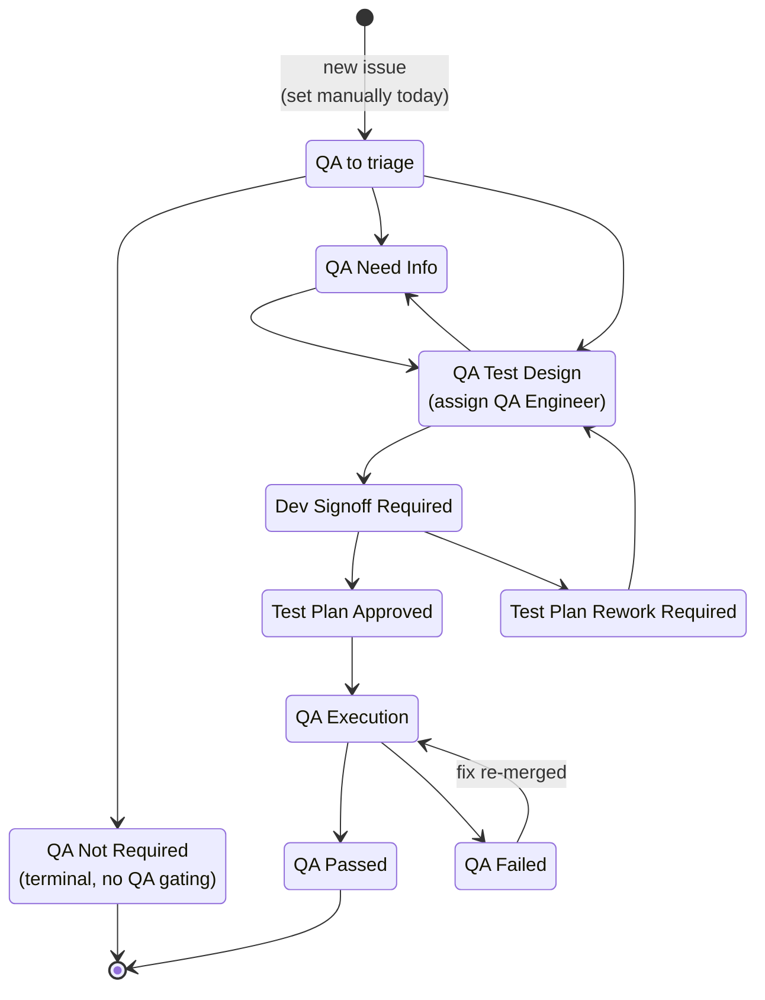

# QA Process

This page describes the QA workflow for NVIDIA Infra Controller (NICo) issues. For NICo's canonical release policy, including branches, Semantic Versioning (SemVer) tags, release cadence, supported upgrade paths, support tiers, and compatibility guarantees, see [RELEASE.md](../../RELEASE.md).

## QA Workflow

NICo's QA process is tracked entirely in GitHub Issues, using the [NVIDIA Infra Controller GitHub Project](https://github.com/orgs/NVIDIA/projects/142). Every issue carries two relevant fields:

- **`Status`** — the overall lifecycle of the issue (dev side).
- **`QA Test Status`** — the QA-side lifecycle.

### Ground Rules

- **Every issue is expected to have a `QA Test Status`.** Even issues that turn out to need no testing must be marked `QA Not Required` — there is no "unset" outcome. Today this field is set manually; there is no automation that initializes it on issue creation.
- **Every PR is expected to have at least one linked issue.** Use GitHub's `Fixes #N` / `Closes #N` / `Resolves #N` keywords, or attach the PR to the issue from the issue's sidebar. Code changes without a linked issue should not merge.
- **QA decides what testing is needed, not engineering.** Engineers should not pre-set `QA Not Required` or otherwise short-circuit the QA triage process. The QA team owns triage and scoping; engineering owns the fix and the test-plan dev signoff.
- **Merging a PR does not close its linked issue(s).** When a PR merges, the linked issue should move to `Status: Verify` with `Disposition: Item Completed` — meaning the code is complete and the issue is now ready for QA to test. Closure happens only after QA passes. The `complete-linked-issues` workflow in the GitHub repository automates this process.

### QA Test Status Values and Transitions

The `QA Test Status` field walks roughly like this:

1. **`QA to triage`** — Default starting state. QA reviews the issue and decides what (if any) testing is required.
1. **`QA Need Info`** — QA needs clarification from the reporter or the engineer before they can scope the work. Returns to triage or test design after it is answered.
1. **`QA Not Required`** — Terminal QA state. The issue still proceeds through the normal dev workflow (`In Progress` → `Verify | Item Completed` → `Closed`); QA simply does not gate it. Used for internal refactors, dev-only tooling, doc-only changes, and so on.
1. **`QA Test Design`** — QA owns the issue and is writing the test plan. The `QA Engineer` field is assigned at this point.
1. **`Dev Signoff Required`** — QA has drafted a test plan and is asking the responsible engineer to confirm that it correctly covers the change.
1. **`Test Plan Rework Required`** — Dev pushed back on the test plan. Returns to `QA Test Design` for revision.
1. **`Test Plan Approved`** — Dev has signed off. The plan is ready to be executed after the fix lands.
1. **`QA Execution`** — QA is actively running the approved test plan, typically after the linked PR(s) have merged and the issue has moved to `Status: Verify | Item Completed`.
1. **`QA Passed`** — All tests passed. The issue can move to `Status: Closed`.
1. **`QA Failed`** — Tests failed. The issue goes back to engineering for a fix; after the fix is merged it returns directly to `QA Execution` (the test plan itself does not need to be re-designed unless the failure reveals a gap in the plan).

### How `QA Test Status` Relates to Issue `Status`

The two fields move semi-independently:

- While dev is still working, `Status` is `In Progress` and `QA Test Status` is typically somewhere in the triage/test-design/signoff portion of its track.
- When the PR merges, the linked issue's `Status` flips to `Verify | Item Completed` (through the automation in [PR #2584](https://github.com/dsx-ai-factory/infra-controller/pull/2584)), signaling to QA that the fix is code-complete and ready to be exercised. `QA Test Status` is expected to be `Test Plan Approved` (or already in `QA Execution`) by this point.
- After `QA Test Status` becomes `QA Passed`, the issue's `Status` is moved to `Closed` with `Disposition: Item Completed`.
- If `QA Test Status` becomes `QA Failed`, the issue typically moves back to `Status: In Progress` so engineering can address the failure.

### Roles

- **Engineer** — writes the fix, links the PR to the issue, reviews the QA test plan when asked (`Dev Signoff Required`), and addresses any `QA Failed` outcomes.
- **QA Engineer** (set through the `QA Engineer` field, assigned at `QA Test Design`) — owns triage, test plan authoring, execution, and the final pass/fail call.

## Glossary

A few QA terms used on this page that are not always obvious:

- **Test plan** — the set of test cases QA writes for a given issue during `QA Test Design`. The plan is what gets dev-signed-off and then executed in `QA Execution`.
- **Disposition** — the GitHub project field that records *why* an issue was closed (for example, `Item Completed`, `Cannot reproduce`, `Will not fix`, `Behaves Correctly`, `Not a bug`). Independent of `QA Test Status`.
