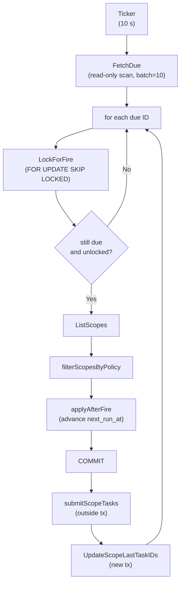

# Task Schedule Implementation

Operator guide: [Task Schedules](../../../docs/operations/flow/task-schedules.md).

## Dispatcher Internals

The `Dispatcher` runs as a background goroutine started by the service at boot.
It is safe to run in multi-instance deployments because individual schedule
rows are locked with `SELECT … FOR UPDATE SKIP LOCKED` before firing.

### Poll cycle



### Three-phase fire

Each schedule firing is split into three phases to avoid nesting transactions
(the task manager opens its own transaction when submitting a task):

1. **Locking phase (transaction):** Lock the row, fetch scopes, run the overlap check,
   advance `next_run_at` (so the row is no longer "due"), commit.
2. **Submission phase (outside transaction):** Call `SubmitTask` once per eligible scope.
3. **Writeback phase (new transaction):** Write back `last_task_id` on each scope row.

If Phase 2 fails for a scope, the scope is logged and skipped — other scopes
still fire. Phase 1 committing before Phase 2 means `next_run_at` has already
advanced; the schedule will not fire again for that same tick even if all
submissions fail.

### Advancing next_run_at

| `spec_type` | When all scopes are skipped (overlap) | After a normal firing |
|---|---|---|
| `one-time` | `next_run_at = NULL`, `enabled = false` (consumed — window passed, nothing to retry) | `next_run_at = NULL`, `enabled = false` |
| `interval` | `next_run_at = dispatch time + duration` | `next_run_at = dispatch time + duration` |
| `cron` | `next_run_at = next cron time` | `next_run_at = next cron time` |

### Operation template

The `operation_template` JSONB column stores the operation type, code, and
parameters needed to reconstruct an `operation.Request` at fire time. The
target is **not** stored in the template — it is resolved from the scope rows
at fire time. This means changing the scope (via scope management RPCs) takes
effect on the very next firing without modifying the operation template.

```json
{
  "type": "power_control",
  "code": "restart",
  "information": { "operation": 5, "forced": false }
}
```

---

## Database Schema

```sql
CREATE TABLE task_schedule (
    id                  UUID PRIMARY KEY DEFAULT gen_random_uuid(),
    name                VARCHAR(255) NOT NULL UNIQUE,
    spec_type           VARCHAR(16) NOT NULL,   -- 'interval' | 'cron' | 'one-time'
    spec                TEXT NOT NULL,          -- duration string, cron expression, or RFC3339 timestamp
    timezone            VARCHAR(64) NOT NULL DEFAULT 'UTC',
    operation_template  JSONB NOT NULL,         -- serialized operation type + parameters (no target)
    overlap_policy      VARCHAR(16) NOT NULL DEFAULT 'skip',
    enabled             BOOLEAN NOT NULL DEFAULT TRUE,
    next_run_at         TIMESTAMPTZ,
    last_run_at         TIMESTAMPTZ,
    created_at          TIMESTAMPTZ NOT NULL DEFAULT current_timestamp,
    updated_at          TIMESTAMPTZ NOT NULL DEFAULT current_timestamp
);

-- Partial index used by the dispatcher's FetchDue query.
CREATE INDEX idx_task_schedule_next_run ON task_schedule (next_run_at)
    WHERE enabled = TRUE AND next_run_at IS NOT NULL;

CREATE TABLE task_schedule_scope (
    id               UUID PRIMARY KEY DEFAULT gen_random_uuid(),
    schedule_id      UUID NOT NULL REFERENCES task_schedule(id) ON DELETE CASCADE,
    rack_id          UUID NOT NULL REFERENCES rack(id) ON DELETE CASCADE,
    component_filter JSONB,          -- NULL = all components in rack
    last_task_id     UUID REFERENCES task(id) ON DELETE SET NULL,
    created_at       TIMESTAMPTZ NOT NULL DEFAULT current_timestamp,
    UNIQUE (schedule_id, rack_id)
);

CREATE INDEX idx_task_schedule_scope_rack ON task_schedule_scope (rack_id);
```

### Key columns

| Column | Notes |
|---|---|
| `task_schedule.name` | Unique across all schedules. Human-readable identifier. |
| `task_schedule.next_run_at` | `NULL` for disabled one-time schedules that have fired. The partial index makes the dispatcher's poll query efficient. |
| `task_schedule.enabled` | `false` = paused (will not fire). Set by `PauseTaskSchedule` or automatically after a one-time schedule fires. |
| `task_schedule_scope.component_filter` | `NULL` means all components. See [Component filter variants](../../../docs/operations/flow/task-schedules.md#component-filter-variants). |
| `task_schedule_scope.last_task_id` | The task submitted for this rack on the most recent firing. Used by the overlap check for the `skip` policy. `NULL` until the first firing. |
| `task_schedule_scope.schedule_id` FK | `ON DELETE CASCADE` — scopes are removed automatically when the schedule is deleted. |
